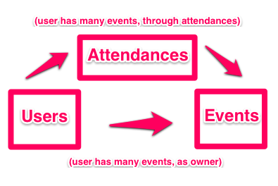

## Introduction to our example application and setup

### Example application

We will use a fake example application called Humon to explain and demonstrate
the concepts throughout this book. Humon is an app that lets you find nearby
events.

In the Humon application, a user can have many events as an event owner. An
event has geolocation information (latitude and longitude), which allows us to
plot it on a map. A user has and belongs to many events through attendances. A
user can only have one attendance per event.

The Humon application does not ask for a username or password. Instead, we will
use an ID unique to the device ('device token') to track unique users. The iOS
portion of the book will discuss where this token comes from. For now, all you
need to know is that users are identified by their devices. This approach does
not allow for multiple users per device or a single account across devices, but
it does enable users to start using the application immediately. Our desire to
create the simplest application possible led us to choose immediate usability
over a more complex authentication system.

We will provide code snippets in context, but you can also view the entire
[example application in
GitHub](https://github.com/thoughtbot/ios-on-rails/tree/master/example_apps/rails)
to see how it is structured.

### Setting up our project

We used [Suspenders](https://github.com/thoughtbot/suspenders), a Rails 4
template with thoughtbot's standard defaults, to start our project. Starting a
Rails app with Suspenders is simple, just follow the instructions in the
`README`.

While Suspenders is not required to follow along with this book, it does
conveniently include all of the gems we will use to test-drive our API,
including: [Factory Girl](https://github.com/thoughtbot/factory_girl_rails),
[RSpec](https://github.com/rspec/rspec-rails), and [Shoulda
Matchers](https://github.com/thoughtbot/shoulda-matchers). So if you choose not to
use Suspenders to start your project, make sure you add those gems to your
`Gemfile`.

### Parsing incoming JSON requests

[MultiJson](https://github.com/intridea/multi_json) is an adapter for JSON
parsers. Another adapter familiar to Rails developers is ActiveRecord. Just as
ActiveRecord provides a common interface to database drivers like Postgres and
MySQL, MultiJson provides a common interface to JSON parsers like Oj and Yajl.
We get MultiJson for free with Rails because MultiJson is a dependency of
ActiveSupport.

For parsing JSON, we chose the Oj gem. To use the Oj gem in your Rails
application, simply add it to your Gemfile and install it with the bundle
install command. We chose Oj because it is a really fast JSON parser. From the
MultiJson README:

> "When loading, libraries are ordered by speed. First Oj, then Yajl, then the
> JSON gem, then JSON pure. If no other JSON library is available, MultiJSON
> falls back to OkJson, a simple, vendorable JSON parser."

### Generating outgoing JSON responses

There is no shortage of methods to render a JSON response. We looked into
[Active Model
Serializers](https://github.com/rails-api/active_model_serializers),
[RABL](https://github.com/nesquena/rabl), and simply using the Rails `.as_json`
method. In the end we chose [Jbuilder](https://github.com/rails/jbuilder) for
rendering JSON because of its excellent community support (repo is maintained
under the Rails organization) and the consistency of its view logic to other
kinds of Rails views such as Haml, ERB, and Builder.

With Jbuilder, we render the JSON from Rails controllers like any other view.
We're able to use partials like any other Rails view template to compose JSON.
There's also a `cache!` method that has the same method signature as
[`ActionView::Helpers::CacheHelper`](http://api.rubyonrails.org/classes/ActionView/Helpers/CacheHelper.html)
and uses
[`Rails.cache`](http://guides.rubyonrails.org/caching_with_rails.html#cache-stores)
under the hood. We will delve into the details of views and caching in later
chapters.

### Versioning

Before we get started with building out our API, we must think about how we are
going to handle versioning. While web developers can deploy as often as they
want and users see the newly deployed code with every browser page refresh, iOS
developers have both a lag time before Apple approves the new version of an app
and a lag time before users update to the newest application version available.
iOS applications reference the same API endpoints until a new release of the
application has been downloaded. If you want to continue to support users with
older versions of the iOS application you are building, you must maintain the
same general JSON data structures on the backend for those users.

You will of course discover new and better ways of structuring your JSON
responses as time goes on and your application grows. Once that happens, the
easiest way to support old versions of the application and allow newer versions
to use different JSON structures is to release a new API version.

Releasing multiple versions of an API is outside the scope of this book, but
Ryan Bates has an excellent
[RailsCast](http://railscasts.com/episodes/350-rest-api-versioning) on this
topic. For now, we will future proof our API by including our views and
controllers within the api/v1
subdirectories. Our routes file looks like this:

    # config/routes.rb

    Humon::Application.routes.draw do
      scope module: :api, defaults: { format: 'json' } do
        namespace :v1 do ## resources will be here
      end
    end

The API is now scoped via the URL. For example, with our setup above, the
endpoint for a single event at version 1 of the API will live at
`#{Rails.root}/v1/event/:event_id`.

### API Documentation

In the early days of creating your JSON API, you will likely be changing the
data returned as well as the data structure on almost a daily basis. While
communication is both key and challenging on all software development teams, it
can be especially challenging when working across teams that speak different
programming languages. While Rails developers and iOS developers alike speak
“JSON”, we found that asking iOS developers to stay up to date with API changes
using source code on GitHub was difficult.

A solution we found for keeping all developers in sync was using GitHub’s wiki
feature as a source of API documentation. While updating the wiki after each API
change required a small amount of work for our Rails developers, having an place
where iOS developers could find up-to-date API documentation was an invaluable
resource. You can see how we structure our wiki
[here](https://github.com/thoughtbot/ios-on-rails/wiki/API-Endpoints).

If you are interested in exploring other documentation options, here are some
suggestions:

 * [fdoc](https://github.com/square/fdoc)
 * [apipie-rails](https://github.com/Pajk/apipie-rails)
 * [YARD](http://yardoc.org/)

