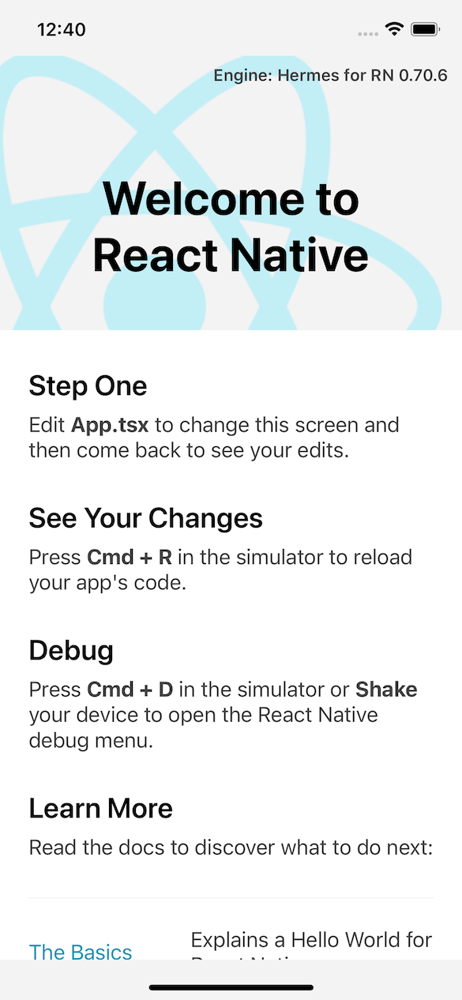

# A New React Native Project

## Creating the App

This book assumes you have done the setup for React Native version 0.70 as per the [Environment setup][]

We now want to [set up a new React Native app using the built-in TypeScript
template][]. We will use `npx` to set up our application. `npx` allows us to
execute a command within the context of the project directory, without actually
installing the package globally.

To create our new Humon app, run the following command. This is enough to set up the application for both Android and iOS. You only have to run it once, and then you can forget about it forever.

```shell
npx react-native init Humon --template react-native-template-typescript
```

You will see a prompt similar to the following. Enter `y` to continue.

```text
Need to install the following packages: 
  react-native
Ok to proceed? (y)
```

Once the script runs successfully, we would see an output with green tick marks
completing the different steps.


## Running on Android 
Change into the newly created `Humon` directory and run the command mentioned below.

```shell
cd Humon/
npx react-native run-android
```

The Android App should build successfully and show up on the Emulator.


## Running on iOS 

Change into the newly created `Humon` directory and run the command mentioned below.

```shell
cd Humon/
npx react-native run-ios
```

The iOS App should build successfully and show up on the Simulator.



[environment setup]: https://reactnative.dev/docs/environment-setup
[set up a new React Native app using the built-in TypeScript template]: https://reactnative.dev/docs/typescript