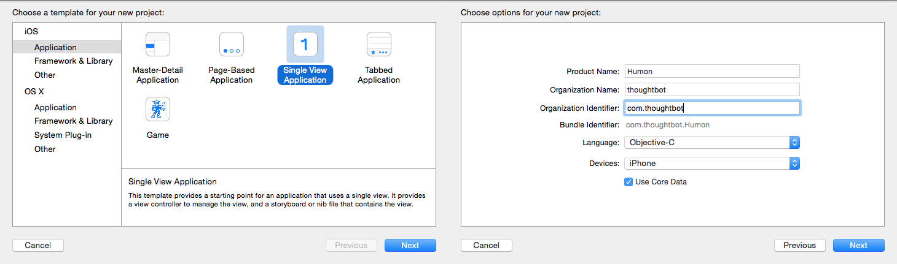
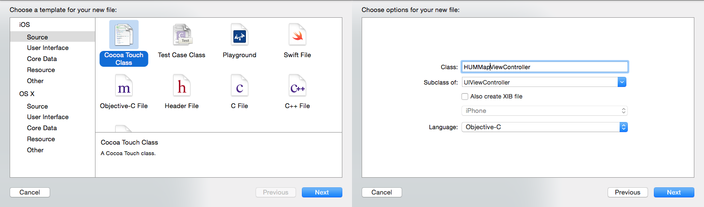
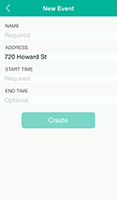
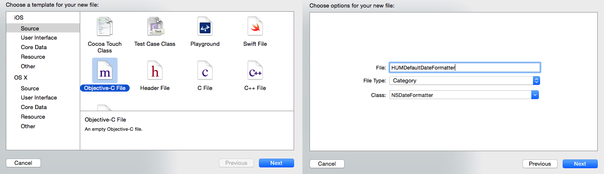

% iOS on Rails
% thoughtbot; Jessie Young; Diana Zmuda

\clearpage

# Introduction

### Why this book?

There are many ways to build the backend for an iOS application but you only
need one. And depending on the complexity of the API you are going to create,
different solutions work best for different applications.

Just as Rails makes it possible to set up a basic web application in a matter of
minutes, Rails makes it possible to set up a basic API in a matter of minutes.
But deciding how to structure your API isn't easy. While experimenting with all
the options is a fun weekend project, sometimes you just want to get going.
This book will help you do just that. While your API will no doubt require some
tweaking while you flesh out your iOS app, the approach we will be taking is to
define and build the API first, and then consume this API through our iOS app.

The Rails portions of *iOS on Rails* will guide you through what we have found
to be a robust, clean, flexible way of building out a JSON API with Rails. We
provide code samples for GET, POST, and PATCH requests. In addition, we will
explore some of the alternative approaches that we didn't choose and explain
why we made the choices that we did.

The iOS portion of the book will then walk, step-by-step, through creating an
iOS application that works with the Rails API you just created. The iOS
application will use each endpoint to post up objects and get back necessary
data for the user. Our model objects in the iOS app will correspond with the
model objects in the database, and be populated with response data from the
API.

### Who is this book for?

This book is for a developer who wants to build an iOS application with a Rails
backend. It's also a book for both a Rails developer and an iOS developer to
share and use in concert. This will permit them to create an app quickly and
with more flexibility to change it than a backend-as-a-service provider like
StackMob or Parse.

The approach shared in this book is the result of our own experiments as Rails
and iOS developers working together to build an application. The Rails portions
of this book assume a basic working knowledge of how to build a web application
with Rails as well as familiarity with the Ruby programming language. The iOS
portions of this book assume experience with object oriented programming and a
basic familiarity with the Objective-C programming language.

This book is intended to be used as a guide rather than a recipe. While our aim
is to give you all the tools necessary to build great Rails APIs and iOS
clients, it does not cover the fundamentals of Ruby, Rails or Objective-C. That
being said, if any part of the book strikes you as incomplete or confusing, we
are always happy to receive pull requests and issue submissions on
[GitHub](https://github.com/thoughtbot/ios-on-rails).

\mainmatter

\part{Building the Humon Rails App}

# Introduction to our example application and setup

### Example application

We will use a fake example application called Humon to explain and demonstrate
the concepts throughout this book. Humon is an app that lets you find nearby
events.

In the Humon application, a user can have many events as an event owner. An
event has geolocation information (latitude and longitude), which allows us to
plot it on a map. A user has and belongs to many events through attendances. A
user can have only one attendance per event.

The Humon application does not ask for a username or password.
Instead, we will assign an auth token to all new devices using our API.
The iOS device is responsible for storing this token
and signing all requests with it. This approach does
not allow for multiple users per device or a single account across mutliple
devices, but it does enable users to start using the application immediately.
Our desire to create the simplest application possible led us to choose
immediate usability over a more complex authentication system.

We will provide code snippets in context, but you can also view the entire
[example application in
GitHub](https://github.com/thoughtbot/ios-on-rails/tree/master/example_apps/rails)
to see how it is structured.

### Setting up our project

We used [Suspenders](https://github.com/thoughtbot/suspenders), a Rails 4
template with thoughtbot's standard defaults, to start our project. Starting a
Rails app with Suspenders is simple. Just follow the instructions in the
`README`.

While Suspenders is not required to follow along with this book, it does
conveniently include all of the gems we will use to test-drive our API,
including: [Factory Girl](https://github.com/thoughtbot/factory_girl_rails),
[RSpec](https://github.com/rspec/rspec-rails), and [Shoulda
Matchers](https://github.com/thoughtbot/shoulda-matchers). So if you choose not
to use Suspenders to start your project, make sure you add those gems to your
`Gemfile`.

### Parsing incoming JSON requests

[MultiJson](https://github.com/intridea/multi_json) is an adapter for JSON
parsers. Another adapter familiar to Rails developers is ActiveRecord. Just as
ActiveRecord provides a common interface to database drivers like Postgres and
MySQL, MultiJson provides a common interface to JSON parsers like Oj and Yajl.
We get MultiJson for free with Rails because MultiJson is a dependency of
ActiveSupport.

For parsing JSON, we chose the Oj gem. To use the Oj gem in your Rails
application, simply add it to your Gemfile and install it with the bundle
install command. We chose Oj because it is a really fast JSON parser. From the
MultiJson README:

> "When loading, libraries are ordered by speed. First Oj, then Yajl, then the
> JSON gem, then JSON pure. If no other JSON library is available, MultiJSON
> falls back to OkJson, a simple, vendorable JSON parser."

### Generating outgoing JSON responses

There is no shortage of methods to render a JSON response. We looked into
[Active Model
Serializers](https://github.com/rails-api/active_model_serializers),
[RABL](https://github.com/nesquena/rabl), and simply using the Rails `.as_json`
method. In the end we chose [Jbuilder](https://github.com/rails/jbuilder) for
rendering JSON because of its excellent community support (repo is maintained
under the Rails organization) and the consistency of its view logic to other
kinds of Rails views such as Haml, ERB, and Builder.

With Jbuilder, we render the JSON from Rails controllers like any other view.
We're able to use partials as with any other Rails view template to compose JSON.
There's also a `cache!` method that has the same method signature as
[`ActionView::Helpers::CacheHelper`](http://api.rubyonrails.org/classes/ActionView/Helpers/CacheHelper.html)
and uses
[`Rails.cache`](http://guides.rubyonrails.org/caching_with_rails.html#cache-stores)
under the hood. We will delve into the details of views and caching in later
chapters.

### Versioning

Before we get started with building out our API, we must think about how we are
going to handle versioning. While web developers can deploy as often as they
want and users see the newly deployed code with every browser page refresh, iOS
developers have both a lag time before Apple approves an app's new version 
and a lag time before users update to the newest available application version.
iOS applications reference the same API endpoints until a new release of the
application has been downloaded. If you want to continue to support users with
older versions of the iOS application you are building, you must maintain the
same general JSON data structures on the backend for those users.

You will, of course, discover new and better ways of structuring your JSON
responses as time goes on and your application grows. Once that happens, the
easiest way both to support old versions of the application and to allow newer versions
to use different JSON structures is to release a new API version.

Releasing multiple versions of an API is outside this book's scope, but
Ryan Bates has an excellent
[RailsCast](http://railscasts.com/episodes/350-rest-api-versioning) on this
topic. For now, we will future-proof our API by including our views and
controllers within the api/v1 subdirectories. Our routes file looks like this:

    # config/routes.rb

    Humon::Application.routes.draw do
      scope module: :api, defaults: { format: 'json' } do
        namespace :v1 do
         ## resources will be here
        end
      end
    end

The API is now scoped via the URL. For example, with our setup above, the
endpoint for a single event at version 1 of the API will live at
`#{Rails.root}/v1/event/:event_id`.

### API Documentation

In the early days of creating your JSON API, you will likely be changing the
data returned as well as the data structure on almost a daily basis. While
communication is both key and challenging on all software development teams, it
can be especially challenging when working across teams that speak different
programming languages. While Rails developers and iOS developers alike speak
"JSON", we found it difficult to ask iOS developers to stay up to date with API
changes using source code on GitHub.

A solution we found for keeping all developers in sync was using GitHub’s wiki
feature as a source of API documentation. While updating the wiki after each API
change required a small amount of work for our Rails developers, a place
where iOS developers could find up-to-date API documentation was an invaluable
resource. You can see how we structure our wiki
[here](https://github.com/thoughtbot/ios-on-rails/wiki).

If you are interested in exploring other documentation options, here are some
suggestions:

 * [fdoc](https://github.com/square/fdoc)
 * [apipie-rails](https://github.com/Pajk/apipie-rails)
 * [YARD](http://yardoc.org/)

### API Security

APIs built for commercial use usually have some concept of a client id and/or
client secret. These are unguessable strings that act as a username and password
combination required for all API requests. Requiring a client id and secret
ensures that only known users can access the API. This also allows the API to
turn off access to a particular person or application if the usage violates the
API terms of service. [This blog post on API
security](https://stormpath.com/blog/top-six-reasons-use-api-keys-and-how/)
explains the benefits of API keys.

Humon is not an API built for commercial purposes, so we don't need to worry
about creating a complicated permissions scheme that involves many API tokens.
We do, however, want to make sure that not just anyone can query our API. Having
zero security would mean that anyone could create a `curl` request to an
endpoint and hit our database.

As a security measure, we require a header of `tb-app-secret` for the POST users
request. We ensure that only requests that send a `tb-app-secret` header with a
value matching the value set by the Rails app can create new users via the Humon
API. We store the app secret in an environment variable so that it is not
anywhere in version control.

We use [`dotenv`](https://github.com/bkeepers/dotenv) so that our API can read
environment variables from a `.env` file while in development mode. We also add
`.env` to `.gitignore` so it is not added to our git repository. If the app
secret sent by the client on POST users does not match the app secret in the
API, a `404 Not Found` is returned.

For all requests (except for a POST users request), we require that the header
contain a `tb-auth-token`. During a POST users request, we create an auth token
for a user and return it in the response JSON. The iOS app stores
that token and sets it in the header of every subsequent request.

To see how we implemented an app secret and auth tokens for POST users, see the
[`before_filter` in our `UsersController`](https://github.com/thoughtbot/ios-on-rails/blob/master/example_apps/rails/app/controllers/api/v1/users_controller.rb)
and the [`before_validation` in our `User model`.](https://github.com/thoughtbot/ios-on-rails/blob/master/example_apps/rails/app/models/user.rb)

# Creating a GET request

### It all starts with a request spec

At thoughtbot, we do test-driven and outside-in development, which means we
start work on any feature by writing a high-level test that describes user
behaviors. You can read a more detailed description of outside-in development
[here](http://rubylearning.com/blog/2010/10/05/an-introduction-to-outside-in-development/), but the
benefits can be summarized as follows:

>  Outside-in, along with the test-driven process, helps you write just the
>  minimum amount of code that provides value to stakeholders, and not a line
>  more.

The external interface of our application will be the iOS app that GETs and
POSTs data to the Rails app, so [feature
specs](https://www.relishapp.com/rspec/rspec-rails/docs/feature-specs/feature-spec),
which usually interact with the application via web interfaces, do not make
sense. Jonas Nicklas, the creator of Capybara, [said it
best](http://www.elabs.se/blog/34-capybara-and-testing-apis): "Do not test APIs
with Capybara. It wasn't designed for it."

Instead, we will use [request
specs](https://www.relishapp.com/rspec/rspec-rails/docs/request-specs/request-spec).
RSpec request specs, like feature specs, are a great way to ensure the entire
stack is working together properly, but via HTTP verbs, response codes, and
responses rather than browser interactions.

When writing our request specs, we found that we were calling
`JSON.parse(response.body)` over and over again. We abstracted this into a
method called
[`response_json`](https://github.com/thoughtbot/ios-on-rails/blob/master/example_apps/rails/spec/support/response_json.rb),
which we use below and in all of our request specs that include a JSON response.

    # spec/requests/api/v1/events/events_spec.rb

    require 'spec_helper'

    describe 'GET /v1/events/:id' do
      it 'returns an event by :id' do
        event = create(:event)

        get "/v1/events/#{event.id}"

        expect(response_json).to eq(
          {
            'address' => event.address,
            'ended_at' => event.ended_at,
            'id' => event.id,
            'lat' => event.lat,
            'lon' => event.lon,
            'name' => event.name,
            'started_at' => event.started_at.as_json,
            'owner' => {
              'id' => event.owner.id
            }
          }
        )
      end
    end

### Model

This first error we will get for the request spec above is that our app does not
have a factory named `event`. FactoryGirl guesses the object's class based on
the factory name, so creating the `event` factory is a good opportunity to set
up our `Event` model.

At the model level, Rails applications that serve a JSON API look exactly like
regular web applications built with Rails. Although the views and controllers
will be versioned, we will write our migrations like standard Rails migrations
and keep our models within the models directory. You can see the data migrations
for our example application
[here](https://github.com/thoughtbot/ios-on-rails/tree/master/example_apps/rails/db/migrate).

At this point, let's assume our `User` model has already been created.

Our `Event` model has a few validations and relations, so we will write tests
for those validations. In our development process, we would write the following
tests line by line, watching them fail, and writing the lines in our model one
at a time to make them pass. We will use FactoryGirl, Shoulda Matchers, and
RSpec for our unit tests. To see our full test setup, see our `spec_helper`
[here](https://github.com/thoughtbot/ios-on-rails/blob/master/example_apps/rails/spec/spec_helper.rb).

    # spec/models/event_spec.rb

    require 'spec_helper'

    describe Event, 'Validations' do
      it { should validate_presence_of(:lat) }
      it { should validate_presence_of(:lon) }
      it { should validate_presence_of(:name) }
      it { should validate_presence_of(:started_at) }
    end

    describe Event, 'Associations' do
      it { should have_many(:attendances) }
      it { should belong_to(:owner).class_name('User') }
    end

To make the tests pass, we will write a migration (note: your file name will be
different, as the numbers in the name are generated based on the date and time
the migration was created):

    # db/migrate/20131028210819_create_events.rb

    class CreateEvents < ActiveRecord::Migration
      def change
        create_table :events do |t|
          t.timestamps null: false
          t.string :address
          t.datetime :ended_at
          t.float :lat, null: false
          t.float :lon, null: false
          t.string :name, null: false
          t.datetime :started_at, null: false
          t.integer :user_id, null: false
        end

        add_index :events, :user_id
      end
    end

and add those validations to the model:

    # app/models/event.rb

    class Event < ActiveRecord::Base
      validates :lat, presence: true
      validates :lon, presence: true
      validates :name, presence: true
      validates :started_at, presence: true

      belongs_to :owner, foreign_key: 'user_id', class_name: 'User'
    end

Once this is working, we can add the `event` Factory to
[`spec/factories.rb`](https://github.com/thoughtbot/ios-on-rails/blob/master/example_apps/rails/spec/factories.rb)
for use in our request spec.

### Controller

At this point, we can create an `event` object using FactoryGirl, but our
request spec is failing on the next line. This is because we have no routes set
up for the path we are using in our test's GET request (`get
"/v1/events/#{event.id}"`). To fix this, we need to add a controller and
configure our `routes.rb` file.

As we discussed in the versioning section of our introduction, we will add
controllers within `api/v1` directory so we may release future versions of our
API without breaking older versions of our application.

Because our `routes.rb` file tells our controllers to look for the JSON format
by default, we do not need to tell our individual controllers to render JSON
templates. We do, however, need to add our new paths to our routes file:

    # config/routes.rb

    Humon::Application.routes.draw do
      scope module: :api, defaults: { format: 'json' } do
        namespace :v1 do
          resources :events, only: [:show]
        end
      end
    end

Aside from including our controller within the `api/v1 directory`, our
`EventsController` looks much like a standard Rails controller. To make our
request spec pass, we need to add a single action to our API:

    # app/controllers/api/v1/events_controller.rb

    class Api::V1::EventsController < ApplicationController
      def show
        @event = Event.find(params[:id])
      end
    end

### View

Our controller and routes are set up, but we still need one final piece before
our spec will pass: a view. Our request spec is looking for a view template with
some response JSON, so we need to create that view.

For a Rails developer, the views are where the most difference will occur
between a standard web application and a JSON API.  As with our controllers, we
will include our views in the `api/v1` directory so that they are versioned.

Just like regular view partials, Jbuilder partials minimize duplication by
letting us re-use blocks of view code in many different places. JSON
representations of data frequently include duplication (a collection is usually
an array of the same JSON structure that would be found for a single object), so
partials are especially handy when creating a JSON API. We will use Jbuilder’s
DSL to tell our show view to find the event partial:

    # app/views/api/v1/events/show.json.jbuilder

    json.partial! 'event', event: @event

Our show GET view is looking for a partial named `_event.json.jbuilder` within
the `events` directory. So we will create that partial next:

    # app/views/api/v1/events/_event.json.jbuilder

    json.cache! event do
      json.address event.address
      json.ended_at event.ended_at
      json.id event.id
      json.lat event.lat
      json.lon event.lon
      json.name event.name
      json.started_at event.started_at

      json.owner do
        json.id event.owner.id
      end
    end

#### Caching our view

You might be wondering what the `json.cache!` at the top of our `event` partial
is doing. Jbuilder supports [fragment
caching](http://guides.rubyonrails.org/caching_with_rails.html#fragment-caching),
and you tell your app to cache a block of view code by wrapping it in a
`json.cache!` block. While the load time for the JSON in our view above is going
to be teeny tiny, adding fragment caching is simple and a good habit to get into
for apps that are likely to expand over time.

If you're interested in learning more about fragment caching, here is a great
[Railscast](http://railscasts.com/episodes/90-fragment-caching-revised) (paid)
on the topic.

### Putting it all together

We have now successfully created our first API endpoint for Humon and our
request spec should pass!

But let's test it manually just to make sure. Our iOS app isn't up and running
yet, so we will have to create records in Rails console. Make sure you are in
your project directory in Terminal, run `rails console` and then enter the
following:

    User.create(auth_token: '12345')
    Event.create(
      address: '85 2nd Street',
      lat: 37.8050217,
      lon: -122.409155,
      name: 'Best event OF ALL TIME!',
      owner: User.find_by(auth_token: '12345'),
      started_at: Time.zone.now
    )

Assuming this created your first event (`id` will equal 1) and you are running
`rails server` in Terminal (you will need to exit from Rails console or open a
new Terminal window to do this), when you visit `localhost:3000/v1/events/1` in
your browser you should see something like this:

    {
      "address":"85 2nd Street",
      "ended_at":"2013-09-17T00:00:00.000Z",
      "id":1,
      "lat":37.8050217,
      "lon":-122.409155,
      "name":"Best event OF ALL TIME!",
      "started_at":"2013-09-16T00:00:00.000Z",
      "owner":{
        "id":"1"
       }
     }

Alternatively, you can run a [curl](http://curl.haxx.se/docs/manpage.html)
request (`curl http://localhost:3000/v1/events/1`) from Terminal and see the
same JSON output.

Congratulations, you just created your first API endpoint with Rails!

# Creating a POST request

### Forgery protection strategy and Rails 4

Before we begin digging into creating POST requests to our API, we need to
change our forgery protection strategy.

Rails protects against [cross-site request
forgery](http://en.wikipedia.org/wiki/Cross-site_request_forgery) by protecting
your application from requests that are missing authenticity tokens. [An
explanation](http://stackoverflow.com/a/1571900/1019369) of authenticity tokens
in Rails:

> When the user views a form to create, update, or destroy a resource, the Rails
> app  would create a random `authenticity_token`, store this token in the
> session, and place it in a hidden field in the form. When the user submits the
> form, Rails would look for the `authenticity_token`, compare it to the one
> stored in the session, and if they match the request is allowed to continue.

Why this happens:

> Since the authenticity token is stored in the session, the client cannot know
> its value. This prevents people from submitting forms to a Rails app
> without viewing the form within that app itself. Imagine that you are using
> service A, you logged into the service and everything is ok. Now imagine that
> you went to use service B, and you saw a picture you like, and pressed on the
> picture to view a larger size of it. Now, if some evil code was there at service
> B, it might send a request to service A (which you are logged into), and ask to
> delete your account, by sending a request to
> `http://serviceA.com/close_account`. This is what is known as CSRF (Cross Site
> Request Forgery).

While protecting against CSRF attacks is a good thing, the default forgery
protection strategy in Rails 4 is problematic for dealing with POST requests to
APIs. If you make a POST request to a Rails endpoint (rather than using a
standard web form to create a record), you will see the following error:

    ActionController::InvalidAuthenticityToken

Rails lets us choose between forgery protection strategies. The default in Rails
4 is `:exception`, which we are seeing in action above. Rails recommends the
`:null_session` strategy for APIs, which empties the session rather than raising
an exception. Since we want this strategy for all API endpoints but not
necessarily all endpoints, we will create an `ApiController` that all of our API
controllers will inherit from and set the forgery protection strategy there:

    # app/controllers/api_controller.rb

    class ApiController < ApplicationController
      protect_from_forgery with: :null_session
    end

    # app/controllers/api/v1/events_controller.rb

    class Api::V1::EventsController < ApiController

    ...

    end

Now we're ready to get started on our first POST request.

### It all starts with a request spec

We will start working on our POST request the same way we began working on our
GET request: with a request spec.

    # spec/requests/api/v1/events/events_spec.rb

    describe 'POST /v1/events' do
      it 'saves the address, lat, lon, name, and started_at date' do
        date = Time.zone.now
        auth_token = '123abcd456xyz'
        owner = create(:user, auth_token: auth_token)

        post '/v1/events', {
          address: '123 Example St.',
          ended_at: date,
          lat: 1.0,
          lon: 1.0,
          name: 'Fun Place!!',
          started_at: date,
          owner: {
            id: owner.id
          }
        }.to_json,
        set_headers(auth_token)

        event = Event.last
        expect(response_json).to eq({ 'id' => event.id })
        expect(event.address).to eq '123 Example St.'
        expect(event.ended_at.to_i).to eq date.to_i
        expect(event.lat).to eq 1.0
        expect(event.lon).to eq 1.0
        expect(event.name).to eq 'Fun Place!!'
        expect(event.started_at.to_i).to eq date.to_i
        expect(event.owner).to eq owner
      end
    end

In this test we are using a method called `set_headers` and passing the
`auth_token` into the method. This is a helper method that we will use
in many request specs, so let's define it outside of this spec file:

    # spec/support/request_headers.rb

    module RequestHeaders
      def set_headers(auth_token)
        {
          'tb-auth-token' => auth_token,
          'Content-Type' => 'application/json'
        }
      end
    end

    RSpec.configure do |config|
      config.include RequestHeaders
    end

Note about the time comparisons above: the reason we are calling `to_i` on
`event.started_at` and `event.ended_at` is that Ruby time (the time we are
setting when we declare the `date` variable) is more precise than ActiveRecord
time (the time we are getting back from `Event.last`). If you run the tests
without `to_i`, you will see something like this:

        expected: Wed, 16 Apr 2014 17:13:47 UTC +00:00
             got: Wed, 16 Apr 2014 17:13:47 UTC +00:00

Even though the date objects themselves appear equal, as [this blog post on time
comparisons in Rails
notes](http://blog.tddium.com/2011/08/07/rails-time-comparisons-devil-details-etc/),
"When the value is read back from the database, it's only preserved to
microsecond precision, while the in-memory representation is precise to
nanoseconds." Calling `to_i` on these dates normalizes them to use the same
place value, which renders them equal for our test.

#### Controller

When we run the test above, our first error should be `No route matches [POST]
"/v1/events"`. This is exactly the error we would expect, since we haven't
defined this route in our `routes.rb` file. Let's fix that:

    # config/routes.rb

    Humon::Application.routes.draw do
      scope module: :api, defaults: { format: 'json' } do
        namespace :v1 do
          resources :events, only: [:create, :show]
        end
      end
    end

When we run the spec again, our error has changed to

    The action 'create' could not be found for Api::V1::EventsController

This is good; it means the route we
added is working, but we still need to add a `create` method to our
`EventsController`. So let's do that:

    # app/controllers/api/v1/events_controller.rb

    class Api::V1::EventsController < ApiController
      def create
      end

      ...

    end

Run the spec again, and our error has changed to `Missing template
api/v1/events/create`. Again, receiving a different error message is a good
indication that the last change we made is bringing us closer to a passing test.

We will get back to the view layer in the next section, but for now let's just
create an empty file at `app/views/api/v1/events/create.json.jbuilder`, since
that will help us get to our next error.

Run the spec again, and our error has changed (hooray!) to:

     Failure/Error: expect(response_json).to eq({ 'id' => event.id })
       NoMethodError:
         undefined method `id' for nil:NilClass

If we look back at our spec, we can see that `id` is being called on `event`,
which is the variable name we assigned to `Event.last`. By saying that `id` is
an undefined method for `nil`, our error is telling us that `Event.last` is
`nil`.

And of course it is! We haven't added any logic into our controller that would
create an instance of `Event`; at the moment, all we have is an empty `create`
method. Time to add some logic:

    # app/controllers/api/v1/events_controller.rb

    class Api::V1::EventsController < ApiController
      def create
        authorize do |user|
          @user = user
          @event = Event.new(event_params)

        if @event.save
          render
        else
          render json: {
            message: 'Validation Failed',
            errors: @event.errors.full_messages
          }, status: 422
        end
      end

      ...

      private

      def event_params
        {
          address: params[:address],
          ended_at: params[:ended_at],
          lat: params[:lat],
          lon: params[:lon],
          name: params[:name],
          started_at: params[:started_at],
          owner: @user
        }
      end
    end

Now we get a different error:

    Failure/Error: post '/v1/events', {
      NoMethodError: undefined method `authorize'

#### Checking for the auth token header

Oh yes, we are using a method we haven't defined yet! What is this `authorize`
method all about? When we are creating an `event` with our API, we want to make
sure that the event has an owner.

In Humon, we identify users by their auth token, which is being sent in the
request header. We are sending tokens in the header rather than in the URL
because it is standard practice, even though SSL encrypts the entire request.
As shared in [this
StackOverflow response](http://stackoverflow.com/a/20754104/1019369), putting
tokens in the header "Provides extra measure of security by preventing users
from inadvertently sharing URLs with their credentials embedded in them."

Another reason tokens are usually sent as headers is that it is simpler for the
client to process auth tokens when they are sent as headers. For this reason,
sending auth tokens in the header is common practice for APIs. Since we want to
establish and follow design principles for APIs that can be used and re-used for
many use cases, it make sense to go with what's popular.

So, given then we are sending the `auth_token` in the header, and we will be
doing that for any action that requires us to know which user is making the
request, it makes sense to define a method in `ApiController` that looks for
the auth token header and finds the user with that auth token.
Let's define that method now:

    # app/controllers/api_controller.rb

    class ApiController < ApplicationController
      def protect_from_forgery with: :null_session

      def authorize
        if authorization_token
          yield User.find_by(auth_token: authorization_token)
        else
          render nothing: true, status: 401
        end
      end

       private

       def authorization_token
         @authorization_token ||= authorization_header
       end

       def authorization_header
         request.headers['tb-auth-token']
       end
     end

Note that we are using `tb-auth-token` as our header key so it does not clash
with header keys for any other auth libraries we might implement in the future.

Our error message has changed yet again, and now it is time for us to move to
the final step: creating our view.

#### View

Our
[`EventsController`](https://github.com/thoughtbot/ios-on-rails/blob/master/example_apps/rails/app/controllers/api/v1/events_controller.rb)
is creating an `event`, but we are still getting an error when we run our spec
(note: your expectation might have a different `id` number depending on how many
times you've run your test; that's fine):

    expect(response_json).to eq({ 'id' => event.id })
           expected: {"id"=>6}
            got: {}

The empty brackets we are getting tell us that our view is rendering an empty
JSON object. Time to fix our empty view template:

    # app/views/api/v1/events/create.json.jbuilder

    json.id @event.id

And with that, our test is passing. Nice work. But before we move on, let's not
forget our second POST spec.

### It all starts with a request spec, part II

Our first spec covered the "happy path," which
[Wikipedia](http://en.wikipedia.org/wiki/Happy_path) defines as the "a
well-defined test case using known input, which executes without exception and
produces an expected output." Our second test will show the "sad path," which
means that it will cover validation and error handling.

You might remember that our GET request section only contained a single test.
While these decisions are rarely black and white, it was our judgment that only
a "happy path" test was required for that endpoint. The "sad path" for a GET
request would occur when the `id` in the URL does not correspond to an existing
`event`. In that case, the application would return a [`404 Not
Found`](http://en.wikipedia.org/wiki/HTTP_404) response code, which is the
default behavior and therefore does not need to be tested.

By default, passing invalid attributes to our POST request would not create the
`event` and would return a response body without helpful error messages and a
misleading response code of [`200
OK`](http://en.wikipedia.org/wiki/HTTP_200#2xx_Success).

Because we want to change both the response body and the response code returned
when invalid attributes are used in a POST request, writing a test for that
scenario makes sense.

Let's move on to our "sad path" request spec and cover a POST request with
invalid attributes (it will go inside the same `describe` block as our first
POST request spec):

    # spec/requests/api/v1/events/events_spec.rb

    describe 'POST /v1/events' do

    ...

     it 'returns an error message when invalid' do
        auth_token = '123abcd456xyz'

        post '/v1/events', {}.to_json, set_headers(auth_token)

        expect(response_json).to eq({
          'message' => 'Validation Failed',
          'errors' => [
            "Lat can't be blank",
            "Lon can't be blank",
            "Name can't be blank",
            "Started at can't be blank"
          ]
        })
        expect(response.code.to_i).to eq 422
      end
    end

Creating an `event` without attributes does not work because of the validations
we set up in the GET request section of this book. If you need a refresher,
check out the validations on
[`Event`](https://github.com/thoughtbot/ios-on-rails/blob/master/example_apps/rails/app/models/event.rb).

Right now, rather than our response JSON containing the message and errors we
want to see, we get `{"id"=>nil}`. Time to look at the `EventsController`.

##### Controller

Right now, our controller doesn't contain any instructions for what to do in the
case that an `event` does not save properly, which is why we do not see the
message or errors included in our spec. So let's add those:

    # app/controllers/api/v1/events_controller.rb

    class Api::V1::EventsController < ApiController
      def create
        @event = Event.new(event_params)

        if @event.save
          render
        else
          render json: {
            message: 'Validation Failed',
            errors: @event.errors.full_messages
          }, status: 422
        end
      end

      ...

    end

With this change, our spec should be passing.

To manually test that this is working, make sure you are running `rails server`
and try a `curl` request in another Terminal window:

    $ curl --data "{}" http://localhost:3000/v1/events

You should see the same message and errors that are in the "sad path" spec
expectations.

With that, our second request spec is passing. Nice work!

# Creating a PATCH request

### It all starts with a request spec

We will start working on our PATCH request the same way we began working on our
other requests: with a request spec. In this test, we want to create an `event`
with the name `'Old Name'` and send a PATCH request to change the name to
`'New Name'`.

In our test setup, we will create the first event with `FactoryGirl` and then
use the PATCH request with a new event name in the parameters as the spec
exercise. Our expectation looks at the name of the `event` to confirm that it
was changed. The spec expectation also looks for the `event.id` in the
response, since that is what our iOS app will be expecting after a successful
PATCH request.

    # spec/requests/api/v1/events/events_spec.rb

    describe 'PATCH /v1/events/:id' do
      it 'updates the event attributes' do
        event = create(:event, name: 'Old name')
        new_name = 'New name'

        patch "/v1/events/#{event.id}", {
          address: event.address,
          ended_at: event.ended_at,
          lat: event.lat,
          lon: event.lon,
          name: new_name,
          owner: {
            id: event.owner.id
          },
          started_at: event.started_at
        }.to_json,
        set_headers(event.owner.auth_token)

        event.reload
        expect(event.name).to eq new_name
        expect(response_json).to eq({ 'id' => event.id })
      end

#### Controller

When we run the test above, we will again get a routing error: `No route
matches [PATCH] "/v1/events/13"` (note: your `id` will likely not be `13` like
mine, but the error message should otherwise be the same).

Let's add the `update` route to fix that:

    #config/routes.rb

    Humon::Application.routes.draw do
      scope module: :api, defaults: { format: 'json' } do
        namespace :v1 do
          resources :events, only: [:create, :show, :update]
        end
      end
    end

If we updated the `routes.rb` file correctly, running our test again should
produce a different error: `The action 'update' could not be found for
Api::V1::EventsController`.

What a nice, clear error message! Thank you, RSpec. Let's add that `update`
method to our controller.

Note: Rails' scaffolding places the `update` method second to last in the
controller, right above `destroy`. To stick with that convention, I will add
the `update` method below my other controller methods, right above the
`private` methods:

    # app/controllers/api/v1/events_controller.rb

    class Api::V1::EventsController < ApiController

     ...

      def update
      end

      private

      ...

    end

Run the spec again, and, our error has changed to `Missing template
api/v1/events/update`. As we covered in the last section, receiving a different
error message is a good indication that the last change we made is bringing us
closer to a passing test.

We will address the view layer in the next section, but for now let's just
create an empty file at `app/views/api/v1/event/update.json.jbuilder`.

Run the spec again, and our error has changed (woot!) to:

    Failure/Error: expect(event.name).to eq new_name

       expected: "New name" got: "Old name"

See how handy the semantic variable naming is in our test?

Our route, controller method, and view template are in place. All that's left
is to add logic to our `update` method that actually updates our `event`:

    # app/controllers/api/v1/events_controller.rb

    def update
      authorize do |user|
        @user = user
        @event = Event.find(params[:id])

        if @event.update_attributes(event_params)
          render
        end
      end
    end

If we run our request spec again, we will find that `event.name` is now
updating correctly. Yay! But the test is still failing. Boo! Time to move onto
our view.

#### View

Our spec error now looks like this (note: your expectation might have a
different `id` number depending on how many times you've run your test; that's
fine):

     Failure/Error: expect(response_json).to eq({ 'id' => event.id })

       expected: {"id"=>21} got: {}

Our view template exists, but is rendering an empty JSON object. And of course
it is. All we did was to create an empty view template! Let's add the JSON our
test is expecting:

    # app/views/api/v1/events/update.json.jbuilder

    json.id @event.id

Our test passes!

### It all starts with a request spec, part II

If you guessed that our PATCH request requires two specs, you'd be right! One
thing we've found when creating APIs with Rails is that it's just as important
to return consistent, logical error messages and response codes as it is to
create endpoints and responses for valid requests.

Like our POST request, a PATCH request has a "sad path" where the parameters
passed are invalid. We need to create logic in our controller for that case.
To test drive that logic we will write a request spec:

    # spec/requests/api/v1/events/events_spec.rb

    describe 'PATCH /v1/events/:id' do

      ...

      it 'returns an error message when invalid' do
        event = create(:event)

        patch "/v1/events/#{event.id}", {
           address: event.address,
           ended_at: event.ended_at,
           lat: event.lat,
           lon: event.lon,
           name: nil,
           owner: {
             id: event.owner.id
           },
           started_at: event.started_at
         }.to_json,
         set_headers(event.owner.auth_token)

         event.reload
         expect(event.name).to_not be nil
         expect(response_json).to eq({
           'message' => 'Validation Failed',
           'errors' => [
             "Name can't be blank"
           ]
         })
         expect(response.code.to_i).to eq 422
       end
     end

In our expectation above, we are hoping to see a `422` response, which is the
[most
appropriate](http://www.bennadel.com/blog/2434-HTTP-Status-Codes-For-Invalid-Data-400-vs-422.htm)
HTTP status code for a request with invalid (but not
[malformed](http://stackoverflow.com/a/20215807/1019369)) attributes.

The need for this test is apparent immediately upon running it: rather than
returning a validation error or telling response code, we are getting the same
response from a PATCH request with *invalid* parameters that we got from a PATCH
request with *valid* parameters:

     Failure/Error: expect(response_json).to eq({

       expected: {"message"=>"Validation Failed", "errors"=>["Name can't be blank"]}
            got: {"id"=>24}

Our iOS app will have no way of knowing that a request with invalid parameters
was passed, since it returns the same JSON either way.

To fix this, we will add a branching statement to our controller method that
renders the `event` error messages (note: these error messages already exist
because of the validations we set up in our `Event` model) and a `422` status:

    # app/controllers/api/v1/events_controller.rb

    class Api::V1::EventsController < ApiController

      ...

      def update
        @event = Event.find(params[:id])

      if @event.update_attributes(event_params)
        render
      else
        render json: {
          message: 'Validation Failed',
          errors: @event.errors.full_messages
        }, status: 422
      end

Phew! Our test passes.

Hooray! We've now successfully implemented 3 different HTTP requests
in our Rails API. Don't forget to update the API documentation. Next we'll
be having some fun with geocoding!

# Creating a geocoded GET request

### What is geocoding?

> Geocoding is the process of finding associated geographic coordinates (often
> expressed as latitude and longitude) from other geographic data, such as
> street addresses, or ZIP codes.

-- [Wikipedia](http://en.wikipedia.org/wiki/Geocoding).

Geocoding gives us the power to take location information from humans and turn
it into something a computer can understand and reason about.

[Yelp](http://www.yelp.com), for example, does not ask businesses to add their
latitude and longitude when creating a profile. Instead, it asks for the
street address and zip code, which the Yelp application transforms into a
latitude and longitude that can be plotted on a map.

This is important because humans don't think in the decimal precision terms of
latitude and longitude, but computers do. A web application that receives
location information from humans will always receive a string of text, and that
application cannot plot locations on a map or compute distances between points
without turning that text into a set of coordinates.

There are many approaches to geocoding with Rails. If you're interested in
learning more, thoughbot's [*Geocoding on
Rails*](http://geocodingonrails.com) provides a
thorough analysis and discussion of the various options.

### Geocoding in Humon: choosing a library

For Humon, we aren't going to be transforming one type of geographic data into
another. What we want is to be able to receive a latitude and longitude from
the iOS application and return the events closest to those coordinates.

After consulting *Geocoding on Rails*, we chose the
[Geocoder](https://github.com/alexreisner/geocoder) gem for Humon. It supports
distance queries, is simple to use, and is under active development.

### It all starts with a request spec

Before we jump into setting up our `Event` model with the Geocoder gem, let's
write a request spec for this new endpoint. Since this new endpoint will
require a controller of its own, we will create an `events` directory within
`spec/requests` and include this spec there:

    # spec/requests/api/v1/events/nearest_spec.rb

    describe 'GET /v1/events/nearests?lat=&lon=&radius=' do
      it 'returns the events closest to the lat and lon' do
        near_event = create(:event, lat: 37.760322, lon: -122.429667)
        farther_event = create(:event, lat: 37.760321, lon: -122.429667)
        create(:event, lat: 37.687737, lon: -122.470608)
        lat = 37.771098
        lon = -122.430782
        radius = 5

        get "/v1/events/nearests?lat=#{lat}&lon=#{lon}&radius=#{radius}"

        expect(response_json).to eq([
          {
            'address' => near_event.address,
            'ended_at' => near_event.ended_at,
            'id' => near_event.id,
            'lat' => near_event.lat,
            'lon' => near_event.lon,
            'name' => near_event.name,
            'owner' => { 'auth_token' => near_event.owner.auth_token },
            'started_at' => near_event.started_at.as_json,
          },
          {
            'address' => farther_event.address,
            'ended_at' => farther_event.ended_at,
            'id' => farther_event.id,
            'lat' => farther_event.lat,
            'lon' => farther_event.lon,
            'name' => farther_event.name,
            'owner' => { 'auth_token' => farther_event.owner.auth_token },
            'started_at' => farther_event.started_at.as_json,
          }
        ])
      end
    end

### Controller

When we run the test above, we get an interesting error:

    ActiveRecord::RecordNotFound:
       Couldn't find Event with id=nearests

What's that about!? If we run `rake routes` in our shell we'll see that our app
has the following GET endpoint defined:

    GET   /v1/events/:id(.:format)  api/v1/events#show

Rails is matching `get '/v1/events/nearests'` to this pattern and thinks we are
looking for an `event` with an `id` of `nearests`. How do we fix this? We need
to tell our Rails app that a GET request at `events/nearests` is different from
a GET request at `events/:id` (note: we must define this route *before* the
other `events` routes within the file or it will be overridden):

    # config/routes.rb

    Humon::Application.routes.draw do
      scope module: :api, defaults: { format: 'json' } do
       namespace :v1 do
          namespace :events do
            resources :nearests, only: [:index]
          end

      ...

        end
      end
    end

If we run `rake routes` in the shell again, we'll see that there's a new GET
endpoint:

    GET   /v1/events/nearests(.:format) api/v1/events/nearests#index

And when we run our test again, our error has changed:

    ActionController::RoutingError:
       uninitialized constant Api::V1::Events

Nice! Our routes file now knows that we are looking for a controller within
`Api::V1::Events` rather than the `EventsController`, but we haven't defined
anything within that namespace. Time to define our controller.  In the
[`NearestsController`](https://github.com/thoughtbot/ios-on-rails/blob/master/example_apps/rails/app/controllers/api/v1/events/nearests_controller.rb),
we will be using the [`near`
scope](https://github.com/alexreisner/geocoder#location-aware-database-queries)
(given to us by the Geocoder gem). This takes in a latitude-longitude pair,
radius, and units as arguments:

    # app/controllers/api/1/events/nearests_controller.rb

    class Api::V1::Events::NearestsController < ApiController
      def index
        @events = Event.near(
          [params[:lat], params[:lon]],
          params[:radius],
          units: :km
        )
      end
    end

Run the test again, and again our test is failing:

     NoMethodError:
       undefined method `near` for #<Class:0x007ffba8583468>

Oh yeah! We forgot to actually add the Geocoder gem. Let's do that now.

### Model (and Gemfile)

Let's start by adding `gem 'geocoder'` to our
[Gemfile](https://github.com/thoughtbot/ios-on-rails/blob/master/example_apps/rails/Gemfile)
and running `bundle install`.

We already have the `lat` and `lon` attributes on our `Event` model, so no need
for a database migration. If we run our test again, however, we will get the
same `undefined method` error we got before.

According to the [Geocoder
README](https://github.com/alexreisner/geocoder#object-geocoding), "your model
must tell Geocoder which method returns your object's geocodable address."
Since our model is *already* geocoded (meaning: it already has the latitude and
longitude set) we need to tell Geocoder which attributes store latitude and
longitude:

    # app/models/event.rb

    class Event < ActiveRecord::Base

      ...

      reverse_geocoded_by :lat, :lon

    end

This setup is a bit confusing. If we were *reverse geocoding*, we would be
looking at the latitude and longitude in order to find an address. On the other
hand, if we were *geocoding*, we would be turning an address string into a set
of coordinates.

In Humon we're neither geocoding nor reverse geocoding. We're using geolocation
information to find objects that are close to each other using Geocoder's
`near` scope. By adding the line above to our `Event` model, we are telling
Geocoder that this is a geocoded model and that the geocoded coordinates are
named `lat` and `lon`.

An illustrative example: comment out the new line in our `Event` model above
and open a Rails console. Create or select an `event`:

    irb(main):001:0> event = Event.first

    irb(main):002:0> event.geocoded?

    NoMethodError: undefined method `geocoded?` for #<Event:0x007fdb4e4353b0>

Does this error message look familiar? Answer: yes! This is the same type of
error we got when we last ran our test.

Let's reload our Rails console by running `reload!`, add `reverse_geocoded_by :lat,
:lon` back to the `Event` model, and do the same thing:

    irb(main):001:0> event = Event.first

    irb(main):002:0> event.geocoded?

    => true

By adding `reverse_geocoded_by`, we are telling Geocoder that this is a
geocoded object, and consequently giving our `Event` model access to Geocoder's
instance methods, such as `geocoded?`, and scopes, such as `near`.

### View

Run the test again, and our failure has changed.

      Failure/Error: get "/v1/events/nearests?lat=#{lat}&lon=#{lon}&radius=#{radius}"
      ActionView::MissingTemplate api/v1/events/nearests/index

We now need to create a `nearests` directory within `app/views/api/v1/events` and
create the following template inside of that directory:

    # app/views/api/v1/events/nearests/index.json.jbuilder

    json.partial! 'api/v1/events/event', collection: @events, as: :event

This view is using the `_event.json.jbuilder` template we already have, and
rendering the `@events` found in the controller.

When we run our test again, and it passes! Time to address the sad path...

### It all starts with a request spec, part II

We want to explicitly define what happens when no events are nearby.
Let's do that through writing a test first:

    # spec/requests/api/v1/events/nearest_spec.rb

    describe 'GET /v1/events/nearest?lat=&lon=&radius=' do

     ...

      it 'returns an error message when no event is found' do
        lat = 37.771098
        lon = -122.430782
        radius = 1

        get "/v1/events/nearest?lat=#{lat}&lon=#{lon}&radius=#{radius}"

        expect(response_json).to eq({ 'message' => 'No Events Found' })
        expect(response.code.to_i).to eq 200
      end
    end

  When we run this test, we get the following error:

     expected: {"message"=>"No Events Found"}
           got: []

### Controller

Time to add some branching in our controller so we're returning the
correct message.

    # app/controllers/api/v1/events/nearests_controller.rb

    class Api::V1::Events::NearestsController < ApiController
      def index

      ...

        if @events.count(:all) > 0
          render
        else
          render json: { message: 'No Events Found' }, status: 200
        end
      end
    end

And just like that, our test is now passing.

\part{Building the Humon iOS App}

# Introduction

The iOS portion of this book will cover creating an Xcode project, 
using CocoaPods, 
making requests to the API you just created, 
and displaying the JSON you receive.

If you haven't created a project with Xcode before, 
we have included a few images 
to assist your understanding of Apple's dev tools. 
Xcode is an exciting editor that takes a bit of getting used to, 
so if you would like a primer please visit 
[Apple's Xcode Overview.](https://developer.apple.com/library/mac/documentation/ToolsLanguages/Conceptual/Xcode_Overview/index.html)

CocoaPods should feel quite familiar to Ruby developers, 
since it is written in Ruby 
and allows you to use iOS libraries similarly to how you use Ruby gems. 
Like Rails, iOS uses the Model-View-Controller design pattern, 
with the small caveat that most of your controllers 
will instead be called ViewControllers.

# A New Xcode Project

For all iOS apps, the first step is to create a new project in Xcode. 
Create a new "Single View Project" with your own name and identifier. 
Running the project for the first time will yield a white screen.

We want our app to target iOS 8.0 and above. 
Open the Humon project in the file navigator and select the Humon target. 
Under the "General" tab, select 8.0 as the Deployment Target.

A useful resource for new Objective-C projects is GitHub's 
[gitignore template. ](https://github.com/github/gitignore/blob/master/Objective-C.gitignore)
Add a gitignore to your new project before creating your first commit.

# Managing Dependencies

### Using CococaPods

Before we create our new iOS project, 
lets discuss the libraries and resources we will use.

We'll be using CocoaPods to manage our dependencies. 
CocoaPods is a Ruby gem and command line tool 
that makes it easy to add dependencies to your project. 
We prefer CocoaPods over Git submodules 
due to its ease of implementation 
and the wide variety of third-party libraries available as pods. 
CocoaPods will not only download the libraries we need 
and link them to our project in Xcode, 
it will also allow us to easily manage 
and update which version of each library we want to use.

### CocoaPods Setup

What follows is a succinct version of the instructions on the [CocoaPods](http://guides.cocoapods.org/using/getting-started.html) website:

1. `$ gem install cocoapods` or `$ gem install cocoapods --pre` to use the latest version. The Podfile we provide in the next section uses CocoaPods v1.0 syntax.

2. Navigate to your iOS project's root directory.

3. Create a text file named `Podfile` using your editor of choice.

4. `$ pod install`

5. If you have your iOS project open in Xcode, close it and reopen the workspace that CocoaPods generated for you.

6. When using CocoaPods in conjunction with Git, you may choose to ignore the Pods directory so the libraries that CocoaPods downloads are not under version control. If you want to do this, add `Pods` your .gitignore. Anyone who clones your project will need to `$ pod install` to retrieve the libraries that the project requires.

### Humon's Podfile

Installing the CocoaPods gem and creating a podfile is covered in more detail on their website. 
Below is the podfile we're going to use for this project.

	platform :ios, '7.0'

	target 'Humon' do
		pod 'SSKeychain', '~> 1.2.2'
		pod 'SVProgressHUD', '~> 1.0'
	end

SSKeychain will help us save user info to the keychain. 
SVProgressHUD will let us display loading views to the user. 
Once you've updated your podfile, go ahead and run `$ pod install`

# The Mobile App's Skeleton

The Humon app is going to have two view controllers:

1. The initial view will be a large map view with pins for events that are near you. It will also contain a button for creating a new event.

2. The views for creating and viewing an event will be very similar. The view will be a table with cells for the address, name, and time of an event. The only difference is that the text fields for creating an event will be editable.

We can either create our view controllers programatically or use Storyboards. 
For the purposes of this book, we will be creating all our view controllers programatically. 
Storyboards are incredibly useful tools for visually laying out an app's view controllers, 
but learning about Interface Builder is out of scope for this book. 
Apple provides a good introduction to Interface Builder and 
[Storyboards](https://developer.apple.com/library/ios/recipes/xcode_help-IB_storyboard/_index.html)
 in their Developer Library.

To use programatically created view controllers instead of the Storyboard 
provided by Xcode:

1. Delete the Main.storyboard file in the file navigator. Choose "Move to Trash" rather than just "Remove Reference".

2. Select the Humon project in the file navigator. Select the Humon target and under the "Info" tab, delete the "Main storyboard file base name". This will remove the reference to the Storyboard you deleted.

# The Map View Controller

### Create the New View Controller

Create a new view controller subclass called `HUMMapViewController` by selecting File > New > File. This will create a header (.h) file and implementation (.m) file.

### Set the Root View Controller

Now that we have a view controller subclass that will serve as our initial view controller in the app, we can show this view controller on launch. The app delegate has a method for exactly this purpose, called `-application:didFinishLaunchingWithOptions:`, which we will overwrite.

	// AppDelegate.m

	- (BOOL)application:(UIApplication *)application
	    didFinishLaunchingWithOptions:(NSDictionary *)launchOptions
	{
	    self.window = [[UIWindow alloc] initWithFrame:
	                   [[UIScreen mainScreen] bounds]];
	
	    HUMMapViewController *mapViewController =
	        [[HUMMapViewController alloc] init];
	    UINavigationController *navigationController =
	        [[UINavigationController alloc]
	         initWithRootViewController:mapViewController];
	
	    self.window.rootViewController = navigationController;
	    [self.window makeKeyAndVisible];
	    
	    return YES;
	}

The `UIWindow` class handles the task of presenting views onto the device's screen. In the app delegate, the method should already set `self.window` to an instance of `UIWindow`.

To set an instance of `HUMMapViewController` as the initial view controller that we see, we need to add `#import "HUMMapViewController.h"` near the top of the `AppDelegate.m`. If we don't, the compiler will throw an error, since the app delegate needs to be aware of a class before instantiating an instance of it.

So let's create a new instance of `HUMMapViewController` via `[[HUMMapViewController alloc] init];`. Since we want to push new views on top of this map view controller, we also initialize a `UINavigationController` with the map view controller as its root view controller. Now, when we want to show the user new view controllers, we can just push them onto that navigation controller.

Next, set that navigation controller as the window's `rootViewController`. This will make the map view controller (since it is the only view controller in the navigation view controller's stack) the first view controller we see on a fresh launch of the app.

Finally, call `makeKeyAndVisible` on the window to make the window visible. This is so you can see your views on the device screen.

Run the app and you'll see an instance of your `HUMMapViewController`!

### Create the MapView

First, import MapKit by placing `@import MapKit;` at the top of `HUMMapViewController.m`.

Inside your implementation file, create a new property called `mapView`. Alternatively, you can place this property in the header file. It's preferable, if possible, to keep properties private by placing them in the hidden interface located in the implementation file. 

Also, declare that the `HUMMapViewController` conforms to the `MKMapViewDelegate` protocol by adding `<MKMapViewDelegate>`. This allows the `HUMMapViewController` to respond to delegate messages that the `mapView` sends.

	// HUMMapViewController.m
	
	@interface HUMMapViewController () <MKMapViewDelegate>
	
	@property (strong, nonatomic) MKMapView *mapView;
	
	@end

Now we want to fill the entirety of the `HUMMapViewController`'s view with a `mapView`. Inside your `-viewDidLoad` method, instantiate a map view and add it as a subview of the main view. Remember to set `HUMMapView` as the delegate of `self.mapview` so it can respond to delegate messages like `-mapView:regionDidChangeAnimated:`.

Also, we set the title of this view controller to the name of our app, `@"Humon"`. For more information on why we used an `NSLocalizedString` here instead of a `@"plain old string literal"`, please visit the [Apple Developer Library](https://developer.apple.com/library/ios/documentation/Cocoa/Conceptual/LoadingResources/Strings/Strings.html#//apple_ref/doc/uid/10000051i-CH6). The short explanation is that we use localized strings for all text that will be displayed to a user. That way we can easily translate our app from English to other languages.

	// HUMMapViewController.m
	
	@implementation HUMMapViewController
	
	- (void)viewDidLoad
	{
	    [super viewDidLoad];
		
		// Set the title in the navigation bar
		self.title = NSLocalizedString(@"Humon", nil);
		
		// Create and add a mapView as a subview of the main view
		self.mapView = [[MKMapView alloc] initWithFrame:self.view.frame];
		self.mapView.delegate = self;
		[self.view addSubview:self.mapView];
		
		// Find the map's center point and add a red dot
	}
	
	@end

When a user adds an event, the new event's coordinate will be at the center of the visible map. Replace the last comment in `viewDidLoad` with the following to add a red dot to the center of the map, so users will know where their new event is being added.

The `masksToBounds` and `cornerRadius` properties mask the edges of the square `centerpointView` so it looks like a circle.

	// HUMMapViewController.m
	
	// Find the map's center point
	CGFloat centerpointRadius = 4;
	CGFloat statusBarHeight = [UIApplication sharedApplication]
                              .statusBarFrame.size.height;
	CGRect centerpointRect = CGRectMake(self.view.center.x - centerpointRadius,
	                                    self.view.center.y - centerpointRadius 
	                                    - statusBarHeight,
	                                    2 * centerpointRadius,
	                                    2 * centerpointRadius);
	
	// Add a red dot to the center point
	UIView *centerpointView = [[UIView alloc] initWithFrame:centerpointRect];
	centerpointView.backgroundColor = [UIColor redColor];
	centerpointView.layer.masksToBounds = YES;
	centerpointView.layer.cornerRadius = centerpointRadius;
	[self.view addSubview:centerpointView];
	
Go ahead and run the app to see the big beautiful map you just created.

### Create the Add Button

Now we'll create an "Add" button and place it in the navigation bar at the top of our the screen.

	// HUMMapViewController.m
	
	- (void)viewDidLoad
	{
	    ...
        
		// Create an "Add" button
	    UIBarButtonItem *button = [[UIBarButtonItem alloc]
	        initWithBarButtonSystemItem:UIBarButtonSystemItemAdd
	        target:self
	        action:@selector(addButtonPressed)];
	    self.navigationItem.leftBarButtonItem = button;
    }
    
We want our "Add" button to be on our navigation bar, so create an instance of `UIBarButtonItem`. The `target:action:` portion of the `UIBarButtonItem` initializer method sets the button up to call the `-addButtonPressed` method when the button is tapped.

To see the `button` on the navigation bar, set it as the `leftBarButtonItem` on the view controller's `navigationItem`.

We need to implement the method `addButtonPressed`, so add the method below the viewDidLoad method and have it log a confirmation.

	// HUMMapViewController.m
	
	- (void)addButtonPressed
	{
    	NSLog(@"You pressed the add button!");
	}
	
Go ahead and run your project. If everything is set up correctly, you should see a full screen mapView and a button for adding events.

# The Event View Controller

### Subclassing UITableViewController

Create a new subclass of `UITableViewController` called `HUMEventViewController`. `UITableViewController` is a subclass of `UIViewController` that has a `tableView` property and conforms to the `<UITableViewDataSource>` and `<UITableViewDelegate>` protocols. This means that we have to implement the `tableView:numberOfRowsInSection:` and `tableView:cellForRowAtIndexPath:` so the `tableView` will know how many cells to display and what these cells will look like. You can remove any other `-tableView:...` methods you see in the implementation file.

	// HUMEventViewController.m
	
	- (NSInteger)tableView:(UITableView *)tableView 
		numberOfRowsInSection:(NSInteger)section
	{
    	return 5;
	}

    - (UITableViewCell *)tableView:(UITableView *)tableView
             cellForRowAtIndexPath:(NSIndexPath *)indexPath
    {
        UITableViewCell *cell = [tableView
                        dequeueReusableCellWithIdentifier:HUMEventCellIdentifier
                                             forIndexPath:indexPath];    
        
        return cell;
    }

The method `-tableView:cellForRowAtIndexPath:` returns a cell for every row in the tableview. Instead of instantiating and returning a new cell every time, we use `-dequeueReusableCellWithIdentifier:forIndexPath:` so we can reuse cells that have already been instantiated. The identifier argument allows you to recycle different types of cells, in case you wanted to have a `@"GreenCellIdentifier"` and a `@"BlueCellIdentifier"`.

We use static strings as cell identifiers, since there's no need to create a new instance of the identifier every time we want to use it. This is why we are using `HUMEventCellIdentifier` here instead of a string literal like `@"cell"`.

Create a static string named `HUMEventCellIdentifier` and place it just below your imports. Now you can refer to this `@"HUMEventCellIdentifier"` string as `HUMEventCellIdentifier` throughout the file.

	// HUMEventViewController.m
	
	#import "HUMEventViewController.h"
	
	static NSString *const HUMEventCellIdentifier = @"HUMEventCellIdentifier";
	
	...
	
	- (void)viewDidLoad
	{
    	[super viewDidLoad];
    
    	[self.tableView registerClass:[UITableViewCell class]
           	   forCellReuseIdentifier:HUMEventCellIdentifier];
	}

If we want to be able to reuse cells using the `HUMEventCellIdentifier`, we have to register a class that the `tableView` will create or reuse an instance of when we call `dequeueReusableCellWithIdentifier:forIndexPath:`. We do this inside of `viewDidLoad`.

### Linking the Add Button to the HUMEventViewController

Now that we have created a `HUMEventViewController` we can create and show the add view from the `HUMMapViewController`. Go back to the `HUMMapViewController`'s implementation file and add `#import "HUMEventViewController.h"` below the `#import "HUMMapViewController.h"` to import the header file we created in the previous section.

Now we can replace the `-addButtonPressed` method to present a `HUMEventViewController`. When we press the "Add" button on top of the map view, we can either:

1. Push a new `HUMEventViewController` onto the navigation stack managed by the `UINavigationController` we created in the `AppDelegate.m`.
	
2. Present a new `HUMEventViewController` modally.
	
Having the `HUMMapViewController` present modally means the `HUMEventViewController` would animate sliding up from the bottom. 

Pushing onto the navigation stack means the `UINavigationController` we created in the `AppDelegate.m` would contain a `HUMMapViewController` at the bottom, and a `HUMEventViewController` on the top. That topmost view controller, the `HUMEventViewController`. will be visible.

This is what we're going to do, and it will also give us the "Back" functionality for dismissing the `HUMEventViewController`.

	// HUMMapViewController.m
	
	- (void)addButtonPressed
	{
    	HUMEventViewController *eventViewController = [[HUMEventViewController alloc] init];
	    [self.navigationController pushViewController:eventViewController
	                                         animated:YES];
	}

You can run the Humon app now and press the "Add" button to see your new event view controller.

# A Rails API Client With NSURLSession

### Creating a Singleton Client Object

Create a subclass of `NSObject` called `HUMRailsClient`. All of our API requests will be handled by one instance of the `HUMRailsClient`, so we're going to create a singleton of `HUMRailsClient`. 

What we will create and refer to as a singleton isn't a dictionary-definition singleton, since we aren't completely limiting the instantiation of HUMRailsClient to only one object. We are, however, limiting the instantiation of HUMRailsClient to only one object if we always use our sharedClient. Essentially, our sharedClient is a singleton if we use it consistently but it is not if we errantly decide to instantiate another instance of HUMRailsClient using `[[HUMRailsClient alloc] init]`.

Declare a class method that will return our singleton by adding `+ (instancetype)sharedClient;` to your `HUMRailsClient.h` file. We use `instancetype` as our return type to indicate that this class method will return an instance of `HUMRailsClient`. The + indicates that `sharedClient` is a class method to be called directly on the `HUMRailsClient` class. Prepending your class method with "shared" indicates to other developers that the method returns a singleton.

Now let's implement this method:
	
	// HUMRailsClient.m
	
	+ (instancetype)sharedClient
	{
    	static HUMRailsClient *_sharedClient = nil;
    	
    	static dispatch_once_t onceToken;
    	dispatch_once(&onceToken, ^{
    	
    		// Code to be run only once
        	_sharedClient = [[HUMRailsClient alloc] init];
        	
    	});
    
    	return _sharedClient;
	}

First, we declare a static variable of type `HUMRailsClient`. Since it's a static variable, `_sharedClient` will last for the life of the program.

Then, we use Grand Central Dispatch to execute a block of code once and only once. If you are using Xcode and begin typing `dispatch_once`, you can even use autocomplete to find and insert the entire `dispatch_once` code snippet. `dispatch_once` takes a reference to a static variable of type `dispatch_once_t` and a block of code to execute. `dispatch_once_t` is a long variable type that indicates whether the block of code has already been executed. On the first call of `dispatch_once`, the `onceToken` is set and the block executed, but on every subsequent call the block is not executed because the onceToken has already been set.

Inside the block we instantiate a `HUMRailsClient` and set it as the value of the static variable `_sharedClient`. Once that is done, we simply need to return our singleton `_sharedClient`.

### Creating a Session for Handling Requests

iOS 7 introduced the `NSURLSession` class, which is an object that handles groups of HTTP requests. Each API request we make in a NSURLSession is encapsulated in a `NSURLSessionTask`, which executes the request asynchronously and notifies you of completion by executing a block or by calling a method on its delegate.

There are three different types of `NSURLSession` objects, including one that allows your app to continue downloading data even if the app is in the background. The type of a session is determined by its `sessionConfiguration`, but for simple API requests we only need to use the default session type.

Declare a session property of the default `NSURLSession` class on your `HUMRailsClient`. We will also need a static app secret string and static root url string to communicate with our Rails app. Add these above your `@implementation` inside `HUMRailsClient.m`.

	// HUMRailsClient.m
	
	static NSString *const HUMAppSecret =
	    @"yourOwnUniqueAppSecretThatYouShouldRandomlyGenerateAndKeepSecret";
	static NSString *const HUMRootURL = @"https://humon-staging.herokuapp.com/v1/";
	
	@interface HUMRailsClient ()
	
	@property (strong, nonatomic) NSURLSession *session;
	
	@end

We will use the `HUMAppSecret` to sign POST requests to /users so the backend can validate that the request is coming from our mobile app. The session object will handle all of our API requests.

We want our `HUMRailsClient` to always have a session object, so we will overwrite the `HUMRailsClient`'s `-init` method to set the client's `session` property.

Custom init methods all have the same general format:

	- (instancetype)init
	{
	    self = [super init];
	    if (!self) { 
	    	return nil; 
	    }
	    // Do custom init stuff.
	    return self;
    }
    
So, our `HUMRailsClient`'s custom `-init` method will look like:

	// HUMRailsClient.m
	
	- (instancetype)init
	{
	    self = [super init];
	    
	    if (!self) {
	        return nil;
	    }
	    
	    NSURLSessionConfiguration *sessionConfiguration =
	        [NSURLSessionConfiguration defaultSessionConfiguration];
	    sessionConfiguration.timeoutIntervalForRequest = 30.0;
	    sessionConfiguration.timeoutIntervalForResource = 30.0;
	    
	    _session = [NSURLSession sessionWithConfiguration:sessionConfiguration];
	    
	    return self;
	}
        
This custom `-init` method first creates a `sessionConfiguration`. We could just use the default `NSURLSessionConfiguration` that is returned from `NSURLSessionConfiguration`'s class method `defaultSessionConfiguration` to create our `NSURLSession`. However, we also want to change our timeout properties to 30 seconds and add some HTTP headers.

Next, we use that `sessionConfiguration` to create an `NSURLSession`, and set that session as the `_session` property on our singleton.

### Setting the Session Headers

Setting the session headers on the `sessionConfiguration` is particularly important. The custom session headers include our app secret, which is needed for POSTing to the users endpoint. The headers also indicate that our content type is JSON.

	// HUMRailsClient.m
	
	- (instancetype)init
	{
	    ...
	    
	    NSDictionary *headers = @{
	          @"Accept" : @"application/json",
	          @"Content-Type" : @"application/json",
	          @"tb-app-secret" : HUMAppSecret
	          };
	    [sessionConfiguration setHTTPAdditionalHeaders:headers];
	    
	    _session = [NSURLSession sessionWithConfiguration:sessionConfiguration];
	    
	    return self;
	}

Other requests (such as POSTing to the events endpoint) will require the session headers to contain a user's auth token. Later, we will conditionally set the HTTP additional headers based on whether we have a user's auth token stored.

# The User Object

Our app doesn't require username/password login. Instead, we will create a user object on the app's first run and then consistantly sign our requests as this user. This behavior is useful for apps that don't require login, or have some sort of guest mode.

The user entity on the database has two relevant properties: `device_token` and `id`. We will pass along the device token with our user requests, and we will use the ID to compare users. 

### Creating the User Session Object

When we make a POST request to /users, the backend confirms that we sent the correct app secret, creates a new user with the device_token we pass, and returns the account's ID and token. 

Create a subclass of `NSObject` called `HUMUserSession`. This object will manage the current user's session. That means it will be responsible for keeping track of one user ID and one `device_token` that we'll be signing our requests with.

The interface for our user session manager should contain 5 class methods:

	// HUMUserSession.h
	
    @class HUMUser;

    @interface HUMUserSession : NSObject

	+ (NSString *)userID;
	+ (NSString *)userToken;
	+ (void)setUserID:(NSNumber *)userID;
	+ (void)setUserToken:(NSString *)userToken;
	+ (BOOL)userIsLoggedIn;

    @end

The first four class methods are for getting and setting the current user's ID and token. These methods will access the keychain to keep track of this information. We want to use the keychain whenever we are storing sensitive information, like the user's token.

Since we're using SSKeychain, we'll want to create a few static strings above our `@implementation`. Don't forget to `#import <SSKeychain/SSKeychain.h>` at the top of the file as well.

	// HUMUserSession.m

	static NSString *const HUMService = @"Humon";
	static NSString *const HUMUserID = @"currentUserID";
	static NSString *const HUMUserToken = @"currentUserToken";

Now we can use these strings as keys when querying the keychain for our `userID` and `userToken`.

	// HUMUserSession.m

	+ (NSString *)userID
	{
	    NSString *userID = [SSKeychain passwordForService:HUMService
	                                              account:HUMUserID];
	
	    return userID;
	}
	
	+ (NSString *)userToken
	{
	    NSString *userToken = [SSKeychain passwordForService:HUMService
	                                                 account:HUMUserToken];
	
	    return userToken;
	}

Next we'll want to implement the methods we defined for setting our ID and token.

	// HUMUserSession.m
	
	+ (void)setUserID:(NSNumber *)userID
	{
	    if (!userID) {
	        [SSKeychain deletePasswordForService:HUMService account:HUMUserID];
	        return;
	    }
	
	    NSString *IDString = [NSString stringWithFormat:@"%@", userID];
	    [SSKeychain setPassword:IDString
	                 forService:HUMService
	                    account:HUMUserID
	                      error:nil];
	}
	
	+ (void)setUserToken:(NSString *)userToken
	{
	    if (!userToken) {
	        [SSKeychain deletePasswordForService:HUMService account:HUMUserToken];
	        return;
	    }
	
	    [SSKeychain setPassword:userToken
	                 forService:HUMService
	                    account:HUMUserToken
	                      error:nil];
	}

You'll notice that we created an `IDString` with `[NSString stringWithFormat:@"%@", userID]`. This is because our `userID` returned from the API is a number, while we need a string `IDString` password to store in the keychain.

Finally, we need to implement the method that we will use in our client singleton to determine if we currently have a valid user session. It's easiest to think of this as whether the user is logged in.

	// HUMUserSession.m

	+ (BOOL)userIsLoggedIn
	{
	    BOOL hasUserID = [self userID] ? YES : NO;
	    BOOL hasUserToken = [self userToken] ? YES : NO;
	    return hasUserID && hasUserToken;
	}
	
Now we can use this `userIsLoggedIn` method to determine if we need to make a POST to users, and to determine what headers we need in our API client.

# Posting a User With NSURLSession

Now that we have a singleton `HUMRailsClient`, a configured session property on that object, and a `HUMUserSession` object, we can create instances of `NSURLSessionTask` that will actually make our API request. 

### Declaring a Task for Making Requests

Declare a method in our `HUMRailsClient.h` that creates a POST request to /users.

	- (void)createCurrentUserWithCompletionBlock:
		(void (^)(NSError *error))block;

The type of our parameter for this method is a block, which we declare here with `(void (^)(NSError *error))`. Declaring a block as our parameter type is similar to how we declare other parameter types like `(NSString *)`, where the word following the type is the name of the parameter. This block has a return type of `void` and one argument of type `NSError` so we can check if the POST completed with an error.

It makes sense to typedef a new name for our completion block so we can refer to it more easily, especially if we plan on using this block type again. Using typedef allows us to define a new name for an existing type, which in this case will be the new name `HUMRailsClientErrorCompletionBlock` for the block type `(void (^)(NSError *error))`. Place this typedef above the interface in HUMRailsClient.h:

	typedef void(^HUMRailsClientErrorCompletionBlock)(NSError *error);
	
The block that we typedef is the same as the block we previously declared, so now we can declare the method `-createCurrentUserWithCompletionBlock:` as so:

	- (void)createCurrentUserWithCompletionBlock:
		(HUMRailsClientErrorCompletionBlock)block;

The [Apple Developer Library](https://developer.apple.com/library/ios/documentation/cocoa/Conceptual/Blocks/Articles/bxDeclaringCreating.html#//apple_ref/doc/uid/TP40007502-CH4-SW1) has an in-depth section on declaring blocks in Objective C, for those interested. This [cheat sheet](http://goshdarnblocksyntax.com) of different block syntaxes may also be of help, as they do vary slightly.

### Creating a Task for Making Requests

Now that we have declared `-createCurrentUserWithCompletionBlock:` and typedef-ed its completion block, we can define the method.

	// HUMRailsClient.m
	
	- (void)createCurrentUserWithCompletionBlock:
		(HUMRailsClientCompletionBlock)block
	{
    	// Create a request for the POST to /users
    	NSString *urlString = [NSString stringWithFormat:@"%@users", HUMRootURL];
    	NSURL *url = [NSURL URLWithString:urlString];
    	NSMutableURLRequest *request = [[NSMutableURLRequest alloc] initWithURL:url];
    	[request setHTTPMethod:@"POST"];
    	
    	// Create a task to encapsulate your request and a completion block
    	NSURLSessionTask *task = [self.session dataTaskWithRequest:request
                                             	completionHandler:
        	^void (NSData *data, NSURLResponse *response, NSError *error) {
        
        	// See 'Responding to Completion of the Task'
        
    	}];
    	
    	[task resume];
	}
	
First, we instantiate a `url` for our request, which in this case is our ROOT_URL (which we set up with a user-defined macro) with `@"users"` appended to it. Then we can instantiate a `request` using this URL and set the request method to POST.

Now that we have a `request`, we can create a task for our `self.session` that will execute the request. The method `-dataTaskWithRequest:completionHandler:` takes two arguments: the `request` that we created and a block that will be run when the request is complete.

The block we pass into the method must be of a type defined by `-dataTaskWithRequest:completionHandler:`, so we pass in a block of the appropriate type as an argument with this syntax:

	^void (NSData *data, NSURLResponse *response, NSError *error) { 
		// code to execute
	}

Where the block's return type is `void` and the block's parameters are `data`, `response`, and `error`. We don't have to explicitly declare the void return type, since it can be inferred, which means we could instead use the syntax:

	^(NSData *data, NSURLResponse *response, NSError *error) { 
		// code to execute
	}

Finally, we fire off the task by calling the method resume on the task object you just created. 

### Responding to the Completion of the Task

Once the task has completed, the block we just defined will be invoked with the relevant `data`, `response`, and `error` as arguments. Replace the comment in the completion block with the following:

	// HUMRailsClient.m
	
    if (!error) {
    	// Set the user session properties using the response
        NSDictionary *responseDictionary = [NSJSONSerialization
                                            JSONObjectWithData:data
                                            options:kNilOptions
                                            error:nil];
        [HUMUserSession setUserToken:responseDictionary[@"auth_token"]];
        [HUMUserSession setUserID:responseDictionary[@"id"]];
        
        // Create a new configuration with new token
        NSURLSessionConfiguration *newConfiguration =
            self.session.configuration;
        [newConfiguration setHTTPAdditionalHeaders:
            @{
                @"Accept" : @"application/json",
                @"Content-Type" : @"application/json",
                @"tb-auth-token" : responseDictionary[@"auth_token"]
            }];
        [self.session finishTasksAndInvalidate];
        self.session = [NSURLSession sessionWithConfiguration:
                        newConfiguration];
    }
    
    // Execute the completion block regardless of the error
    dispatch_async(dispatch_get_main_queue(), ^{
        block(error);
    });

If there is no error, we can create a dictionary using the response data from the task. This dictionary will contain an `auth_token` and an `id` for a user. We can save these using the class methods we created on `HUMUserSession`.

Now that we have an `auth_token` that is associated with a user in the database, we will use it to sign our requests. Create a `newConfiguration` that is a copy of the old configuration, place the `auth_token` in the `newConfiguration`'s header, and set `self.session` to a new session that uses the `newConfiguration`.

Regardless of whether or not there's an error, we want to execute the completion block we passed into the method `-createCurrentUserWithCompletionBlock:`. Since we will be updating the UI in this completion block, we have to force the completion block to execute on the main thread using `dispatch_async`. Alternatively, you could use `NSOperationQueue` to execute the block on the main thread, but since we are just sending off a block I chose to use `dispatch_async`.

### Setting the Headers Conditionally

Now that we have a POST to the users endpoint method and we store the token recieved from this method, we can conditionally set our session's headers depending on whether we have a stored auth token.

Currently, our custom init method sets a `tb-app-secret` in our headers every time it initializes. This is the correct header for a POST request to /users, but we need different headers for all our other requests.

In the custom init method of our `HUMRailsClient`, change the `headers` variable to a ternary.

	// HUMRailsClient.m
	
    NSDictionary *headers = [HUMUserSession userIsLoggedIn] ?
        @{
          @"Accept" : @"application/json",
          @"Content-Type" : @"application/json",
          @"tb-auth-token" : [HUMUserSession userToken]
          } :
        @{
          @"Accept" : @"application/json",
          @"Content-Type" : @"application/json",
          @"tb-app-secret" : HUMAppSecret
          };
          
This ternary depends on the class methods `+userIsLoggedIn` and `+userToken` that we defined on `HUMUserSession`, so remember to `#import "HUMUserSession.h"` at the top of the file. It sets the headers to include the saved `+[HUMUserSession userToken]` if we are logged in. 

If we aren't logged in, we need to send the app secret so the backend will accept our POST request to create a new user.

# Making the POST User Request

We want to make a POST request to create and save a user only once on each device. So let's conditionally call the `-createCurrentUserWithCompletionBlock:` we just created inside `HUMMapViewController`'s `-viewDidAppear:` method. Remember to `#import "HUMRailsClient.h"`.

	// HUMMapViewController.m

	- (void)viewDidAppear:(BOOL)animated
	{
    	[super viewDidAppear:animated];

    	if (![HUMUserSession userIsLoggedIn]) {
        
        	[SVProgressHUD show];
        
        	[[HUMRailsClient sharedClient] 
        		createCurrentUserWithCompletionBlock:^(NSError *error) {
            
	            if (error) {
	                [SVProgressHUD showErrorWithStatus:
	                    NSLocalizedString(@"App authentication error", nil)];
	            } else {
	                [SVProgressHUD dismiss];
	            }
            
        	}];
        
    	}
	}

If `+[HUMUserSession userIsLoggedIn]` returns `NO`, then we haven't successfully made a POST request to /users. So we can call `-createCurrentUserWithCompletionBlock:` to make our POST request. That method saves the user ID that returns from the API request and changes the request headers to include this user ID.

We'll also present a heads-up-display to users to indicate that an API call is in progress. SVProgressHUD is a CocoaPod that provides a clean and easy-to-use view for showing loading and percent completion. We simply call the SVProgressHUD class method `show` to display the HUD, and `+dismiss` to remove it. Remember to `#import <SVProgressHUD/SVProgressHUD.h>` since we're using it in this file.

If you run the app and get back a completionBlock with no error, you've officially made a successful POST request and created a user on the database!

# The Event Object

Create a subclass of `NSObject` called `HUMEvent`. This subclass will have a series of properties that define each event object.

Add the following properties to your `HUMEvent.h`'s `@interface`:

	// HUMEvent.h
	
	@class HUMUser;
	
	@interface HUMEvent : NSObject
	
	// Properties set on creation of the event object
	@property (copy, nonatomic) NSString *name;
	@property (copy, nonatomic) NSString *address;
	@property (strong, nonatomic) NSDate *startDate;
	@property (strong, nonatomic) NSDate *endDate;
	
	// Properties set by the rails API
	@property (copy, nonatomic) NSString *userID;
	@property (strong, nonatomic) NSNumber *eventID;
	
	// Properties used for placing the event on a map
	@property (assign, nonatomic) CLLocationCoordinate2D coordinate;
	
We use the `copy` property attribute for the properties that are of type `NSString` so that if we set the property `userID` to an `NSMutableString` and then mutate the string, the property `userID` will not change with the mutation.

For classes that don't have mutable subclasses, like NSDate for `startDate`, we use the `strong` property attribute.

For properties that are primitives like `coordinate`, we use `assign`.

We want to place our event objects on our `HUMMapViewController`'s map, so we `@import MapKit;` at the top of the file. Now we can declare that our `HUMEvent` object conforms to the `<MKAnnotation>` protocol. This protocol has a required property `coordinate`, which we have declared. Conforming to this property is covered further by the "Getting Events from the API" section.

### Methods for Initializing an Event

Declare three methods for intializing `HUMEvent` objects:

	// HUMEvent.h

	+ (NSArray *)eventsWithJSON:(NSArray *)JSON;
	- (instancetype)initWithJSON:(NSDictionary *)JSON;
	- (NSDictionary *)JSONDictionary;

`initWithJSON:` is a custom intialization method for creating a `HUMEvent` object with a JSON dictionary from the API. It initializes a `HUMEvent` object and sets its properties to corresponding values from the `JSON` dictionary. We haven't defined the `RFC3339DateFormatter` yet, but we will do so in the next section.

	// HUMEvent.m
	
	- (instancetype)initWithJSON:(NSDictionary *)JSON
	{
    	self = [super init];
    
    	if (!self)
        	return nil;
    
        _name = JSON[@"name"];
        _address = JSON[@"address"];
        
        _startDate = [[NSDateFormatter RFC3339DateFormatter]
                      dateFromString:JSON[@"started_at"]];
        _endDate = [[NSDateFormatter RFC3339DateFormatter]
                    dateFromString:JSON[@"ended_at"]];
        
        double lat = [JSON[@"lat"] doubleValue];
        double lon = [JSON[@"lon"] doubleValue];
        _coordinate = CLLocationCoordinate2DMake(lat, lon);
        
        _userID = [NSString stringWithFormat:@"%@", JSON[@"owner"][@"id"]];
        _eventID = [NSString stringWithFormat:@"%@", JSON[@"id"]];
    
    	return self;
	}

`+eventsWithJSON:` is a class method that takes in an array of JSON dictionaries and returns an array of `HUMEvent` objects. It uses the `-initWithJSON:` method we just defined.

	// HUMEvent.m
	
	+ (NSArray *)eventsWithJSON:(NSArray *)JSON
	{
    	NSMutableArray *events = [[NSMutableArray alloc] init];
    
    	for (NSDictionary *eventJSON in JSON) {
        	HUMEvent *event = [[HUMEvent alloc] initWithJSON:eventJSON];
        	[events addObject:event];
    	}
    
    	return [events copy];
	}

`JSONDictionary` is a method that returns a JSON formatted dictionary of all the properties on an event. This method will be used when we need JSON data to POST an event to the API. The method `+ RFC3339DateFormatter` is currently undefined, but we will address that in the next section.

	// HUMEvent.m
	
	- (NSDictionary *)JSONDictionary
	{
    	NSMutableDictionary *JSONDictionary = [[NSMutableDictionary alloc] init];
    
    	[JSONDictionary setObject:self.address forKey:@"address"];
    	[JSONDictionary setObject:self.name forKey:@"name"];
    
    	[JSONDictionary setObject:@(self.coordinate.latitude) forKey:@"lat"];
    	[JSONDictionary setObject:@(self.coordinate.longitude) forKey:@"lon"];
    
    	NSString *start = [[NSDateFormatter RFC3339DateFormatter]
                       stringFromDate:self.startDate];
    	NSString *end = [[NSDateFormatter RFC3339DateFormatter]
                     stringFromDate:self.endDate];
    	[JSONDictionary setObject:start forKey:@"started_at"];
    	[JSONDictionary setObject:end forKey:@"ended_at"];
    
    	NSDictionary *user = @{@"device_token" : [HUMUserSession userID]};
    	[JSONDictionary setObject:user forKey:@"user"];
    
    	return [JSONDictionary copy];
	}

### Formatting the Event's Date

Since our rails app uses RFC 3339 formatting when sending and recieving dates in JSON, we have to use an NSDateFormatter that can translate these RFC 3339 date strings.

Create a new category on NSDateFormatter that will contain all of our default date formatters. Notice that the naming scheme for categories is `ClassYoureAddingCategoryTo+CategoryName`. 

For now, we will only need one date formatter. Place `+ (instancetype)RFC3339DateFormatter;` in your `NSDateFormatter+HUMDefaultDateFormatter.h`. Define the method as follows:

	// NSDateFormatter+HUMDefaultDateFormatter.m
	
	+ (instancetype)RFC3339DateFormatter
	{
    	static NSDateFormatter *dateFormatter = nil;
    
    	static dispatch_once_t onceToken;
    	dispatch_once(&onceToken, ^{
        	dateFormatter = [[NSDateFormatter alloc] init];
        	NSLocale *enUSPOSIXLocale = [[NSLocale alloc]
                                     initWithLocaleIdentifier:@"en_US_POSIX"];
        
        	[dateFormatter setLocale:enUSPOSIXLocale];
        	[dateFormatter setDateFormat:@"yyyy'-'MM'-'dd'T'HH':'mm':'ss'.'SSS'Z'"];
        	[dateFormatter setTimeZone:[NSTimeZone timeZoneForSecondsFromGMT:0]];
    	});

    	return dateFormatter;
	}

We don't want to instantiate a new RFC 3339 date formatter every time we need to translate a date from the API, so we use a singleton.

First, we declare a static `dateFormatter` and instantiate it in a `dispatch_once` block. Once we set the locale, date format, and time zone to match what we're receiving from the API, we can use the date formatter to translate RFC 3339 date strings to NSDates and vice versa.
	
For an in-depth explanation of date formatters and using NSLocale, read [Apple's Technical Q&A QA1480.](https://developer.apple.com/library/ios/qa/qa1480/_index.html)

Be sure to add `#import NSDateFormatter+HUMDefaultDateFormatter.h` at the top of `HUMEvent.m` since we used the date formatter in that file, and need to know about this `RFC3339DateFormatter` method.

# Posting an Event With NSURLSession

Our `HUMRailsClient` is already all set up to use the appropriate headers that we need for POST to events: namely, the token we receive back from POST to users. So we simply need to define a new method for making a POST to events request.

### Declaring a Task for Making Requests

The completion block we'll use for our create event method should return an event ID and an error. If our request is successful, the API will return the event ID for the event it created and a nil error. If our request fails, we'll return a nil event ID and the error.

Typedef this new type of event completion block:

	// HUMRailsClient.h

	typedef void(^HUMRailsClientEventIDCompletionBlock)(NSString *eventID, NSError *error);

and declare the event creation method:

	// HUMRailsClient.h

	- (void)createEvent:(HUMEvent *)event
        	withCompletionBlock:(HUMRailsClientEventIDCompletionBlock)block;

### Creating a Task for Making Requests

Define the event creation method as follows:

	// HUMRailsClient.m    
	
	- (void)createEvent:(HUMEvent *)event
	        withCompletionBlock:(HUMRailsClientEventIDCompletionBlock)block
	{
	    NSData *JSONdata = [NSJSONSerialization
	                        dataWithJSONObject:[event JSONDictionary]
	                        options:kNilOptions
	                        error:nil];
	    
	    NSString *urlString = [NSString stringWithFormat:@"%@events", HUMRootURL];
	    NSURL *url = [NSURL URLWithString:urlString];
	    NSMutableURLRequest *request = [[NSMutableURLRequest alloc]initWithURL:url];
	    [request setHTTPMethod:@"POST"];
	    
	    NSURLSessionUploadTask *task = [self.session uploadTaskWithRequest:request
	    fromData:JSONdata
	    completionHandler:^(NSData *data, NSURLResponse *response, NSError *error) {
	    
	    // See the section 'Handle the Response'
	        
	    }];
	    [task resume];
	}
	
This POST /events method is slightly different from the POST /users method we created before.

1. We need to serialize a JSON dictionary of required event information into data so we can set that as the POST request data. This is why we created the method `[event JSONDictionary]` on our event object.

2. We don't need to change the headers at all. When we call `-createEvent:withCompletionBlock:`, we have already set the headers to include the current user's ID with `-createCurrentUserWithCompletionBlock:`.
    
### Handle the Response

Now that we've serialized the event's JSON dictionary, created a POST request, and created a task to handle that request, we can fill in the completion block. Replace the error log in `task`'s completion block with the following:

	// HUMRailsClient.m
	
    NSString *eventID;
                                             
    if (!error) {
        NSDictionary *responseDictionary =[NSJSONSerialization
                                           JSONObjectWithData:data
                                           options:kNilOptions
                                           error:nil];
        eventID = [NSString stringWithFormat:@"%@",
                                 responseDictionary[@"id"]];
    }
    
    dispatch_async(dispatch_get_main_queue(), ^{
        block(eventID, error);
    });

If the task completes without an error, we can serialize the data we receive into a dictionary and set the event's ID from that response dictionary. 

If the the task completes with an error, `eventID` will remain nil. 

Either way, we want to execute the completion block with whatever the `eventID` and the `error` are. We also need to execute the completion block on the main queue, since the block will be updating the UI.

# Making the POST Event Request

### Creating a New Init Method

Our POST to events will happen in the `HUMEventViewController`. This view controller will be used for creating a new event as well as viewing other people's events, so we'll create an init method that encompasses both these cases.

	// HUMEventViewController.h
	
	@class HUMEvent;

	@interface HUMEventViewController : UITableViewController
	
	- (instancetype)initWithEvent:(HUMEvent *)event editable:(BOOL)editable;
	
	@end
	
Now, lets implement this method. Don't forget to `#import "HUMEvent.h"`

	// HUMEventViewController.m

	- (instancetype)initWithEvent:(HUMEvent *)event editable:(BOOL)editable;
	{
	    self = [super initWithStyle:UITableViewStylePlain];
	    if (!self) {
	        return nil;
	    }
	
	    _event = event;
	    _editable = editable;
	
	    return self;
	}

This method implementation references two properties we don't have yet, so place declarations for those in the hidden interface.

	// HUMEventViewController.m

	@interface HUMEventViewController ()
	
	@property (strong, nonatomic) HUMEvent *event;
	@property (assign, nonatomic) BOOL editable;
	
	@end
	
### Adding a Submit Event Method

Let's take a step back and remember what this view controller is supposed to look like. The `HUMEventViewController` will have a cell for each property of our event (name, address, startDate, endDate) and a submit cell. Instead of referring to these by their indexes, let's define these cell indexes in an enum at the top of `HUMEventViewController.h`. This enum starts at `HUMEventCellName = 0` and goes to `HUMEventCellCount = 5`.

	// HUMEventViewController.h
	
	typedef NS_ENUM(NSUInteger, HUMEventCell) {
	    HUMEventCellName,
	    HUMEventCellAddress,
	    HUMEventCellStart,
	    HUMEventCellEnd,
	    HUMEventCellSubmit,
	    HUMEventCellCount
	};
	
Now we can change the `-tableView:numberOfRowsInSection:` to `return HUMEventCellCount;` instead of `return 5;`

We can also use this new enum when we declare `-tableView:didSelectRowAtIndexPath:` to determine which cell was selected.
	
	// HUMEventViewController.m
	
	- (void)tableView:(UITableView *)tableView
	    didSelectRowAtIndexPath:(NSIndexPath *)indexPath
	{
	    // Return if the user didn't select the submit cell
	    // This is the same as (indexPath.row != 5) but much more readable
	    if (indexPath.row != HUMEventCellSubmit) {
	        return;
	    }
	
	    // Post the event
	    [SVProgressHUD show];
	    [[HUMRailsClient sharedClient] createEvent:self.event
	        withCompletionBlock:^(NSString *eventID, NSError *error) {
	
			// Handle the error or dismiss the view controller on success
	        if (error) {
	            [SVProgressHUD showErrorWithStatus:
	             NSLocalizedString(@"Failed to create event.", nil)];
	        } else {
	            [SVProgressHUD dismiss];
	            [self.navigationController popToRootViewControllerAnimated:YES];
	        }
	
	    }];
	}

### Using the New Init Method

Now we just have to use this new init method in the `HUMMapViewController`. Change the `-addButtonPressed` method to use this new initializer and be sure to `#import "HUMEvent.h"`.

	// HUMMapViewController.m

	- (void)addButtonPressed
	{
	    // Create a fake event at the centerpoint of the map
	    HUMEvent *event = [[HUMEvent alloc] init];
	    event.name = @"Picnic";
	    event.address = @"123 Fake St.";
	    event.coordinate = self.mapView.centerCoordinate;
	    event.startDate = [NSDate date];
	    event.endDate = [NSDate dateWithTimeIntervalSinceNow:100];
	
	    // Push an event controller with the fake event
	    HUMTableViewController *eventViewController =
	        [[HUMTableViewController alloc] initWithEvent:event editable:YES];
	    [self.navigationController pushViewController:eventViewController
	                                         animated:YES];
	}

Now, if you run the app, you should be able to press the add button, tap the 5th cell in the event table view, and make a successful POST to events.

# Posting with the Event View Controller

### Creating a Custom Cell

We just implemented posting a dummy event to our API, but what we really want is to post an event based on user input. So we need to create some custom cells for our HUMEventViewController.

Create a new subclass of UITableViewCell called HUMTextFieldCell. Define a property called `textField` in the header file. We'll also want to define a static string that we can use as this cell's reuse identifier.

	// HUMTextFieldCell.h
	
	static NSString *kTextFieldCellID = @"kTextFieldCellID";
	
	@interface HUMTextFieldCell : UITableViewCell
	
	@property (strong, nonatomic) UITextField *textField;
	
	@end

Now we'll want to initialize that `textView` and add it as a subview of our cell in a custom init method. We'll also set the `selectionStyle` to `UITableViewCellSelectionStyleNone` since we don't want any visual response when the user selects the cell.

	// HUMTextFieldCell.m
	
	- (id)initWithStyle:(UITableViewCellStyle)style
	    reuseIdentifier:(NSString *)reuseIdentifier
	{
	    self = [super initWithStyle:UITableViewCellStyleDefault
	                reuseIdentifier:reuseIdentifier];
	    if (!self) {
	        return nil;
	    }
	
	    _textField = [[UITextField alloc] initWithFrame:self.contentView.bounds];
	    _textField.delegate = self;
	    [self.contentView addSubview:_textField];
	    
	    self.selectionStyle = UITableViewCellSelectionStyleNone;
	
	    return self;
	}

We want the user to be able to return out of the text field, so implement the delegate method `-textFieldShouldReturn:`.

	// HUMTextFieldCell.m
	
	- (BOOL)textFieldShouldReturn:(UITextField *)textField
	{
	    [textField resignFirstResponder];
	    return YES;
	}

This text field will receive and display text for the name and address properties, but will receive a date object and display text for the start and end dates.

So, let's create a method for setting a date on the cell. We'll use this method on the start and end date cells. Declare it as `- (void)setDate:(NSDate *)date` in HUMTextFieldCell.h and define it as follows:

	// HUMTextFieldCell.m

	- (void)setDate:(NSDate *)date
	{
	    UIDatePicker *picker = [[UIDatePicker alloc] init];
	    [picker addTarget:self
	               action:@selector(changeTextField:)
	     forControlEvents:UIControlEventValueChanged];
	    [picker setDate:date];
	
	    self.textField.inputView = picker;
	}

We're using a `UIDatePicker` as the `textField`'s input view to let the user pick a new date after we set the initial date on the picker. When the user picks a new date, the method `-changeTextField:` will fire, as we defined with `-addTarget:action:forControlEvents:`.

	// HUMTextFieldCell.m

	- (void)changeTextField:(UIDatePicker *)picker
	{
	    self.textField.text = [[NSDateFormatter hum_RFC3339DateFormatter]
	                           stringFromDate:picker.date];
	}
	
Don't forget to `#import "NSDateFormatter+HUMDefaultDateFormatter.h"` as well.

### Using a Custom Cell

Back in the `HUMEventViewController.m`, we can use this new custom cell by adding `#import "HUMTextFieldCell.h"` to the top of the file and then registering our new custom cell class with the `tableView`. We'll use the constant string `kTextFieldCellID` that we just defined.   

	// HUMEventViewController.m
	
	- (instancetype)initWithEvent:(HUMEvent *)event editable:(BOOL)editable;
	{
	    self = [super initWithStyle:UITableViewStylePlain];
	    if (!self) {
	        return nil;
	    }
	    
		[self.tableView registerClass:[HUMTextFieldCell class]
			forCellReuseIdentifier:kTextFieldCellID];
		...
	}

Then, define four new properties in our hidden interface.

	// HUMEventViewController.m
	
	@property (strong, nonatomic) HUMTextFieldCell *nameCell;
	@property (strong, nonatomic) HUMTextFieldCell *addressCell;
	@property (strong, nonatomic) HUMTextFieldCell *startCell;
	@property (strong, nonatomic) HUMTextFieldCell *endCell;

Now we can use these properties and the `kTextFieldCellID` identifier in the `-tableView:cellForRowAtIndexPath:` method. After we dequeue a new cell with our identifier, we set whether the user can edit the `textField`. We also reset the input view, in case it was previously a UIDatePicker but should now use the keyboard for input.

	// HUMEventViewController.m
	
	- (UITableViewCell *)tableView:(UITableView *)tableView 
			 cellForRowAtIndexPath:(NSIndexPath *)indexPath 
	{
	    HUMTextFieldCell *cell = [tableView
	                              dequeueReusableCellWithIdentifier:kTextFieldCellID
	                              forIndexPath:indexPath];	                              	                              
	   	cell.textField.userInteractionEnabled = self.editable;
	    cell.textField.inputView = nil;
	    
	    // Switch statement to format cell for index path
	    
	    return cell;
	}

Now, on to the switch statement that will format our cells.

	// HUMEventViewController.m
	
    switch (indexPath.row) {
        case HUMEventCellName:
            self.nameCell = cell;
            cell.textField.placeholder = NSLocalizedString(@"Name", nil);
            cell.textField.text = self.event.name;
            break;
        case HUMEventCellAddress:
            self.addressCell = cell;
            cell.textField.placeholder = NSLocalizedString(@"Address", nil);
            cell.textField.text = self.event.address;
            break;
        case HUMEventCellStart:
            self.startCell = cell;
            cell.textField.placeholder = NSLocalizedString(@"Start Date", nil);
            [cell setDate:self.event.startDate ?: [NSDate date]];
            break;
        case HUMEventCellEnd:
            self.endCell = cell;
            cell.textField.placeholder = NSLocalizedString(@"End Date", nil);
            [cell setDate:self.event.endDate ?: [NSDate date]];
            break;
        case HUMEventCellSubmit:
            cell.textField.text = NSLocalizedString(@"Submit", nil);
            cell.textField.userInteractionEnabled = NO;
            break;
        default:
            break;
    }

Now that all of our cell properties are set, we can run the app and see what it looks like.

### Reflecting Cell Input

We have our new cell properties, but we are still relying on the fake event data we set in the `HUMMapViewController.m`. To make a POST to events with user input, we need to:

1. Remove the fake data we placed in `HUMMapViewController.m`.

2. Assign our user-entered properties to the event on `HUMEventViewController`.

Go back to the `-addButtonPressed` method in `HUMMapViewController.m` and remove the assignment of the properties `event.name` `event.address` `event.startDate` `event.endDate`. Do not remove the assignment of `event.coordinate`, since we still need that to be set by the HUMMapViewController.

Then, replace `-tableView:didSelectRowAtIndexPath:` in `HUMEventViewController.m` with the following:

	// HUMEventViewController.m

	- (void)tableView:(UITableView *)tableView
	    didSelectRowAtIndexPath:(NSIndexPath *)indexPath
	{
	    if (indexPath.row != HUMEventCellSubmit) {
	        return;
	    }
	
	    self.event.name = self.nameCell.textField.text;
	    self.event.address = self.addressCell.textField.text;
	    self.event.startDate = [(UIDatePicker *)
	    	self.startCell.textField.inputView date];
	    self.event.endDate = [(UIDatePicker *)
	    	self.endCell.textField.inputView date];
	    ...
	}
	
Now, go ahead and run the app. The event object that gets posted by the `HUMEventViewController` now reflects user input.

# Getting Events With NSURLSession

### Declaring the Get Events Method

To make the event GET request, typedef a completion block that will return an array of events or an error once we receive event JSON from the API.

	//HUMRailsClient.h
	
	typedef void(^HUMRailsClientEventsCompletionBlock)(NSArray *events, NSError *error);
	
Then declare a method for fetching events whose parameters are a map region and a completion block of this new type. The `region` will be the visible map region in our HUMMapViewController, since we only want to load events within the region we're viewing. Unlike our other API client methods, we'll return an `NSURLSessionDataTask` from this method so we can cancel the task.

	//HUMRailsClient.h
	
	- (NSURLSessionDataTask *)fetchEventsInRegion:(MKCoordinateRegion)region
        	withCompletionBlock:(HUMRailsClientEventsCompletionBlock)block;
        	
### Creating the Get Events Request

Now we can implement this method:

	// HUMRailsClient.m
	
	- (NSURLSessionDataTask *)fetchEventsInRegion:(MKCoordinateRegion)region
	        withCompletionBlock:(HUMRailsClientEventsCompletionBlock)block
	{
	    // region.span.latitudeDelta/2*111 is how we find the aproximate radius
	    // that the screen is displaying in km.
	    NSString *parameters = [NSString stringWithFormat:
	                            @"?lat=%@&lon=%@&radius=%@",
	                            @(region.center.latitude),
	                            @(region.center.longitude),
	                            @(region.span.latitudeDelta/2*111)];
	
	    NSString *urlString = [NSString stringWithFormat:@"%@events/nearests%@",
	                           ROOT_URL, parameters];
	    NSURL *url = [NSURL URLWithString:urlString];
	    NSMutableURLRequest *request = [[NSMutableURLRequest alloc]initWithURL:url];
	    [request setHTTPMethod:@"GET"];
	
		return nil;
	}
    
The `parameters` for our GET request contain `lat`, `lon`, and `radius`. The Rails app will use these values to return a list of events that are less than the `radius` (in kilometers) away from the map region's centerpoint.

We want to inscribe our square `mapView` span inside our circular API search area so we receive more events than need to be displayed, rather than too few. We use half the width of the `mapView` (the `latitudeDelta` property) as our radius since the lateral span is the larger value in portrait mode. Multiplying by 111 is simply the conversion from degrees of latitude to kilometers.
    
### Creating the Get Events Task

Now that we've created the request for fetching events in a region, we can create the actual task.

	// HUMRailsClient.m
	
	- (NSURLSessionDataTask *)fetchEventsInRegion:(MKCoordinateRegion)region
	        withCompletionBlock:(HUMRailsClientEventsCompletionBlock)block
	{    
	
		...
	                          
	    NSURLSessionDataTask *task = [self.session dataTaskWithRequest:request
	    completionHandler:^(NSData *data, NSURLResponse *response, NSError *error) {
	
	        NSArray *events;
	
	        if (!error) {
	            id responseJSON = [NSJSONSerialization JSONObjectWithData:data
	                                                            options:kNilOptions
	                                                            error:nil];
	
	            if ([responseJSON isKindOfClass:[NSArray class]]) {
	                events = [HUMEvent eventsWithJSON:responseJSON];
	            }
	        }
	
	        dispatch_async(dispatch_get_main_queue(), ^{
	            block(events, error);
	        });
	        
	    }];
	    [task resume];
		    	
	    return task;
	}

Since our rails API returns from a successful GET request with either a "No events in area" dictionary or an array of event JSON, our success block has to handle both cases. If we receive an array, we execute the completion block with an array of events. Otherwise, `events` will be `nil`.

In the case of failure, we simply execute our completion block with an error.

# Displaying Events on the Map

### Calling the Get Event Method

When the user runs the app, we want to display events that are near the user's current location. So we want to call our GET events method on `-viewDidAppear:` of the `HUMMapViewController`. We'll encapsulate this request inside a method called `-reloadEventsOnMap`, which we will define in the next section.

If we aren't logged in, we want to call the `-createCurrentUserWithCompletionBlock:` method. Once that request goes through, we can call `-reloadEventsOnMap`.

If we are logged in we can go ahead and just call `[self reloadEventsOnMap]`.

	// HUMMapViewController.m

	- (void)viewDidAppear:(BOOL)animated
	{
	    [super viewDidAppear:animated];
	
	    if (![HUMUserSession userIsLoggedIn]) {
	        
	        [SVProgressHUD showWithStatus:
	            NSLocalizedString(@"Loading Events", nil)];
	
	        [[HUMRailsClient sharedClient]
	            createCurrentUserWithCompletionBlock:^(NSError *error) {
	
	            if (error) {
	                [SVProgressHUD showErrorWithStatus:
	                    NSLocalizedString(@"App authentication error", nil)];
	            } else {
	                [SVProgressHUD dismiss];
	                [self reloadEventsOnMap];
	            }
	
	        }];
	        
	    } else {
	        [self reloadEventsOnMap];
	    }
	}
	
We also want to make a new GET request when the user changes the map's region. The delegate method `-mapView:regionDidChangeAnimated:` will be called whenever the user pans or zooms the map, so let's call the `-reloadEventsOnMap` method there as well.

	// HUMMapViewController.m

    - (void)mapView:(MKMapView *)mapView regionDidChangeAnimated:(BOOL)animated
    {
        [self reloadEventsOnMap];
    }

### Cancelling Get Event Tasks

We call our new `-reloadEventsOnMap` method from the HUMMapViewController every time the map moves. This way, we'll always display events in the map area that the user is viewing. However, if the user moves the map to a new area before the API call completes, we want to cancel the previous task since it's for a map area that the user is no longer viewing. So we'll make a `currentEventGetTask` property, which will represent the current and only GET events task that we are running.

	// HUMMapViewController.m
	
	@property (strong, nonatomic) NSURLSessionDataTask *currentEventGetTask;
	
Now we can define the `-reloadEventsOnMap` method for making the GET API call and updating the map.

	// HUMMapViewController.m

    - (void)reloadEventsOnMap
    {
	    if (![HUMUserSession userIsLoggedIn]) {
	        return;
	    }
        
        [self.currentEventGetTask cancel];
        self.currentEventGetTask = [[HUMRailsClient sharedClient]
                                    fetchEventsInRegion:self.mapView.region
                                    withCompletionBlock:^(NSArray *events, NSError *error) {
                                        
	        if (events) {
	            self.currentEventGetTask = nil;
	            [self updateMapViewAnnotationsWithAnnotations:events];
	        }
            
        }];
    }

Before creating a new task with `-fetchEventsInRegion:withCompletionBlock:`, we need to cancel the previous task. That way we'll limit this view controller to one in-process task for events in the current area. Any unfinished tasks for areas that are not being displayed will be cancelled.

Once a task is finished, remove it from the `self.currentEventGetTask` property since it's not current and doesn't need to be cancelled if we move the map again. 

Finally, we can call `-updateMapViewAnnotationsWithAnnotations:` to update the `mapView` with our new events.

### Updating the Map with New Events

Now we'll define the `-updateMapViewAnnotationsWithAnnotations:` method that we called in the `-reloadEventsOnMap` method.

Each time we get a new array of annotations from the API, we want to remove the old annotations from our `mapView` and add the new ones. However, if an old annotation is the same as a new one, there's no sense in removing it and then placing it back on the map. Removing and adding only the annotations that are necessary reduces the amount of redrawing that's done every time the map pans, leading to a smoother scrolling experience.

This method (from a [thoughtbot blog post](http://robots.thoughtbot.com/how-to-handle-large-amounts-of-data-on-maps/) on displaying annotations on MKMapViews) handles removing, adding, and keeping annotations as necessary.
    
    // HUMMapViewController.m

    - (void)updateMapViewAnnotationsWithAnnotations:(NSArray *)annotations
    {
        NSMutableSet *before = [NSMutableSet setWithArray:self.mapView.annotations];
        NSSet *after = [NSSet setWithArray:annotations];
        
        NSMutableSet *toKeep = [NSMutableSet setWithSet:before];
        [toKeep intersectSet:after];
        
        NSMutableSet *toAdd = [NSMutableSet setWithSet:after];
        [toAdd minusSet:toKeep];
        
        NSMutableSet *toRemove = [NSMutableSet setWithSet:before];
        [toRemove minusSet:after];
        
        [self.mapView addAnnotations:[toAdd allObjects]];
        [self.mapView removeAnnotations:[toRemove allObjects]];
    }
    
Taking advantage of the `-intersectSet:` and `-minusSet:` methods lets us create a set of annotations `toAdd` and a set `toRemove`. For a deeper explanation of this method, go ahead and read the full article.
    
### Checking Event Equality

The set methods `-intersectSet:` and `-minusSet:` call the method `-isEqual:` on each NSObject in the set. So we need to overwrite this method on `HUMEvent`.

	// HUMEvent.m

    - (BOOL)isEqual:(id)object
    {
        if (self == object)
            return YES;
        
        if (![self isKindOfClass:[object class]])
            return NO;
        
        HUMEvent *event = (HUMEvent *)object;
        
        BOOL objectsHaveSameID =
            [self.eventID isEqualToNumber:event.eventID];
        BOOL objectsHaveSameUser =
            [self.userID isEqualToString:event.userID];
        
        return objectsHaveSameID && objectsHaveSameUser;
    }

If an `object` and `self` (which is an object of type `HUMEvent`) are both pointing to the same object, they are definitely equal. If `object` and `self` are not of the same class, then they are definitely not equal.

Two `HUMEvent` objects are the same if they have the same `eventID` from the server and the same `userID` from the user who created the event. We're basing equality on these properties because these are the only event properties that never change.

Since we overwrote `-isEqual:`, we must overwrite `-hash` on `HUMEvent`. This is straight from the documentation, since two objects that are equal must have the same hash.

	// HUMEvent.m

    - (NSUInteger)hash
    {
        if (!self.eventID)
            return [super hash];
        
        NSString *hashString = [NSString stringWithFormat:
                                @"%@%@",
                                self.eventID,
                                self.userID];
        return [hashString hash];
    }

If our event doesn't have an `eventID`, we can just return the normal hash returned by `[super hash]`. If it does, our hash will be based on the two properties that we are basing equality on.

With these two methods implemented on `HUMEvent`, we can run the application in the simulator and the map will display any events that we have already created.

# Viewing Individual Events

### Showing a Callout for an Event

Since we want to place event objects as pins on a `MKMapView`, we need to make sure our `HUMEvent` class conforms to the `<MKAnnotation>` protocol. We already declared the required property, `coordinate`, which corresponds to where the pin is placed. Now we can set the text in the pin's callout view.

Check the `HUMEvent` `@interface` to confirm that it conforms to this protocol.

	// HUMEvent.h
	
	@import MapKit;
	
	@interface HUMEvent : NSObject <MKAnnotation>
	
Since we already declared a `coordinate` property, we just need to add the `title` and `subtitle`.

	// HUMEvent.h

	// Properties used for placing the event on a map
	@property (copy, nonatomic) NSString *title;
	@property (copy, nonatomic) NSString *subtitle;
	@property (assign, nonatomic) CLLocationCoordinate2D coordinate;
	
We want the title and subtitle in an event's callout view to display the event's name and address, so overwrite the getter methods for `-title` and `-subtitle`.

	// HUMEvent.m

	- (NSString *)title
	{
    	return self.name;
	}

	- (NSString *)subtitle
	{
    	return self.address;
	}

Now, once we place our event objects on our `mapView`, they'll display their event information when we tap on the annotation.

### Pushing an Event View Controller

In addition, we want to present a read-only `HUMEventViewController` when we tap on a annotation. When we hit the back button, we'll still see the annotation callout reminding us which event we tapped.

Presenting the `HUMEventViewController` means responding to the mapView delegate method `-mapView:didSelectAnnotationView:`. As long as the annotation is a `HUMEvent` object, we want to push a new view controller with that object.

	// HUMMapViewController.m

	- (void)mapView:(MKMapView *)mapView
	    didSelectAnnotationView:(MKAnnotationView *)view
	{
	    if ([view.annotation isKindOfClass:[HUMEvent class]]) {
	        HUMEvent *event = view.annotation;
	        [self.navigationController pushViewController:
	        	[[HUMEventViewController alloc] initWithEvent:event]
											          animated:YES];
	
	    }
	}

### Removing the Submit Button when Viewing

In order to prevent users from interacting with the "Submit" button on the `HUMEventViewController`, we simply need to change the method that determines the number of rows in the table view. If our view controller is meant to be editable, return the number of cells that includes the "Submit" button. Otherwise, return one less than that.

	// HUMEventViewController.m

	- (NSInteger)tableView:(UITableView *)tableView numberOfRowsInSection:(NSInteger)section {
	    if (self.editable) {
	        return HUMEventCellCount;
	    } else {
	        return HUMEventCellCount - 1;
	    }
	}

Now you should be able to tap on an annotation and see the appropriate read-only view.

# Finishing Touches

Now that we've created an app that can interact with our API using the POST and GET methods 
we can think about implementing more features. 

These features are currently implemented in the sample app 
so feel free to reference the code there if you choose to try any of these.

1. Implement unit tests using Kiwi or the built-in XCTest. Tests in both languages are included in the example app for you to reference.

2. Use [Auto Layout](https://developer.apple.com/library/ios/documentation/UserExperience/Conceptual/AutolayoutPG/index.html) on all the views in the app so the app can be used in landscape.

3. Add a confirmation view controller that pushes onto the nav stack after you POST to users, with a button that lets you share your event to Facebook and Twitter.

4. Add a `user` property to the Event class. Then you can conditionally let the user PATCH an event if they are the owner.

5. Implement a POST to attendences method to let a user indicate they plan to attend an event.

6. Add custom map pin images and pick a tint color for your app.

7. Insert a date picker into the table view, rather than having it pop up from the bottom as the `textView`'s `-inputView`.

8. Prevent the user from attempting to POST an event if they haven't filled out the required fields. Ignore optional fields when you're determining validity.

9. Let the user pick any location, not just their current location. Use geocoding to automatically fill out the address for that location.

10. Use a different date formatter to format all the user-facing dates in a human-readable format.
