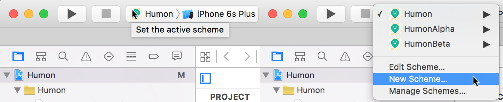
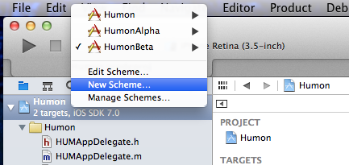
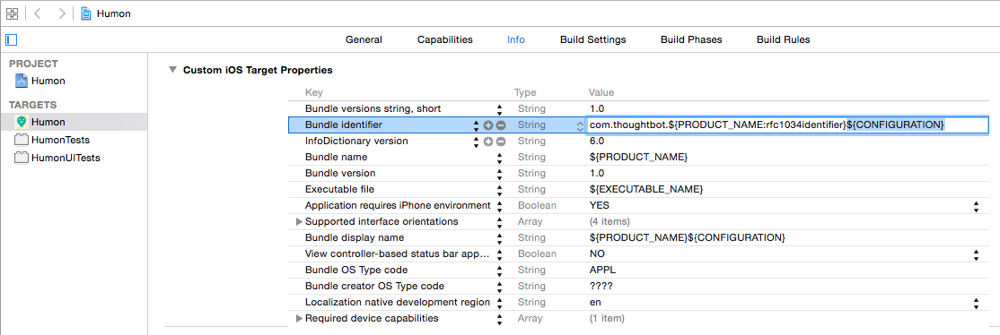
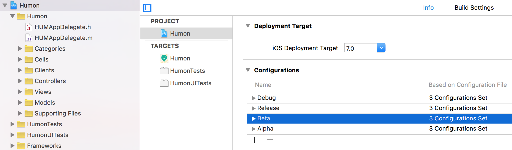
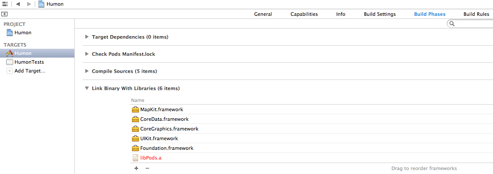
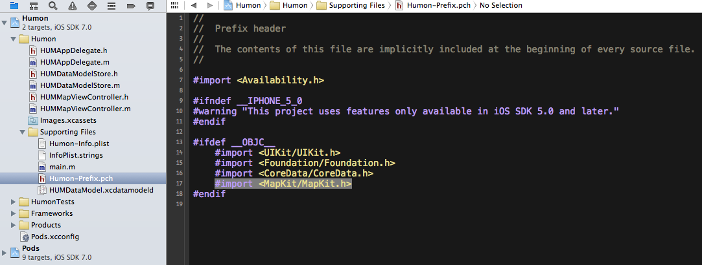
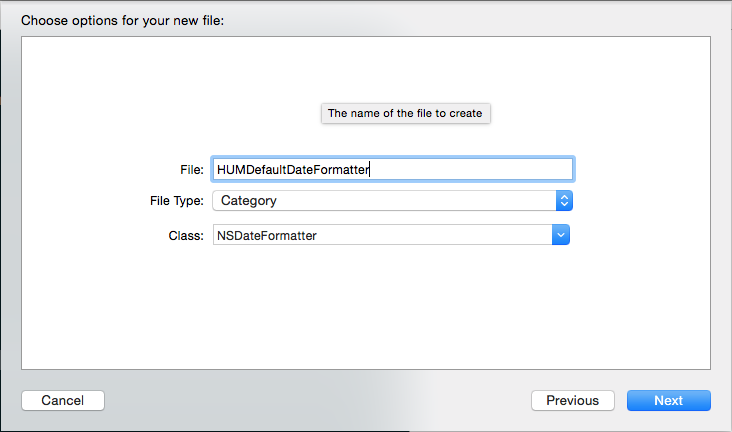

% iOS on Rails (Beta)
% thoughtbot; Jessie Young; Diana Zmuda

\clearpage

# Introduction

### Why this book?

There are many ways to build the backend for an iOS application but you only
need one. And depending on the complexity of the API you are going to create,
different solutions work best for different applications.

Just as Rails makes it possible to set up a basic web application in a matter of
minutes, Rails makes it possible to set up a basic API in a matter of minutes.
But deciding how to structure your API isn't easy. While experimenting with all
of the options is a fun weekend project, sometimes you just want to get going.
This book will help you do just that. While your API will no doubt require some
tweaking while fleshing out your iOS app, the approach we will be taking is to
define and build the API first, and then consume this API through our iOS app.

The Rails portions of *iOS on Rails* will guide you through what we have found
to be a robust, clean, flexible way of building out a JSON API with Rails. We
provide code samples for GET, POST, and PATCH requests. In addition, we will
explore some of the alternative approaches that we didn't choose and explain
why we made the choices that we did.

The iOS portion of the book will then walk, step-by-step, through creating an
iOS application that works with the Rails API you just created. The iOS
application will use each endpoint to post up objects and get back necessary
data for the user. Our model objects in the iOS app will correspond with the
model objects in the database, and be populated with response data from the
API.

### Who is this book for?

This book is for a developer who wants to build an iOS application with a Rails
backend. It's also a book for both a Rails developer and an iOS developer to
share and use in concert to create an app quickly and with more flexibility to
change it than a backend-as-a-service provider like StackMob or Parse.

The approach shared in this book is the result of our own experiments as Rails
and iOS developers working together to build an application. The Rails portions
of this book assume a basic working knowledge of how to build a web application
with Rails as well as the Ruby programming language. The iOS portions of this
book assume experience with object oriented programming and a
basic familiarity with the Objective-C programming language.

\mainmatter

\part{Building the Humon Rails App}

## Introduction to our example application and setup

### Example application

We will use a fake example application called Humon to explain and demonstrate
the concepts throughout this book. Humon is an app that lets you find nearby
events.

In the Humon application, a user can have many events as an event owner. An
event has geolocation information (latitude and longitude), which allows us to
plot it on a map. A user has and belongs to many events through attendances. A
user can only have one attendance per event.

The Humon application does not ask for a username or password. Instead, we will
use an ID unique to the device ('device token') to track unique users. The iOS
portion of the book will discuss where this token comes from. For now, all you
need to know is that users are identified by their devices. This approach does
not allow for multiple users per device or a single account across devices, but
it does enable users to start using the application immediately. Our desire to
create the simplest application possible led us to choose immediate usability
over a more complex authentication system.

We will provide code snippets in context, but you can also view the entire
[example application in
GitHub](https://github.com/thoughtbot/ios-on-rails/tree/master/example_apps/rails)
to see how it is structured.

### Setting up our project

We used [Suspenders](https://github.com/thoughtbot/suspenders), a Rails 4
template with thoughtbot's standard defaults, to start our project. Starting a
Rails app with Suspenders is simple, just follow the instructions in the
`README`.

While Suspenders is not required to follow along with this book, it does
conveniently include all of the gems we will use to test-drive our API,
including: [Factory Girl](https://github.com/thoughtbot/factory_girl_rails),
[RSpec](https://github.com/rspec/rspec-rails), and [Shoulda
Matchers](https://github.com/thoughtbot/shoulda-matchers). So if you choose not to
use Suspenders to start your project, make sure you add those gems to your
`Gemfile`.

### Parsing incoming JSON requests

[MultiJson](https://github.com/intridea/multi_json) is an adapter for JSON
parsers. Another adapter familiar to Rails developers is ActiveRecord. Just as
ActiveRecord provides a common interface to database drivers like Postgres and
MySQL, MultiJson provides a common interface to JSON parsers like Oj and Yajl.
We get MultiJson for free with Rails because MultiJson is a dependency of
ActiveSupport.

For parsing JSON, we chose the Oj gem. To use the Oj gem in your Rails
application, simply add it to your Gemfile and install it with the bundle
install command. We chose Oj because it is a really fast JSON parser. From the
MultiJson README:

> "When loading, libraries are ordered by speed. First Oj, then Yajl, then the
> JSON gem, then JSON pure. If no other JSON library is available, MultiJSON
> falls back to OkJson, a simple, vendorable JSON parser."

### Generating outgoing JSON responses

There is no shortage of methods to render a JSON response. We looked into
[Active Model
Serializers](https://github.com/rails-api/active_model_serializers),
[RABL](https://github.com/nesquena/rabl), and simply using the Rails `.as_json`
method. In the end we chose [Jbuilder](https://github.com/rails/jbuilder) for
rendering JSON because of its excellent community support (repo is maintained
under the Rails organization) and the consistency of its view logic to other
kinds of Rails views such as Haml, ERB, and Builder.

With Jbuilder, we render the JSON from Rails controllers like any other view.
We're able to use partials like any other Rails view template to compose JSON.
There's also a `cache!` method that has the same method signature as
[`ActionView::Helpers::CacheHelper`](http://api.rubyonrails.org/classes/ActionView/Helpers/CacheHelper.html)
and uses
[`Rails.cache`](http://guides.rubyonrails.org/caching_with_rails.html#cache-stores)
under the hood. We will delve into the details of views and caching in later
chapters.

### Versioning

Before we get started with building out our API, we must think about how we are
going to handle versioning. While web developers can deploy as often as they
want and users see the newly deployed code with every browser page refresh, iOS
developers have both a lag time before Apple approves the new version of an app
and a lag time before users update to the newest application version available.
iOS applications reference the same API endpoints until a new release of the
application has been downloaded. If you want to continue to support users with
older versions of the iOS application you are building, you must maintain the
same general JSON data structures on the backend for those users.

You will of course discover new and better ways of structuring your JSON
responses as time goes on and your application grows. Once that happens, the
easiest way to support old versions of the application and allow newer versions
to use different JSON structures is to release a new API version.

Releasing multiple versions of an API is outside the scope of this book, but
Ryan Bates has an excellent
[RailsCast](http://railscasts.com/episodes/350-rest-api-versioning) on this
topic. For now, we will future proof our API by including our views and
controllers within the api/v1
subdirectories. Our routes file looks like this:

    # config/routes.rb

    Humon::Application.routes.draw do
      scope module: :api, defaults: { format: 'json' } do
        namespace :v1 do ## resources will be here
      end
    end

The API is now scoped via the URL. For example, with our setup above, the
endpoint for a single event at version 1 of the API will live at
`#{Rails.root}/v1/event/:event_id`.

### API Documentation

In the early days of creating your JSON API, you will likely be changing the
data returned as well as the data structure on almost a daily basis. While
communication is both key and challenging on all software development teams, it
can be especially challenging when working across teams that speak different
programming languages. While Rails developers and iOS developers alike speak
“JSON”, we found that asking iOS developers to stay up to date with API changes
using source code on GitHub was difficult.

A solution we found for keeping all developers in sync was using GitHub’s wiki
feature as a source of API documentation. While updating the wiki after each API
change required a small amount of work for our Rails developers, having an place
where iOS developers could find up-to-date API documentation was an invaluable
resource. You can see how we structure our wiki
[here](https://github.com/thoughtbot/ios-on-rails/wiki/API-Endpoints).

If you are interested in exploring other documentation options, here are some
suggestions:

 * [fdoc](https://github.com/square/fdoc)
 * [apipie-rails](https://github.com/Pajk/apipie-rails)
 * [YARD](http://yardoc.org/)

## Creating a GET request

### It all starts with a request spec

At thoughtbot, we do test-driven and Outside-in development, which means that we
start work on any feature by writing a high-level test that describes user
behaviors. You can read a more detailed description of Outside-in development
[here](http://rubylearning.com/blog/2010/10/05/outside-in-development/), but the
benefits can be summarized as follows:

>  Outside-in along with the test-driven process helps you write just the
>  minimum amount of code that provides value to stakeholders, and not a line
>  more.

The external interface of our application will be the iOS app that GETs and
POSTs data to the Rails app, so [feature
specs](https://www.relishapp.com/rspec/rspec-rails/docs/feature-specs/feature-spec),
which usually interact with the application via web interfaces, do not make
sense. Jonas Nicklas, the creator of Capybara, [said it
best](http://www.elabs.se/blog/34-capybara-and-testing-apis): "Do not test APIs
with Capybara. It wasn't designed for it."

Instead, we will use [request
specs](https://www.relishapp.com/rspec/rspec-rails/docs/request-specs/request-spec).
RSpec request specs, like feature specs, are a great way to ensure the entire
stack is working together properly but via HTTP verbs, response codes, and
responses rather than browser interactions.

When writing our request specs, we found that we were calling
`JSON.parse(response.body)` over and over again. We abstracted this into a
method called
[`response_json`](https://github.com/thoughtbot/ios-on-rails/blob/master/example_apps/rails/spec/support/response_json.rb),
which we use below and in all of our request specs that include a JSON response.

    # spec/requests/api/v1/events/events_spec.rb

    require 'spec_helper'

    describe 'GET /v1/events/:id' do
      it 'returns an event by :id' do
        event = create(:event)

        get "/v1/events/#{event.id}"

        expect(response_json).to eq(
          {
            'address' => event.address,
            'ended_at' => event.ended_at,
            'id' => event.id,
            'lat' => event.lat,
            'lon' => event.lon,
            'name' => event.name,
            'started_at' => event.started_at.iso8601(3),
            'owner' => {
              'device_token' => event.owner.device_token
            }
          }
        )
      end
    end

### Model

This first error we will get for the request spec above is that our app does not
have a factory named `event`. FactoryGirl guesses the class of the object based
on the factory name, so creating the `event` factory is a good opportunity to
set up our `Event` model.

At the model level, Rails applications that serve a JSON API look exactly like
regular web applications built with Rails. Although the views and controllers
will be versioned, we will write our migrations like standard Rails migrations
and keep our models within the models directory. You can see the data migrations
for our example application
[here](https://github.com/thoughtbot/ios-on-rails/tree/master/example_apps/rails/db/migrate).

At this point, let's assume our `User` model has already been created.

Our `Event` model has a few validations and relations, so we will write tests
for those validations. In our development process, we would write the following
tests line-by-line, watching them fail, and writing the lines in our model one
at a time to make them pass. We will use FactoryGirl, Shoulda Matchers, and
RSpec for our unit tests. To see our full test setup, see our `spec_helper`
[here](https://github.com/thoughtbot/ios-on-rails/blob/master/example_apps/rails/spec/spec_helper.rb).

    # spec/models/event.rb

    require 'spec_helper'

    describe Event, 'Validations' do
      it { should validate_presence_of(:lat) }
      it { should validate_presence_of(:lon) }
      it { should validate_presence_of(:name) }
      it { should validate_presence_of(:started_at) }
    end

    describe Event, 'Associations' do
      it { should have_many(:attendances) }
      it { should belong_to(:owner).class_name('User') }
    end

To make the tests pass, we will write a migration (note: your file name will be
different, as the numbers in the name are generated based on the date and time
the migration was created):

    # db/migrate/20131028210819_create_events.rb

    class CreateEvents < ActiveRecord::Migration
      def change
        create_table :events do |t|
          t.timestamps null: false
          t.string :address
          t.datetime :ended_at
          t.float :lat, null: false
          t.float :lon, null: false
          t.string :name, null: false
          t.datetime :started_at, null: false
          t.integer :user_id, null: false
        end

        add_index :events, :user_id
      end
    end

and add those validations to the model:

    # app/models/event.rb

    class Event < ActiveRecord::Base
      validates :lat, presence: true
      validates :lon, presence: true
      validates :name, presence: true
      validates :started_at, presence: true

      belongs_to :owner, foreign_key: 'user_id', class_name: 'User'
    end

Once this is working, we can add the `event` Factory to
[`spec/factories.rb`](https://github.com/thoughtbot/ios-on-rails/blob/master/example_apps/rails/spec/factories.rb)
for use in our request spec.

### Controller

At this point, we can create an `event` object using FactoryGirl, but our
request spec is failing on the next line. This is because we have no routes set
up for the path we are using in our test's GET request (`get
"/v1/events/#{event.id}"`). To fix this, we need to add a controller and
configure our `routes.rb` file.

As we discussed in the versioning section of our introduction, we will add
controllers within `api/v1` directory so that we may release future versions of
our API without breaking older versions of our application.

Because our `routes.rb` file tells our controllers to look for the JSON format
by default, we do not need to tell our individual controllers to render JSON
templates. We do, however, need to add our new paths to our routes file:

    # config/routes.rb

    Humon::Application.routes.draw do
      scope module: :api, defaults: { format: 'json' } do
        namespace :v1 do
          resources :events, only: [:show]
        end
      end
    end

Aside from including our controller within the `api/v1 directory`, our
`EventsController` looks much like a standard Rails controller. To make our
request spec pass, we need to add a single action to our API:

    # app/controllers/api/v1/events_controller.rb

    class Api::V1::EventsController < ApplicationController
      def show
        @event = Event.find(params[:id])
      end
    end

### View

Our controller and routes are set up, but we still need one final piece before
our spec will pass: a view. Our request spec is looking for a view template with
some response JSON, but so we need to create that view.

For a Rails developer, the views are where there will be the most difference
between a standard web application and a JSON API.  As with our controllers, we
will include our views in the `api/v1` directory so that they are versioned.

Just like regular view partials, Jbuilder partials minimize duplication by
letting us re-use blocks of view code in many different places. JSON
representations of data frequently include duplication (a collection is usually
an array of the same JSON structure that would be found for a single object), so
partials are especially handy when creating a JSON API. We will use Jbuilder’s
DSL to tell our show view to find the event partial:

    # app/views/api/v1/events/show.json.jbuilder

    json.partial! 'event', event: @event

Our show GET view is looking for a partial named `_event.json.jbuilder` within
the `events` directory. So we will create that partial next:

    # app/views/api/v1/events/_event.json.jbuilder

    json.cache! event do
      json.address event.address
      json.ended_at event.ended_at
      json.id event.id
      json.lat event.lat
      json.lon event.lon
      json.name event.name
      json.started_at event.started_at

      json.owner do
        json.device_token event.owner.device_token
      end
    end

#### Caching our view

You might be wondering what the `json.cache!` at the top of our `event` partial
is doing. Jbuilder supports [fragment
caching](http://guides.rubyonrails.org/caching_with_rails.html#fragment-caching),
and you tell your app to cache a block of view code by wrapping it in a
`json.cache!` block. While the load time for the JSON in our view above is going
to be teeny tiny, adding fragment caching is simple and a good habit to get into
for apps that are likely to expand over time.

If you're interested in learning more about fragment caching, there is a great
[Railscast](http://railscasts.com/episodes/90-fragment-caching-revised) (paid)
on the topic.

### Putting it all together

We have now successfully created our first API endpoint for Humon and our
request spec should pass!

But let's test it manually just to make sure. Our iOS app isn't up and running
yet, so we will have to create records in Rails console. Make sure you are in
your project directory in Terminal, run `rails console` and the enter the
following:

    User.create(device_token: '12345')
    Event.create(
      address: '85 2nd Street',
      lat: 37.8050217,
      lon: -122.409155,
      name: 'Best event OF ALL TIME!',
      owner: User.find_by(device_token: '12345'),
      started_at: Time.zone.now
    )

Assuming this created your first event (`id` will equal 1) and you are running
`rails server` in Terminal (you will need to exit from Rails console or open a
new Terminal window to do this), when you visit `localhost:3000/v1/events/1` in
your browser you should see something like this:

    {
      "address":"85 2nd Street",
      "ended_at":"2013-09-17T00:00:00.000Z",
      "id":1,
      "lat":37.8050217,
      "lon":-122.409155,
      "name":"Best event OF ALL TIME!",
      "started_at":"2013-09-16T00:00:00.000Z",
      "owner":{
        "device_token":"234324235"
       }
     }

Alternatively, you can run a [curl](http://curl.haxx.se/docs/manpage.html)
request (`curl http://localhost:3000/v1/events/1`) from Terminal and see the
same JSON output.

Congratulations, you just created your first API endpoint with Rails!

## Creating a POST request

### Forgery protection strategy and Rails 4

Before we begin digging into creating POST requests to our API, we need to
change our forgery protection strategy.

Rails protects against [cross-site request
forgery](http://en.wikipedia.org/wiki/Cross-site_request_forgery) by protecting
your application from requests that are missing authenticity tokens. [An
explanation](http://stackoverflow.com/a/1571900/1019369) of authenticity tokens
in Rails:

> When the user views a form to create, update, or destroy a resource, the Rails
> app  would create a random `authenticity_token`, store this token in the
> session, and place it in a hidden field in the form. When the user submits the
> form, Rails would look for the `authenticity_token`, compare it to the one
> stored in the session, and if they match the request is allowed to continue.

Why this happens:

> Since the authenticity token is stored in the session, the client can not know
> its value. This prevents people from submitting forms to a Rails app
without viewing the form within that app itself. Imagine that you are using
service
A, you logged into the service and everything is ok. Now imagine that you went
to
use service B, and you saw a picture you like, and pressed on the picture to
view a
larger size of it. Now, if some evil code was there at service B, it might send
a 
request to service A (which you are logged into), and ask to delete your
account, by sending a request to `http://serviceA.com/close_account`. This is
what is known as
CSRF (Cross Site Request Forgery).

While protecting against CSRF attacks is a good thing, the default forgery
protection strategy in Rails 4 is problematic for dealing with POST requests to
APIs. If you make a POST request to a Rails endpoint (rather than using a
standard web form to create a record), you will see the following error:

    ActionController::InvalidAuthenticityToken

Rails lets us choose between forgery protection strategies. The default in Rails
4 is `:exception`, which we are seeing in action above. Rails recommends the
`:null_session` strategy for APIs, which empties the session rather than raising
an exception. Since we want this strategy for all API endpoints but not
necessarily all endpoints, we will create an `ApiController` that all of our API
controllers will inherit from and set the forgery protection strategy there:

    # app/controllers/api_controller.rb

    class ApiController < ApplicationController
      protect_from_forgery with: :null_session
    end

    # app/controllers/api/v1/events_controller.rb

    class Api::V1::EventsController < ApiController

    ...

    end

Now we're ready to get started on our first POST request.

### It all starts with a request spec

We will start working on our POST request the same way we began working on our
GET request: with a request spec.

    # spec/requests/api/v1/events/events_spec.rb

    describe 'POST /v1/events' do
      it 'saves the address, lat, lon, name, and started_at date' do
        date = 'Wed, 30 Oct 2013 11:59:55 -0700'.to_datetime
        device_token = '123abcd456xyz'
        owner = create(:user, device_token: device_token)

        post '/v1/events', {
          address: '123 Example St.',
          ended_at: date,
          lat: 1.0,
          lon: 1.0,
          name: 'Fun Place!!',
          started_at: date,
          owner: {
            device_token: device_token
          }
        }.to_json, { 'Content-Type' => 'application/json' }

        event = Event.last
        expect(response_json).to eq({ 'id' => event.id })
        expect(event.address).to eq '123 Example St.'
        expect(event.ended_at).to eq date
        expect(event.lat).to eq 1.0
        expect(event.lon).to eq 1.0
        expect(event.name).to eq 'Fun Place!!'
        expect(event.started_at).to eq date
        expect(event.owner).to eq owner
      end
    end

#### Controller

When we run the test above, our first error should be `No route matches [POST]
"/v1/events"`. This is exactly the error we would expect, since we haven't
defined this route in our `routes.rb` file. Let's fix that:

    #config/routes.rb

    Humon::Application.routes.draw do
      scope module: :api, defaults: { format: 'json' } do
        namespace :v1 do
          resources :events, only: [:create, :show,]
        end
      end
    end

When we run the spec again, our error has changed to

    The action 'create' could not be found for Api::V1::EventsController

This is good; it means the route we
added is working, but we still need to add a `create` method to our
`EventsController`. So let's do that:

    # app/controllers/api/v1/events_controller.rb

    class Api::V1::EventsController < ApiController
      def create
      end

      ...

    end

Run the spec again, and our error has changed to `Missing template
api/v1/events/create`. Again, receiving a different error message is a good
indication that the last change we made is bringing us closer to a passing test.

We will get back to the view layer in the next section, but for now let's just
create an empty file at `app/views/api/v1/event/create.json.jbuilder`, since
that will help us get to our next error.

Run the spec again, and our error has changed (hooray!) to:

     Failure/Error: expect(response_json).to eq({ 'id' => event.id })
       NoMethodError:
         undefined method `id' for nil:NilClass

If we look back at our spec, we can see that `id` is being called on `event`,
which is the variable name we assigned to `Event.last`. By saying that `id` is
an undefined method for `nil`, our error is telling us that `Event.last` is
`nil`.

And of course it is! We haven't added any logic into our controller that would
create an instance of `Event`; at the moment, all we have is an empty `create`
method. Time to add some logic:

    # app/controllers/api/v1/events_controller.rb

    class Api::V1::EventsController < ApiController
      def create
        @event = Event.new(event_params)

        if @event.save
          render
        end
      end

      ...

      private

      def event_params
        {
          address: params[:address],
          lat: params[:lat],
          lon: params[:lon],
          name: params[:name],
          started_at: params[:started_at],
          owner: user
        }
      end
    end

Our error message has changed yet again, and now it is time for us to move to
the final step: creating our view.

#### View

Our
[`EventsController`](https://github.com/thoughtbot/ios-on-rails/blob/master/example_apps/rails/app/controllers/api/v1/events_controller.rb)
is creating an `event`, but we are still getting an error when we run our spec
(note: your expectation might have a different `id` number depending on how many
time's you've run your test; that's fine):

    expect(response_json).to eq({ 'id' => event.id })
           expected: {"id"=>6}
            got: {}

The empty brackets we are getting tell us that our view is rendering an empty
JSON object. Time to fix our empty view template:

    # app/views/api/v1/events/create.json.jbuilder

    json.id @event.id

And with that, our test is passing. Nice work. But before we move on, let's not
forget our second POST spec.

### It all starts with a request spec, part II

Our first spec covered the "happy path," which
[Wikipedia](http://en.wikipedia.org/wiki/Happy_path) defines as the "a
well-defined test case using known input, which executes without exception and
produces an expected output." Our second test will show the "sad path," which
means that it will cover validation and error handling.

You might remember that our GET request section only contained a single test.
While these decisions are rarely black and white, it was our judgment that only
a "happy path" test was required for that endpoint. The "sad path" for a GET
request would occur when the `id` in the URL does not correspond to an existing
`event`. In that case, the application would return a [`404 Not
Found`](http://en.wikipedia.org/wiki/HTTP_404) response code, which is the
default behavior and therefore does not need to be tested.

By default, passing invalid attributes to our POST request would not create the
`event` and would return a response body without helpful error messages and a
misleading response code of [`200
OK`](http://en.wikipedia.org/wiki/HTTP_200#2xx_Success).

Because we want to change both the response body and the response code returned
when invalid attributes are used in a POST request, writing a test for that
scenario makes sense.

Let's move on to our "sad path" request spec and cover a POST request with
invalid attributes (it will go inside the same `describe` block as our first
POST request spec):

    # spec/requests/api/v1/events/events_spec.rb

    describe 'POST /v1/events' do

    ...

     it 'returns an error message when invalid' do
        post '/v1/events',
          {}.to_json,
          { 'Content-Type' => 'application/json' }

        expect(response_json).to eq({
          'message' => 'Validation Failed',
          'errors' => [
            "Lat can't be blank",
            "Lon can't be blank",
            "Name can't be blank",
            "Started at can't be blank",
          ]
        })
        expect(response.code.to_i).to eq 422
      end
    end

Creating an `event` without attributes does not work because of the validations
we set up in the GET request section of this book. If you need a refresher,
check out the validations on
[`Event`](https://github.com/thoughtbot/ios-on-rails/blob/master/example_apps/rails/app/models/event.rb).

Right now, rather than our response JSON containing the message and errors we
want to see, we get `{"id"=>nil}`. Time to look at the `EventsController`.

##### Controller

Right now, our controller doesn't contain any instructions for what to do in the
case that an `event` does not save properly, which is why we do not see the
message or errors included in our spec. So let's add those:

    # app/controllers/api/v1/events_controller.rb

    class Api::V1::EventsController < ApiController
      def create
        @event = Event.new(event_params)

        if @event.save
          render
        else
          render json: {
            message: 'Validation Failed',
            errors: @event.errors.full_messages
          }, status: 422
        end
      end

      ...

    end

With this change, our spec should be passing.

To manually test that this is working, make sure you are running `rails server`
and try a `curl` request in another Terminal window:

    $ curl --data "{}" http://localhost:3000/v1/events

You should see the same message and errors that are in the "sad path" spec
expectations.

With that, our second request spec is passing. Nice work!

## Creating a PATCH request

### It all starts with a request spec

We will start working on our PATCH request the same way we began working on our
other requests: with a request spec. In this test, we want to create an `event`
with the name `'Old Name'` and send a PATCH request to change the name to
`'New Name'`.

In our test setup, we will create the first event with `FactoryGirl` and then
use the PATCH request with a new event name in the parameters as the spec
exercise. Our expectation looks at the name of the `event` to confirm that it
was changed. The spec expectation also looks for the `event.id` in the
response, since that is what our iOS app will be expecting after a successful
PATCH request.

    # spec/requests/api/v1/events/events_spec.rb

    describe 'PATCH /v1/events/:id' do
      it 'updates the event attributes' do
        event = create(:event, name: 'Old name')
        new_name = 'New name'

        patch "/v1/events/#{event.id}", {
          address: event.address,
          ended_at: event.ended_at,
          lat: event.lat,
          lon: event.lon,
          name: new_name,
          owner: {
            device_token: event.owner.device_token
          },
          started_at: event.started_at
        }.to_json, { 'Content-Type' => 'application/json' }

        event = Event.last
        expect(event.name).to eq new_name
        expect(response_json).to eq({ 'id' => event.id })
      end

#### Controller

When we run the test above, we will again get a routing error: `No route
matches [PATCH] "/v1/events/13"` (note: your `id` will likely not be `13` like
mine, but the error message should otherwise be the same).

Let's add the `update` route to fix that:

    #config/routes.rb

    Humon::Application.routes.draw do
      scope module: :api, defaults: { format: 'json' } do
        namespace :v1 do
          resources :events, only: [:create, :show, :update]
        end
      end
    end

If we updated the `routes.rb` file correctly, running our test again should
produce a different error: `The action 'update' could not be found for
Api::V1::EventsController`.

What a nice, clear error message! Thank you, RSpec. Let's add that `update`
method to our controller.

Note: Rails' scaffolding places the `update` method second to last in the
controller, right above `destroy`. To stick with that convention, I will add
the `update` method below my other controller methods, right above the
`private` methods:

    # app/controllers/api/v1/events_controller.rb

    class Api::V1::EventsController < ApiController

     ...

      def update
      end

      private

      ...

    end

Run the spec again, and, our error has changed to `Missing template
api/v1/events/update`. Like we covered in the last section, receiving a
different error message is a good indication that the last change we made is
bringing us closer to a passing test.

We will address the view layer in the next section, but for now let's just
create an empty file at `app/views/api/v1/event/update.json.jbuilder`.

Run the spec again, and our error has changed (woot!) to:

    Failure/Error: expect(event.name).to eq new_name

       expected: "New name" got: "Old name"

See how handy the semantic variable naming in our test is?

Our route, controller method, and view template are in place. All that's left
is to add logic to our `update` method that actually updates our `event`:

    # app/controllers/api/v1/events_controller.rb

    def update
      @event = Event.find(params[:id])

      if @event.update_attributes(event_params)
        render
      end
    end

If we run our request spec again, we will find that `event.name` is now
updating correctly. Yay! But the test is still failing. Boo! Time to move onto
our view.

#### View

Our spec error now looks like this (note: your expectation might have a
different `id` number depending on how many time's you've run your test; that's
fine):

     Failure/Error: expect(response_json).to eq({ 'id' => event.id })

       expected: {"id"=>21} got: {}

Our view template exists, but is rendering an empty JSON object. And of course
it is, all we did was create an empty view template! Let's add the JSON our
test is expecting:

    # app/views/api/v1/events/update.json.jbuilder

    json.id @event.id

Our test passes!

### It all starts with a request spec, part II

If you guessed that our PATCH request requires two specs, you'd be right! One
thing we've found when creating APIs with Rails is that it's just as important
to return consistent, logical error messages and response codes as it is to
create endpoints and responses for valid requests.

Like our POST request, a PATCH request has as "sad path" where the parameters
passed are invalid. We need to create logic in our controller for that case,
and to test drive that logic we will write a request spec:

    # spec/requests/api/v1/events/events_spec.rb

    describe 'PATCH /v1/events/:id' do

      ...

      it 'returns an error message when invalid' do
         event = create(:event)

        patch "/v1/events/#{event.id}", {
           address: event.address,
           ended_at: event.ended_at,
           lat: event.lat,
           lon: event.lon,
           name: nil,
           owner: {
             device_token: event.owner.device_token
           },
           started_at: event.started_at
         }.to_json, { 'Content-Type' => 'application/json' }

         event = Event.last
         expect(event.name).to_not be nil
         expect(response_json).to eq({
           'message' => 'Validation Failed',
           'errors' => [
             "Name can't be blank",
           ]
         })
         expect(response.code.to_i).to eq 422
       end
     end

In our expectation above, we are hoping to see a `422` response, which is the
[most
appropriate](http://www.bennadel.com/blog/2434-HTTP-Status-Codes-For-Invalid-Data-400-vs-422.htm)
HTTP status code for a request with invalid (but not
[malformed](http://stackoverflow.com/a/20215807/1019369)) attributes.

The need for this test is apparent immediately upon running it: rather than
returning a validation erorr or telling response code, we are getting the same
response from a PATCH request with *invalid* parameters that we got from a PATCH
request with *valid* parameters:

     Failure/Error: expect(response_json).to eq({

       expected: {"message"=>"Validation Failed", "errors"=>["Name can't be blank"]}
            got: {"id"=>24}

Our iOS app will have no way of knowing that a request with invalid parameters
was passed, since it returns the same JSON either way.

To fix this, we will add a branching statement to our controller method that
renders the `event` error messages (note: these error messages already exist
because of the validations we set up in our `Event` model) and a `422` status:

    # app/controllers/api/v1/events_controller.rb

    class Api::V1::EventsController < ApiController

      ...

      def update
        @event = Event.find(params[:id])

      if @event.update_attributes(event_params)
        render
      else
        render json: {
          message: 'Validation Failed',
          errors: @event.errors.full_messages
        }, status: 422
      end

Phew! Our test passes.

Hooray! We've now successfully implemented 3 different HTTP requests
in our Rails API. Don't forget to update the API documentation. Next we'll
be having some fun with geocoding!

## Creating a geocoded GET request

### What is geocoding?

> Geocoding is the process of finding associated geographic coordinates (often
> expressed as latitude and longitude) from other geographic data, such as
> street addresses, or ZIP codes.

-- [Wikipedia](http://en.wikipedia.org/wiki/Geocoding).

Geocoding gives us the power to take location information from humans and turn
it into something that a computer can understand and reason about.

[Yelp](http://www.yelp.com), for example, does not ask businesses to add their
latitude and longitude when creating a profile. Instead, they ask for the
street address and zipcode, which the Yelp application transforms into a
latitude and longitude that can be plotted on a map.

This is important because humans don't think in the decimal precision terms of
latitude and longitude, but computers do. A web application that receives
location information from humans will always receive a string of text, and that
application cannot plot locations on a map or compute distances between points
without turning that text into a set of coordinates.

There are many approaches to geocoding with Rails. If you're interested in
learning more, thoughbot's [*Geocoding on
Rails*](https://learn.thoughtbot.com/products/22-geocoding-on-rails) provides a
thorough analysis and discussion of the various options.

### Geocoding in Humon: choosing a library

For Humon, we aren't going to be transforming one type of geographic data to
another. What we want is to be able to receive a latitude and longitude from
the iOS application and return the closest events to those coordinates.

After consulting *Geocoding on Rails*, we chose the
[Geocoder](https://github.com/alexreisner/geocoder) gem for Humon. It supports
distance queries, is simple to use, and is under active development.

### It all starts with a request spec

Before we jump into setting up our `Event` model with the Geocoder gem, let's
write a request spec for this new endpoint. Since this new endpoint will
require a controller of its own, we will create an `events` directory within
`spec/requests` and include this spec there:

    # spec/requests/api/v2/events/nearest_spec.rb

    describe 'GET /v1/events/nearest?lat=&lon=&radius=' do
      it 'returns the events closest to the lat and lon' do
        near_event = create(:event, lat: 37.760322, lon: -122.429667)
        farther_event = create(:event, lat: 37.760321, lon: -122.429667)
        create(:event, lat: 37.687737, lon: -122.470608)
        lat = 37.771098
        lon = -122.430782
        radius = 5

        get "/v1/events/nearest?lat=#{lat}&lon=#{lon}&radius=#{radius}"

        expect(response_json).to eq([
          {
            'address' => near_event.address,
            'ended_at' => near_event.ended_at,
            'id' => near_event.id,
            'lat' => near_event.lat,
            'lon' => near_event.lon,
            'name' => near_event.name,
            'owner' => { 'device_token' => near_event.owner.device_token },
            'started_at' => near_event.started_at.iso8601(3),
          },
          {
            'address' => farther_event.address,
            'ended_at' => farther_event.ended_at,
            'id' => farther_event.id,
            'lat' => farther_event.lat,
            'lon' => farther_event.lon,
            'name' => farther_event.name,
            'owner' => { 'device_token' => farther_event.owner.device_token },
            'started_at' => farther_event.started_at.iso8601(3),
          }
        ])
      end
    end

### Controller

When we run the test above, we get an interesting error:

    ActiveRecord::RecordNotFound:
       Couldn't find Event with id=nearest

What's that about!? If we run `rake routes` in our shell we'll see that our app
has the following GET endpoint defined:

    GET   /v1/events/:id(.:format)  api/v1/events#show

Rails is matching `get '/v1/events/nearest'` to this pattern and thinks we are
looking for an `event` with an `id` of `nearest`. How do we fix this? We need
to tell our Rails app that a GET request at `events/nearest` is different from
a GET request at `events/:id`:

    # config/routes.rb

    Humon::Application.routes.draw do
      scope module: :api, defaults: { format: 'json' } do
       namespace :v1 do
          namespace :events do
            resource :nearest, only: [:show]
          end

      ...

        end
      end
    end

If we run `rake routes` in the shell again, we'll see that there's a new GET
endpoint:

    GET   /v1/events/nearest(.:format) api/v1/events/nearests#show

And when we run our test again, our error has changed:

    ActionController::RoutingError:
       uninitialized constant Api::V1::Events::NearestsController

Nice! Time to define that controller. In the
[`NearestsController`](https://github.com/thoughtbot/ios-on-rails/blob/master/example_apps/rails/app/controllers/api/v1/events/nearests_controller.rb),
we will be using the [`near`
scope](https://github.com/alexreisner/geocoder#location-aware-database-queries)
(given to us by the Geocoder gem) which takes in a latitude-longitude pair,
radius, and units as arguments:

    # app/controllers/api/1/events/nearests_controller.rb

    class Api::V1::Events::NearestsController < ApiController
      def show
        @events = Event.near(
          [params[:lat], params[:lon]],
          params[:radius],
          units: :km
        )
      end
    end

Run the test again, and again, our test is failing:

     NoMethodError:
       undefined method `near' for #<Class:0x007ffba8583468>

Oh yeah! We forgot to actually add the Geocoder gem. Let's do that now.

### Model (and Gemfile)

Let's start by adding `gem 'geocoder'` to our
[Gemfile](https://github.com/thoughtbot/ios-on-rails/blob/master/example_apps/rails/Gemfile)
and running `bundle install`.

We already have the `lat` and `lon` attributes on our `Event` model, so no need
for a database migration. If we run our test again, however, we will get the
same `undefined method` error that we got before.

According to the [Geocoder
README](https://github.com/alexreisner/geocoder#object-geocoding), "your model
must tell Geocoder which method returns your object's geocodable address".
Since our model is *already* geocoded (meaning: it already has the latitude and
longitude set) we need to tell Geocoder which attributes store latitude and
longitude:

    # app/models/event.rb

    class Event < ActiveRecord::Base

      ...

      reverse_geocoded_by :lat, :lon

    end

This setup is a bit confusing. If we were *reverse geocoding*, we would be
looking at the latitude and longitude in order to find an address. On the other
hand, if we were *geocoding*, we would be turning an address string into a set
of coordinates.

In Humon we're neither geocoding nor reverse geocoding. We're using geolocation
information to find objects that are close to each other using Geocoder's
`near` scope. By adding the line above to our `Event` model, we are telling
Geocoder that this is a geocoded model and that the geocoded coordinates are
named `lat` and `lon`.

An illustrative example: comment out the new line in our `Event` model above
and open a Rails console. Create or select an `event`:

    irb(main):001:0> event = Event.first

    irb(main):002:0> event.geocoded?

    NoMethodError: undefined method `geocoded?' for #<Event:0x007fdb4e4353b0>

Does this error message look familiar? Answer: yes! This is the same type of
error we got when we last ran our test.

Let's exit our Rails console, add `reverse_geocoded_by :lat, :lon` back to the
`Event` model, and then open a new Rails console and do the same thing:

    irb(main):001:0> event = Event.first

    irb(main):002:0> event.geocoded?

    => true

By adding `reverse_geocoded_by`, we are telling Geocoder that this is a
geocoded object, and consequently giving our `Event` model access to Geocoder's
instance methods, such as `geocoded?`, and scopes, such as `near`.

When we run our test again, and it passes! Time to address the sad path...

### It all starts with a request spec, part II

We want to explicitly define what happens when there are no events nearby.
Let's do that through writing a test first:

    # spec/requests/api/v1/events/nearest_spec.rb

    describe 'GET /v1/events/nearest?lat=&lon=&radius=' do

     ...

      it 'returns an error message when no event found' do
        lat = 37.771098
        lon = -122.430782
        radius = 1

        get "/v1/events/nearest?lat=#{lat}&lon=#{lon}&radius=#{radius}"

        expect(response_json).to eq({ 'message' => 'No Events Found' })
        expect(response.code.to_i).to eq 200
      end
    end

  When we run this test, we get the following error:

     expected: {"message"=>"No Events Found"}
           got: []

### Controller

Time to add some branching in our controller so that we're returning the
correct message.

    # app/controllers/api/v1/events/nearests_controller.rb

    class Api::V1::Events::NearestsController < ApiController
      def show

      ...

        if @events.any?
          render
        else
          render json: { message: 'No Events Found' }, status: 200
        end
      end
    end

And just like that, our test is now passing.

\part{Building the Humon iOS App}

## Introduction

The iOS portion of this book will cover creating a new Xcode project, using a
few cocoapods to help you get started, and making basic API requests to the API
you just created.

If you haven't created a project with Xcode before, there are images included to
help you navigate the wilds that are Apple's Objective-C editor. Xcode is an
exciting editor that may take a bit of getting used to, so if you would like a
primer please visit [Apple's Xcode
Overview.]("https://developer.apple.com/library/mac/documentation/ToolsLanguages/Conceptual/Xcode_Overview/About_Xcode/about.html")

Rails developers will find that cocoapods feels quite familiar given that the
dependency manager is written in Ruby and allows you to use iOS libraries
similar to how you use Ruby gems. A good understanding of object oriented
programming is also required for the iOS portion of this book. Like Rails, iOS
uses the Model-View-Controller design pattern, with the caveat that most of your
controllers will instead be called ViewControllers.

## A New Xcode Project

As with any iOS app, the first step is to create a new project in Xcode. Create a new, empty project with your own name and identifier. Running the project for the first time will yield a white screen.

## Alpha and Beta Schemes

Distributing a Beta version of your app to testers before submitting to the app store is a vital part of the submittal process for medium to large scale apps. Humon may be a small app now, but we are going to set up a Alpha and Beta configuration and scheme in order to follow with best practices.

Every time you want to distribute a new build to Beta testers, you'll archive it and save it for ad hoc distribution. So, what we're going to do is create a Beta scheme that we'll use every time we archive a Beta version of the app. We'll use the default Humon scheme for archiving the actual production version of the app. The only differences between the new schemes will be the API endpoint (staging or production) we're hitting, the app name on the home screen, and the app's bundle ID.

Setting these manually is perfectly fine as well, but keeping separate configurations for Alpha, Beta, and production ensures that we never forget something important, like switching out the staging endpoint. The following steps will refer to creating the Beta scheme and are exactly the same for creating an Alpha scheme.

### Setting Up the New Schemes

1. **Create the new configuration**

	

    Select the Humon project and create a new configuration that's a duplicate of release, and call this new configuration Beta.
	
2. **Create the new scheme**

	

	Create a new scheme that's a duplicate of the main Humon scheme. Call this scheme HumonBeta.
	
	
	
	Set this scheme's run build configuration and archive build configuration to Beta.)

3. **Automate the bundle identifier and display name**

	

	Under "Info", change the Bundle identifier and the Bundle display name to include `${CONFIGURATION}`. `${CONFIGURATION}` evaluates to the name of the current build configuration.
   
	Now the name of the Beta app will display as HumonBeta and the bundle identifier will be com.thoughtbot.HumonBeta.
	
4. **Use the user-defined setting in a pre-processor macro.**

	
	
	Under "Build Settings", search for preprocessor macros and add `ROOT_URL='@"yourProductionURL"'` to the release and Beta configurations and `ROOT_URL='@"yourStagingURL"'` for debug and Alpha configurations.
	
5. **Build the app using the new scheme.**

	The app's name should display as HumonBeta if everything has been configured correctly. In addition, you can now use `ROOT_URL` instead of a string literal everywhere you want to conditionally use your staging or production base URL.

## Managing Dependencies

### Using CococaPods

Before we create our new iOS project, lets discuss the libraries and resources we're going to be using.

We'll be using CocoaPods to manage our dependencies. Cocoapods is a ruby gem and command line tool that makes makes it easy to add dependencies to your project. Alternatively, you can use git submodules, but using CocoaPods is our preference due to its ease of implementation and the wide variety of third party libraries available as pods. CocoaPods will not only download the libraries we need and link them to our project in Xcode, it will also allow us to easily manage and update what version of each library we want to use we want to use.

With a background in ruby, it may help to think of CocoaPod "pods" as gems, meaning that podfiles function similarly to gemfiles and podspecs are similar to gemspecs. `$ pod install` can be thought of as running `$ bundle install`, except for the fact that a pod install inserts the actual libraries into your project's pod directory.

### CocoaPods Setup

What follows is a succinct version of the instructions on the [CocoaPods](http://guides.cocoapods.org/using/getting-started.html) website:

1. `$ gem install cocoapods`

2. Create a podfile text file in your iOS project's root directory using your editor of choice.

3. `$ pod install`

4. If you have your iOS project open in Xcode, close it and reopen the workspace that Cocoapods generated for you.

5. When using CocoaPods in conjunction with git, you may choose to ignore the Pods directory so that the libraries that CocoaPods downloads are not under version control. If you want to do this, add `Pods` your .gitignore. Anyone who clones your project will have the Podfile and can `$ pod install` to retrieve the libraries and versions that the project requires.

### Humon's Podfile

Installing the CocoaPods gem and creating a podfile is covered in more detail on their website. Below is the podfile we're going to use for this project, which indicates what libraries we'll be using.

	platform :ios, '7.0'
	
	pod 'TestFlightSDK', '~> 2.0'
	pod 'Parse', '~> 1.2.11'
	
	pod 'AFNetworking', '~> 2.0'
	pod 'SSKeychain', '~> 1.2.1'
	pod 'SVProgressHUD', '~> 1.0'
	
	target :HumonTests, :exclusive => true do
		pod 'Kiwi', '~> 2.2'
	end

The `:exclusive => true do` block ensures that the HumonTests target only links to the testing frameworks inside the block. The frameworks outside the block will still be available to HumonTests target. Since they'll be available to the Humon target, which the testing

We will be using the TestFlight SDK to distribute our app to Beta testers. Parse will be used for push notifications by both the iOS app and the Rails app. AFNetworking will handle our API network requests, SSKeychain will help us save user info to the keychain, and SVProgressHUD will let us display loading views to the user.

Once you've updated your podfile, go ahead and run `$ pod install`

## The Mobile App's Skeleton

The Humon app is going to have 3 distinct view controller types, which we will create empty versions of now.

1. The initial view will contain a large map with pins for events that are near you, events you've created, and events you are tracking. It will also contain a button for adding a new event.

2. The views for creating, viewing, and editing an event will be very similar. The entire view will be filled with a table which allows the user to change the address, name, and time of an event or to simply view these properties.

	Creating, viewing, and editing will be handled by distinct view controller classes but each of these will use the same classes of table view cells.

3. The last view will display after the user creates an event to confirm that it has been posted using our API. A button will allow users to post the event to social media sites using a standard activity view controller.

## The Map View Controller

### Add the MapKit Framework

First, since we're going to be using a map view, we'll need to add the `MapKit.framework` to our Humon target.

Now we can import MapKit in the Humon-Prefix file so we can access the map framework throughout the project.

### Create the New View Controller

Create a new view controller subclass called HUMMapViewController by selecting file>new>file. This will create a header (.h) and implementation (.m) file.

### Set the Root View Controller

Now that we have a view controller subclass that will serve as our initial view controller in the app, we can show this view controller on launch. The app delegate has a method for exactly this purpose, called `application:didFinishLaunchingWithOptions:`, which we will overwrite.

	// HUMAppDelegate.m

    - (BOOL)application:(UIApplication *)application
        didFinishLaunchingWithOptions:(NSDictionary *)launchOptions
    {
        self.window = [[UIWindow alloc] initWithFrame:
                       [[UIScreen mainScreen] bounds]];
        
        HUMMapViewController *viewController = [[HUMMapViewController alloc] init];
        self.window.rootViewController = viewController;
        [self.window makeKeyAndVisible];
        
        return YES;
    }
    
The `UIWindow` class handles presenting views onto the screen of the device. In the app delegate, set`self.window` to an instance of `UIWindow` 

Then create a new instance of `HUMMapViewController` and set it as the window's `rootViewController`. This make the map view controller the first view controller we see on a fresh launch of the app.

To set an instance of `HUMMapViewController` as the initial view controller in the app delegate, we need to add `#import "HUMMapViewController.h"` near the top of the `HUMAppDelegate.m`. If we don't, the compiler will throw an error since the app delegate needs to be aware of a class before instantiating an insta

Finally, call `makeKeyAndVisible` on the window to make the window visible so you can see your views on the device screen.

Run the app and you'll see an instance of your `HUMMapViewController`!

### Create the MapView

Inside your implementation file, create a new property called mapView. Alternatively, you can place this property in the header file, but keeping properties private by placing them in the "hidden" interface located in the implementation file is preferable if possible. 

Also, declare that the HUMMapViewController conforms to the MKMapViewDelegate protocol by adding `<MKMapViewDelegate>`. This allows the HUMMapViewController to respond to delegate messages that the `mapView` sends.

	// HUMMapViewController.m
	
	@interface HUMMapViewController () <MKMapViewDelegate>
	
	@property (strong, nonatomic) MKMapView *mapView;
	
	@end

Now we want to fill the entirety of the HUMMapViewController's view with a mapView. Inside of your viewDidLoad method, instantiate a map view and add it as a subview of the main view. 

Remember to set HUMMapView as the delegate of `self.mapview` so it can respond to delegate messages like `mapView:regionDidChangeAnimated:`.

	// HUMMapViewController.m
	
	@implementation HUMMapViewController
	
	- (void)viewDidLoad
	{
	    [super viewDidLoad];
		
        self.mapView = [[MKMapView alloc] initWithFrame:self.view.frame];
        self.mapView.delegate = self;
        self.mapView.showsUserLocation = YES;
        [self.view addSubview:self.mapView];
	}
	
	@end

### Create the Add Button

Add a new property below the mapView property which is of type UIButton.

	// HUMMapViewController.m
	
	@property (strong, nonatomic) MKMapView *mapView;
	@property (strong, nonatomic) UIButton *addButton;

Instantiate `self.addButton` and add it as a subview of the HUMMapViewController's view inside the viewDidLoad method.

	// HUMMapViewController.m
	
	- (void)viewDidLoad
	{
	    [super viewDidLoad];
		
		// Create and add a mapView as a subview of the main view
        self.mapView = [[MKMapView alloc] initWithFrame:self.view.frame];
        self.mapView.delegate = self;
        self.mapView.showsUserLocation = YES;
        [self.view addSubview:self.mapView];
        
		// Create a frame and label for the "Add" button
        CGRect buttonFrame = CGRectMake(0,
                                        self.view.bounds.size.height - 2*44,
                                        self.view.bounds.size.width,
                                        44);
        NSString *buttonText = NSLocalizedString(@"Add Event", nil);
        
        // Create and add the "Add" button as a subview
        self.addButton = [[UIButton alloc] initWithFrame:buttonFrame];
        self.addButton.backgroundColor = [UIColor grayColor];
        self.addButton.alpha = 0.8;
        [self.addButton setTitle:buttonText
                        forState:UIControlStateNormal];
        [self.addButton addTarget:self
                           action:@selector(addButtonPressed)
                 forControlEvents:UIControlEventTouchUpInside];
        [self.view addSubview:self.addButton];
		
    }
    
For more information on why we used an NSLocalizedString here instead of a `@"plain old string literal"`, please visit the [Apple developer library.](https://developer.apple.com/library/ios/documentation/Cocoa/Conceptual/LoadingResources/Strings/Strings.html#//apple_ref/doc/uid/10000051i-CH6) The short explanation is that we use localized strings for all text that will be displayed to a user. That way we can easily translate our app from English to other languages.

The `addTarget:action:ForControlEvents:` method sets the add button up to call the `addButtonPressed` method when the button is tapped. For now, just add a method called addButtonPressed below the viewDidLoad method that logs a confirmation.

	// HUMMapViewController.m
	
	- (void)addButtonPressed
	{
    	NSLog(@"You pressed the add button!");
	}
	
Go ahead and run your project. If everything is set up correctly, you should see a full screen mapView and a grey button for adding events.

## The Add an Event View Controller

### Subclassing UITableViewController

Create a new subclass of UITableViewController called HUMAddEventViewController. UITableViewController is a subclass of UIViewController that has a tableView property and conforms to the `<UITableViewDataSource>` and `<UITableViewDelegate>` protocols. This means that we have to implement the `tableView:numberOfRowsInSection:` and `tableView:cellForRowAtIndexPath:` so the tableView will know how many cells to display and what these cells will look like. If we don't implement these required protocol methods, the compiler will throw an error.

	// HUMAddEventViewController.m
	
	- (NSInteger)tableView:(UITableView *)tableView 
		numberOfRowsInSection:(NSInteger)section
	{
    	return 6;
	}

    - (UITableViewCell *)tableView:(UITableView *)tableView
             cellForRowAtIndexPath:(NSIndexPath *)indexPath
    {
        UITableViewCell *cell = [tableView
                        dequeueReusableCellWithIdentifier:HUMAddEventCellIdentifier
                                             forIndexPath:indexPath];
        if (indexPath.row == 5)
            cell.textLabel.text = NSLocalizedString(@"Done", nil);
        
        return cell;
    }

The method `tableView:cellForRowAtIndexPath:` returns a cell for every row in the tableview. Instead of instantiating and returning a new cell every time, we use `dequeueReusableCellWithIdentifier:forIndexPath:` so that we can reuse cells that have already been instantiated. The identifier argument allows you to recycle different types of cells, in case you wanted to have a `@"GreenCellIdentifier"` and a `@"BlueCellIdentifier"`.

Using a static string as the identifier is suggested, since the string is constant and should only have to be instantiated once. If you place `static NSString *const HUMAddEventCellIdentifier = @"HUMAddEventCellIdentifier";` inside your HUMAddEventViewController implementation file, you can use refer to this `@"HUMAddEventCellIdentifier"` string as `HUMAddEventCellIdentifier` throughout the file.

	// HUMAddEventViewController.m
	
	- (void)viewDidLoad
	{
    	[super viewDidLoad];
    
    	[self.tableView registerClass:[UITableViewCell class]
           	   forCellReuseIdentifier:HUMAddEventCellIdentifier];
	}

If we want to be able to reuse cells using the `HUMAddEventCellIdentifier`, we have to register a class that the tableView will create or reuse an instance of when we call `dequeueReusableCellWithIdentifier:forIndexPath:`. We do this inside of `viewDidLoad`.

### Linking the Add Button to the HUMAddEventViewController

Now that we have created a HUMAddEventViewController we can create and show the add view from the HUMMapViewController. Go back to the HUMMapViewController's implementation file and add `#import "HUMAddEventViewController.h"` below the `#import "HUMMapViewController.h"` to import the header file we created in the previous section.

Now we can replace the `addButtonPressed` method to present a HUMAddEventViewController. When we press the Add button on top of the map view, we can either:

1. Push a new HUMAddEventViewController onto a navigation stack that contains both it and the HUMMapViewController
	
2. Present a new HUMAddEventViewController modally.
	
Having the HUMMapViewController present modally means that the HUMAddEventViewController will animate sliding up from the bottom. Pushing onto the navigation stack would give us the "Back" functionality for dismissing views, but in our case we actually want to present modally and use a custom "Cancel" dismissal.

	// HUMMapViewController.m
	
	- (void)addButtonPressed
	{
    	HUMAddEventViewController *addEventViewController = [[HUMAddEventViewController alloc] init];
    	UINavigationController *navigationController = [[UINavigationController alloc] initWithRootViewController:addEventViewController];
    	[self presentViewController:navigationController animated:YES completion:nil];
	}

Since the `addEventViewController` isn't being placed on a navigation stack with the HUMMapViewController, it won't have a navigation bar by default. We'll place the `addEventViewController` inside its own navigation controller so that it will have a navigation stack and navigation bar of its own.

Now we can present the `navigationController` instead of the `addEventViewController`. This presents the entire `navigationController`'s navigation stack, but right now the only view controller inside the navigation stack is the `addEventViewController`.

You can run the Humon app now and press the "Add" button. However, you won't be able to cancel out of the HUMAddEventViewController, so lets handle that next.

### Adding a Cancel Button

Inside the HUMAddEventViewController, add a left aligned bar button item to the navigation bar. This bar button item will call the method `cancelButtonPressed` which calls a method on the view controller that presented the HUMAddEventViewController (which in this case is the HUMMapViewController) to dismiss.

	// HUMAddEventViewController.m

    - (void)viewDidLoad
    {
        [super viewDidLoad];
        
        [self.tableView registerClass:[UITableViewCell class]
               forCellReuseIdentifier:HUMAddEventCellIdentifier];
        
        self.navigationItem.leftBarButtonItem = [[UIBarButtonItem alloc]
                       initWithBarButtonSystemItem:UIBarButtonSystemItemCancel
                                            target:self
                                            action:@selector(cancelButtonPressed)];
    }

    - (void)cancelButtonPressed
    {
        [self.presentingViewController dismissViewControllerAnimated:YES
                                                          completion:nil];
    }
	
If you run the app now, you'll be able to summon and dismiss the HUMAddEventViewController.

## The Confirmation View Controller

Create a subclass of UIViewController and call it HUMConfirmationViewController. The view for this view controller will contain a share button and an edit button, in case the user wants to change the event they just created.

### Adding a Cancel Button

Add a cancel button as you did in the Add an Event View Controller section. We want the user to be able to cancel directly out of this screen, and not be able to go back to the event they just posted. If the user wants to change the details on an event they just created, they can explicitly follow the edit button.

    // HUMConfirmationViewController.m

    - (void)viewDidLoad
    {
        [super viewDidLoad];
        
        self.navigationItem.leftBarButtonItem = [[UIBarButtonItem alloc]
                       initWithBarButtonSystemItem:UIBarButtonSystemItemCancel
                                            target:self
                                            action:@selector(cancelButtonPressed)];
        self.navigationItem.hidesBackButton = YES;
    }

To disable the back button, we just add `self.navigationItem.hidesBackButton = YES;` right below where we added the left bar button item in `viewDidLoad`.

### Adding a Share Button

Lets add a share button so that users can share their events with their friends. We're going to use some of the default social share functions that are included in the UIActivityViewController.

Create a share button similarly to how we did in the HUMMapViewController. This time, however, lets factor out creating a share button into its own method. We can then call this method `[self createShareButton]` inside of `viewDidLoad`.

    // HUMConfirmationViewController.m

    - (void)createShareButton
    {
        CGRect shareFrame = CGRectMake(self.view.bounds.size.width/2,
                                       self.view.bounds.size.height - 2*44,
                                       self.view.bounds.size.width/2,
                                       44);
        self.shareButton = [[UIButton alloc] initWithFrame:shareFrame];
        self.shareButton.backgroundColor = [UIColor lightGrayColor];
        [self.shareButton setTitle:@"Share Event" forState:UIControlStateNormal];
        [self.shareButton addTarget:self
                             action:@selector(presentActivityViewController)
                   forControlEvents:UIControlEventTouchUpInside];
        [self.view addSubview:self.shareButton];
    }
    
We set the share button to call the method `presentActivityViewController` when tapped, so we have to implement that method inside of HUMConfirmationViewController.

    // HUMConfirmationViewController.m

    - (void)presentActivityViewController
    {
        UIActivityViewController *activityViewController =
            [[UIActivityViewController alloc]
                initWithActivityItems:@[@"Event info"]
                applicationActivities:nil];
        [activityViewController setExcludedActivityTypes:
            @[UIActivityTypeCopyToPasteboard, UIActivityTypePrint]];
        [self presentViewController:activityViewController
                           animated:YES
                         completion:nil];
    }

Inside of the method, we create and present a UIActivityViewController. The activityViewController contains activities that allow users to save pictures to their camera roll, or post links to twitter, etc. When we initialize this view controller, we have to include an array of activity items that we want to save or post or share. The activity items you include can be strings, images, or even custom objects. In our case, we're going to want to include a dummy string that will later contain our event info.

We also set the activityViewController's excludedActivityTypes so that the activity view that pops up will not allow the user to copy the event text or print it. There are quite a few activity types that Apple provides by default in the UIActivityViewController and you can exclude them by including them in the array of excluded types. Keep in mind that some options won't always be available, like "Save to Camera Roll" which is only available if one of the activity items is a UIImage.

### Adding an Edit Button

We'll allow the user to edit their event after creating it, to utelize the PATCH functionality we have in our rails app. Create a method that adds an edit button to the view, and call the method in `viewDidLoad`. If you want to clean your code up even more, you can create a custom subclass of UIButton for this editButton.

    // HUMConfirmationViewController.m

    - (void)createEditButton
    {
        CGRect editFrame = CGRectMake(0,
                                      self.view.bounds.size.height - 2*44,
                                      self.view.bounds.size.width/2,
                                      44);
        self.editButton = [[UIButton alloc] initWithFrame:editFrame];
        self.editButton.backgroundColor = [UIColor darkGrayColor];
        [self.editButton setTitle:@"Edit Event" forState:UIControlStateNormal];
        [self.editButton addTarget:self
                            action:@selector(presentEditViewController)
                  forControlEvents:UIControlEventTouchUpInside];
        [self.view addSubview:self.editButton];
    }
    
We set the edit button to call a method called `presentEditViewController`, so lets create that method so we can fill it in later.
    
    // HUMConfirmationViewController.m
    
	- (void)presentEditViewController
	{
    	NSLog(@"You pressed the edit button!");
	}

### Linking the Confirm Button to the HUMConfirmationViewController

Once the user has successfully created their event, we will present them with the confirmation view. For now, we'll display the confirmation view whenever the user presses the 6th cell in the HUMAddEventViewController, which says "Done".

	//HUMAddEventViewController.m

    - (void)addButtonPressed
    {
        HUMAddEventViewController *addEventViewController =
            [[HUMAddEventViewController alloc] init];
            
        UINavigationController *navigationController = [[UINavigationController
            alloc] initWithRootViewController:addEventViewController];
            
        [self presentViewController:navigationController
                           animated:YES
                         completion:nil];
    }
    
Be sure to `#import HUMConfirmationViewController.h` in HUMAddEventViewController.m so you can use it in this method.

The method `tableView:didSelectRowAtIndexPath:` is one of the `<UITableViewDelegate>` methods that the tableView will call on HUMAddEventViewController if the view controller is set as the tableView's delegate. Since we subclassed UITableViewController, HUMAddEventViewController is already set up as the tableView's delegate.

Notice that we chose to push the `confirmationViewController` instead of present it modally. Since the HUMAddEventViewController is already inside of its own navigation stack, we can push this new view controller onto that stack. That way, when we dismiss the navigation controller, both the `confirmationViewController` and the `addEventViewController` will be dismissed.

If you run the app, you'll be able to go through the approximate flow of creating a new event.

## A Rails API Client With NSURLSession

Before we go about making our first API request, we need to decide how we are going to make our networking calls. As mentioned in the Cocoapods chapter, the AFNetworking framework is a clean and reliable solution to making networking requests. We will be using AFNetworking in this book, but we'll also include examples of how to make a few API requests manually for reference. AFNetworking brings a lot more to the table than just wrapping up your network requests; but, like a programming planeteer, the choice is yours.

### Creating a Singleton Client Object

Create a subclass of NSObject called HUMRailsClient. All of our API requests will be handled by one instance of the HUMRailsClient, so we're going to create a singleton of HUMRailsClient called sharedClient. What we will create and refer to as a singleton isn't a dictionary-definition singleton, since we aren't completely limiting the instantiation of HUMRailsClient to only one object. We are, however, limiting the instantiation of HUMRailsClient to only one object if we always use our sharedClient. Essentially, our sharedClient is a singleton if we use it consistantly but is not if we errantly decide to instantiate another instance of HUMRailsClient using [[HUMRailsClient alloc] init].

Declare a class method that will return our singleton by adding `+ (instancetype)sharedClient;` to your HUMRailsClient.h file. We use instancetype as our return type to indicate that this class method will return an instance of HUMRailsClient. The + indicates that sharedClient is a class method to be called directly on the HUMRailsClient class. Prepending your class method with "shared" indicates to other developers that the method returns a singleton.

Now let's implement this method:
	
	// HUMRailsClient.m
	
	+ (instancetype)sharedClient
	{
    	static HUMRailsClient *_sharedClient = nil;
    	
    	static dispatch_once_t onceToken;
    	dispatch_once(&onceToken, ^{
    	
    		// Code to be run only once
        	_sharedClient = [[HUMRailsClient alloc] init];
        	
    	});
    
    	return _sharedClient;
	}

First, we declare a static variable of type HUMRailsClient. Since it's a static variable, _sharedClient will last for the life of the program.

Then, we use Grand Central Dispatch to execute a block of code once and only once. If you are using XCode and begin typing dispatch_once, you can even use autocomplete to find and insert the entire dispatch_once code snippet. dispatch_once takes a reference to a static variable of type dispatch_once_t and a block of code to execute. dispatch_once_t is a long variable type that indicates whether or not the block of code has been executed already. On the first call of dispatch_once, the onceToken is set and the block executed, but on every subsequent call the block is not executed because the onceToken has already been set.

Inside the block we instantiate a HUMRailsClient and set it as the value of the static variable _sharedClient. Once that is done, we simply need to return our singleton _sharedClient.

### Creating a Session for Handling Requests

iOS7 introduced the NSURLSessions class, which is an object that handles groups of HTTP requests. Each API request we make in a NSURLSession is encapsulated in a NSURLSessionTask, which executes the request asynchronously and notifies you of completion by executing a block or by calling a method on its delegate.

There are three different types of NSURLSessions, including one that allows your app to continue downloading data even if your app is in the background. The type of a session is determined by its `sessionConfiguration`, but for simple API requests we only need to use the default session type.

Declare a session property and a static app secret string by placing:

	// HUMRailsClient.m
	
	static NSString *const HUMAppSecret =
    	@"yourOwnUniqueAppSecretThatYouShouldRandomlyGenerateAndKeepSecret";
	
    @interface HUMRailsClient ()

	@property (strong, nonatomic) NSURLSession *session;

	@end

above your @implementation inside of HUMRailsClient.m. We will use the `HUMAppSecret` to sign POST requests to /users so that the backend can validate that the request is coming from the mobile app.

Then, overwrite the HUMRailsClient's init method to set the client's `session` when we initialize it:

	// HUMRailsClient.m
	
    - (instancetype)init
    {
        self = [super init];
        
        if (!self)
            return nil;
        
        // Create a session configuration
        NSURLSessionConfiguration *sessionConfiguration =
            [NSURLSessionConfiguration defaultSessionConfiguration];
        sessionConfiguration.timeoutIntervalForRequest = 30.0;
        sessionConfiguration.timeoutIntervalForResource = 30.0;
        
        //Set the session headers
        NSDictionary *headers = [HUMUserSession userID] ?
            @{
              @"Accept" : @"application/json",
              @"Content-Type" : @"application/json",
              @"X-DEVICE-TOKEN" : [HUMUserSession userID]
              } :
            @{
              @"Accept" : @"application/json",
              @"Content-Type" : @"application/json",
              @"X-APP-SECRET" : HUMAppSecret
              };
        [sessionConfiguration setHTTPAdditionalHeaders:headers];
        
        // Create a session
        _session = [NSURLSession sessionWithConfiguration:sessionConfiguration];
        
        return self;
    }
        
This custom init method creates a `sessionConfiguration`, uses the `sessionConfiguration` to create an NSURLSession, and sets the session on the `_sharedClient`.

We could just use the default NSURLSessionConfiguration that is returned from NSURLSessionConfiguration's class method `defaultSessionConfiguration` to create our NSURLSession. However, we also want to change our timeout properties to 30 seconds and add some HTTP headers that we will be sending and receiving JSON from our API.

### Setting the Session Headers

Setting the session headers on the `sessionConfiguration` is particularly important, since sending the app secret is necessary for user creation, while the user's ID is necessary for all other requests. When we initialize the `sharedClient` singleton, we place the user ID in the header if we've already saved one in the keychain, or the app secret if there is no user ID saved in the keychain. Having the app secret in the header is only necessary for the POST to /users request, so we'll change out the app secret header one we have successfully made that request

## A Rails API Client With AFNetworking

Now that we've created our own networking client, let's see how we could do this using the AFNetworking framework. We'll create another client that is a subclass of AFNetworking's session manager instead of NSObject.

### Creating a Singleton Client Object

Create a subclass of AFHTTPSessionManager called HUMRailsAFNClient. Declare a class method that will return a shared client singleton as we did in our other client by adding `+ (instancetype)sharedClient;` to your HUMRailsAFNClient.h file. The implementation of this method looks similar as well:

	// HUMRailsAFNClient.m
	
    + (instancetype)sharedClient
    {
        static HUMRailsAFNClient *_sharedClient = nil;
        static dispatch_once_t onceToken;
        dispatch_once(&onceToken, ^{
            
            // Create a client
            NSURL *baseURL = [NSURL URLWithString:ROOT_URL];
            _sharedClient = [[HUMRailsAFNClient alloc] initWithBaseURL:baseURL];

			// Set the client header fields
            if ([HUMUserSession userID])
                [_sharedClient.requestSerializer setValue:[HUMUserSession userID]
                                       forHTTPHeaderField:@"X-DEVICE-TOKEN"];
            else
                [_sharedClient.requestSerializer setValue:HUMAppSecret
                                       forHTTPHeaderField:@"X-APP-SECRET"];
            
        });
        
        return _sharedClient;
    }

With AFNetworking, we don't have to manually set up the session configuration and session with our own custom init method. We simply initialize the client using `initWithBaseURL:`, which means that our paths later will be relative to this ROOT_URL.

### Setting the Session Headers

As before, we need to set the user's ID in the header if we have already created a user for this device. If not, we set the app secret so that we can make a POST to /users to create a user with the app secret.

## The User Object

Rather than having a user create an account and log in, we're going to create a user object on the first run of the app and then consistantly sign our requests as this user. The user entity on the database has only one property: device_token. You can think of this device_token as a user ID, since our users are identified by their device rather than an email address or username.

### Creating the User Object

Each user is going to have one property, which is their user ID. In our case, the user's ID will be their device token which we get back from the rails app. When we make a POST request to /users, the backend confirms that we sent the correct app secret, creates a new user account with a new device_token, and returns the account's device_token so we can use it to sign all our requests. Typically, your user entity will have a separate user_id and user_token so you can use one for publically identifying a user and the other for privately signing requests, but we will treat our device_token as a hybrid of the two.

Create a new subclass of NSObject for the user and define a property and two instance methods.

	// HUMUser.h
	
	@interface HUMUser : NSObject
	
	@property (strong, nonatomic) NSNumber *userID;

	- (id)initWithJSON:(NSDictionary *)JSONDictionary;

	@end
	
When we receive a user's JSON back from the database, we could just [[HUMUser alloc] init] and set the user's properties. However, creating a custom init method `initWithJSON:` makes instantiating a `HUMUser` much easier.

	// HUMUser.m

	- (id)initWithJSON:(NSDictionary *)JSONDictionary
	{
    	self = [super init];
    
    	if (!self)
        return nil;
    
    	_userID = JSONDictionary[@"id"];
    	
    	return self;
	}

The custom init method calls super's init method and sets self to the return value. If the object can't be initialized it returns nil, otherwise it just sets the `_userID` and returns self.

### Creating the User Session Object

Create another subclass of NSObject called HUMUserSession. This object will manage our current user's session, which means it will be responsible for keeping track of the user ID that we'll be signing our requests with.

The interface for our user session manager should contain 3 class methods:

	// HUMUserSession.h
	
    @class HUMUser;

    @interface HUMUserSession : NSObject

    + (NSNumber *)userID;
    + (void)setUserID:(NSNumber *)userID;
    + (BOOL)userMatchesCurrentUserSession:(HUMUser *)user;

    @end

The first two class methods are for getting and setting the current user's ID. These methods will access the keychain to keep track of the current user's ID.

Every event that we create will have a user object that it belongs to. So, we need some way of checking if an event's user is the current user. The `currentUserMatchesUser:` method will be used to check if the current user should be able to edit an event.

Let's implement the two class methods for getting and setting the user's session ID.

	// HUMUser.m

    + (NSNumber *)userID
    {
        NSString *userIDString = [SSKeychain passwordForService:@"Humon"
                                                        account:@"currentUserID"];
        return [NSNumber numberWithInteger:userIDString.integerValue];
    }

    + (void)setUserID:(NSNumber *)userID
    {
        NSString *userIDString = [NSString stringWithFormat:@"%@", userID];
        [SSKeychain setPassword:userIDString
                     forService:@"Humon"
                        account:@"currentUserID"];
    }

We'll be using the SSKeychain framework here to save the user ID to the keychain and retrieve it, so be sure to place `#import <SSKeychain/SSKeychain.h>` at the top of `HUMUser.h` or in your prefix file.

Finally, let's implement a method for `userMatchesCurrentUserSession:`. It's a simple check if the current user's ID matches the ID of the `user` object in question.

	// HUMUser.m
	
    + (BOOL)userMatchesCurrentUserSession:(HUMUser *)user
    {
        return [user.userID isEqualToNumber:[HUMUserSession userID]];
    }

## Posting a User With NSURLSession

Now that we have a singleton `HUMRailsClient` object and a configured session property on that object, we can create NSURLSessionTasks that will actually make our API request. 

### Declaring a Task for Making Requests

Declare a method in our HUMRailsClient.h that creates a POST request to /users.

	- (void)createCurrentUserWithCompletionBlock:
		(void (^)(NSError *error))block;

The type of our parameter for this method is a block, which we declare here with `(void (^)(NSError *error))`. Declaring a block as our parameter type is similar to how we declare other parameter types like `(NSString *)`, where the word following the type is the name of the parameter. This block has a return type of `void` and an argument of type `NSError` so we can check if the POST completed with an error.

It makes sense to typedef a new name for our completion block so that we can refer to it more easily, especially if we plan on using this block type again. Typedef-ing allows us to define a new name for an existing type, which in this case will be the new name `HUMRailsClientErrorCompletionBlock` for the block type `(void (^)(NSError *error))`. Place this typedef above the interface in HUMRailsClient.h:

	typedef void(^HUMRailsClientErrorCompletionBlock)(NSError *error);
	
The block that we typedef is the same as the block we previously declared, so now we can declare the method `createCurrentUserWithCompletionBlock:` as so:

	- (void)createCurrentUserWithCompletionBlock:
		(HUMRailsClientErrorCompletionBlock)block;

The [Apple developer library](https://developer.apple.com/library/ios/documentation/cocoa/Conceptual/Blocks/Articles/bxDeclaringCreating.html#//apple_ref/doc/uid/TP40007502-CH4-SW1) has an in-depth section on declaring blocks in Objective C, for those interested.

### Creating a Task for Making Requests

Now that we have declared `createCurrentUserWithCompletionBlock:` and typedef-ed its completion block, we can define the method.

	// HUMRailsClient.m
	
	- (void)createCurrentUserWithCompletionBlock:
		(HUMRailsClientCompletionBlock)block
	{
    	// Create a request for the POST to /users
    	NSString *urlString = [NSString stringWithFormat:@"%@/users", ROOT_URL];
    	NSURL *url = [NSURL URLWithString:urlString];
    	NSMutableURLRequest *request = [[NSMutableURLRequest alloc] initWithURL:url];
    	[request setHTTPMethod:@"POST"];
    	
    	// Create a task to encapsulate your request and a completion block
    	NSURLSessionTask *task = [self.session dataTaskWithRequest:request
                                             	completionHandler:
        	^void (NSData *data, NSURLResponse *response, NSError *error) {
        
        	// Log the error on completion
        	NSLog(@"Request completed with error: %@", error);
        
    	}];
    	
    	[task resume];
	}
	
First, we instantiate a `url` for our request, which in this case is our ROOT_URL (which we set up with a user-defined macro) with /users appended to it. Then we can instantiate a `request` using this URL and set the request method to POST.

Now that we have a `request`, we can create a task for our `self.session` that will execute the request. The method `dataTaskWithRequest:completionHandler:` takes two arguments, the `request` that we created before, and a block that will be run when the request is complete.

The block we pass into the method must be of a type defined by `dataTaskWithRequest:completionHandler:`, so we pass in a block of the appropriate type as an argument with the syntax:

	^void (NSData *data, NSURLResponse *response, NSError *error) { 
		// code to execute
	}

Where the block's return type is `void` and that the block's parameters are `data`, `response`, and `error`. We don't have to explicitly declare the void return type, since it can be inferred, which means we could instead use the syntax:

	^(NSData *data, NSURLResponse *response, NSError *error) { 
		// code to execute
	}

Finally, we fire off the task by calling the method resume on the task object you just created. 

### Responding to the Completion of the Task

Once the task has completed, the block we just defined will be invoked with the relevant `data`, `response`, and `error` as arguments. Replace the error log in the completion block with the following:

        if (!error) {
        	// Set the user session user ID
            NSDictionary *responseDictionary = [NSJSONSerialization
                                                JSONObjectWithData:data
                                                options:kNilOptions
                                                error:nil];
            [HUMUserSession setUserID:responseDictionary[@"device_token"]];
            
            // Create a new contiguration with the user ID
            NSURLSessionConfiguration *newConfiguration =
                self.session.configuration;
            [newConfiguration setHTTPAdditionalHeaders:
                @{
                    @"Accept" : @"application/json",
                    @"Content-Type" : @"application/json",
                    @"X-DEVICE-TOKEN" : responseDictionary[@"device_token"]
                }];
            self.session = [NSURLSession sessionWithConfiguration:
                            newConfiguration];
        }
        
        // Execute the block regardless of the error
        dispatch_async(dispatch_get_main_queue(), ^{
            block(error);
        });

If there is no error, we can create a dictionary using the response data from the task. This dictionary will contain a device_token that the rails app created to identify the user of this device. Now that we have a device_token from the rails app, we can save it using the `setUserID:` class method on HUMUserSession.

Since we have a new device_token that we want to start sending in we need to create a `newConfiguration` that is a copy of the old configuration, place the device_token in the `newConfiguration`'s header, and set `self.session` to a new session that uses the `newConfiguration`.

Regardless of whether or not there's an error, we want to execute the completion block we passed into the method `createCurrentUserWithCompletionBlock:`. Since we will be updating the UI in this completion block, we have to force the completion block to execute on the main thread using `dispatch_async`. Alternatively, you could use NSOperationQueue to execute the block on the main thread, but since we are just sending off a block I chose to use `dispatch_async`.

## Posting a User With AFNetworking

Now that we've created a method for enqueueing a task manually, lets use the AFNetworking framework to simplify things. We'll create a method on our `HUMRailsAFNClient` to POST to /users.

### Declaring a Task for Making Requests

Before we declare the method for user creation, let's typedef a new name for a completion block type. This time, we'll typedef the block type `(void (^)(NSError *error))` as `HUMRailsAFNClientErrorCompletionBlock`. Place this typedef above the interface in HUMRailsAFNClient.h:

	typedef void(^HUMRailsAFNClientErrorCompletionBlock)(NSError *error);
	
Now we can declare the `createCurrentUserWithCompletionBlock:` method in HUMRailsAFNClient.h.

	- (void)createCurrentUserWithCompletionBlock:
		(HUMRailsAFNClientErrorCompletionBlock)block;

### Creating a Task for Making Requests

When defining the method `createCurrentUserWithCompletionBlock:`, we can use one of the convenient methods that we inherit from AFHTTPSessionManager to create and execute a task.

	// HUMRailsAFNClient.m

    - (void)createCurrentUserWithCompletionBlock:
        (HUMRailsAFNClientErrorCompletionBlock)block
    {
        [self POST:@"users" parameters:@{@"device_token" : @"435353"}
           success:^(NSURLSessionDataTask *task, id responseObject) {
               
            [HUMUserSession setUserID:responseObject[@"device_token"]];
            [self.requestSerializer setValue:responseObject[@"device_token"]
                          forHTTPHeaderField:@"X-DEVICE-TOKEN"];
            block(nil);
               
           } failure:^(NSURLSessionDataTask *task, NSError *error) {
               
            block(error);
               
        }];
    }

The method is called `POST:parameters:success:failure:` and takes four arguments.

1. The path that we're POSTing to is `@"users"`, which will be appended to our ROOT_URL that we set when initializing the client.

2. The parameters for this POST request are `nil`, since the HTTPHeaderField contains our HUMAppSecret. We don't need to send any additional data for this specific POST request.

3. A completion block that will execute if the request is successful. If the request is successful we set the current user's ID to the device_token we get back from the API. We also set the device_token in the header field so we can start signing our requests as that user. Finally, we execute the completion block with `nil` as an argument since we have no error.

4. A completion block that executes if there was an error when executing the POST task. This completion block executes the completion block we provided, with the `error` as an argument to indicate that our POST wasn't successful.

### Making the POST Request

We want to make a POST request to create and save a user only once on each device. So, lets conditionally call the `createCurrentUserWithCompletionBlock:` we just created inside of HUMMapViewController's `viewDidAppear:` method.

	- (void)viewDidAppear:(BOOL)animated
	{
    	[super viewDidAppear:animated];

    	if (![HUMUserSession userID]) {
        
        	[SVProgressHUD show];
        
        	[[HUMRailsAFNClient sharedClient] 
        		createCurrentUserWithCompletionBlock:^(NSError *error) {
            
            	[SVProgressHUD dismiss];
            
        	}];
        
    	}
	}

If there's no `currentUserID` in the keychain, then we haven't successfully made a POST request to /users. So, we can call `createCurrentUserWithCompletionBlock:` to make our POST request, save the user ID that returns from the API request, and change the request headers to include this user ID.

We'll also present a heads-up-display to users to indicate that an API call is in progress. SVProgressHUD is a cocoapod that provides a clean and easy to use view for showing loading and percent completion. We simply call the SVProgressHUD class method `show` to display the HUD, and `dismiss` to remove it.

If you run the app and get back a completionBlock with no error, you've officially made a successful POST request and created a user on the database!

## The Event Object

Users will be interacting with the HUMAddEventViewController to create events in the app. 

### Creating an Event Object

Create a subclass of NSObject called HUMEvent. This subclass will have a series of properties that define each event object.

Add the following properties to your HUMEvent.h's `@interface`:

	// HUMEvent.h
	
	// Properties set on creation of the event object
	@property (copy, nonatomic) NSString *name;
	@property (copy, nonatomic) NSString *address;
	@property (strong, nonatomic) NSDate *startDate;
	@property (strong, nonatomic) NSDate *endDate;
	
	// Properties set by the rails API
	@property (strong, nonatomic) HUMUser *user;
	@property (strong, nonatomic) NSNumber *eventID;
	@property (assign, nonatomic) NSInteger attendees;
	
	// Properties used for placing the event on a map
	@property (assign, nonatomic) CLLocationCoordinate2D coordinate;
	
We use the `copy` property attribute for the properties that are of type NSString so that if we set the property `name` to a NSMutableString and then mutate the string, the property `name` will not change with the mutation.

For properties like `user`, we want to be able to mutate the object after setting it as a property, so we use the `strong` property attribute.

For properties that are primitives like `attendees`, we use `assign`.

### Methods for Initializing an Event

Declare three methods for intializing HUMEvent objects:

	// HUMEvent.h

	+ (NSArray *)eventsWithJSON:(NSArray *)JSON;
	- (instancetype)initWithJSON:(NSDictionary *)JSON;
	- (NSDictionary *)JSONDictionary;

`initWithJSON:` is a custom intialization method for creating a HUMEvent object with a JSON dictionary from the API. It initializes a HUMEvent object and sets its properties to corresponding values from the `eventJSON` dictionary. We haven't defined the `RFC3339DateFormatter` yet, but we will do so in the next section.

	// HUMEvent.m
	
	- (instancetype)initWithJSON:(NSDictionary *)JSON
	{
    	self = [super init];
    
    	if (!self)
        	return nil;
    
        _name = JSON[@"name"];
        _address = JSON[@"address"];
        
        _startDate = [[NSDateFormatter RFC3339DateFormatter]
                      dateFromString:JSON[@"started_at"]];
        _endDate = [[NSDateFormatter RFC3339DateFormatter]
                    dateFromString:JSON[@"ended_at"]];
        
        double lat = [JSON[@"lat"] doubleValue];
        double lon = [JSON[@"lon"] doubleValue];
        _coordinate = CLLocationCoordinate2DMake(lat, lon);
        
        _user = [[HUMUser alloc] initWithJSON:JSON[@"user"]];
        _eventID = JSON[@"id"];
        _attendees = [JSON[@"attendees"] integerValue];
    
    	return self;
	}

`eventsWithJSON:` is a class method that takes in an array of JSON dictionaries and returns an array of HUMEvent objects.

	// HUMEvent.m
	
	+ (NSArray *)eventsWithJSON:(NSArray *)JSON
	{
    	NSMutableArray *events = [[NSMutableArray alloc] init];
    
    	for (NSDictionary *eventJSON in JSON) {
        	HUMEvent *event = [[HUMEvent alloc] initWithJSON:eventJSON];
        	[events addObject:event];
    	}
    
    	return [events copy];
	}

`JSONDictionary` is a method that returns a JSON formatted dictionary of all the properties on an event. This method will be used when we need JSON data to POST an event to the API. We haven't defined the `RFC3339DateFormatter` yet, but we will do so in the next section.

	// HUMEvent.m
	
	- (NSDictionary *)JSONDictionary
	{
    	NSMutableDictionary *JSONDictionary = [[NSMutableDictionary alloc] init];
    
    	[JSONDictionary setObject:self.address forKey:@"address"];
    	[JSONDictionary setObject:self.name forKey:@"name"];
    
    	[JSONDictionary setObject:@(self.coordinate.latitude) forKey:@"lat"];
    	[JSONDictionary setObject:@(self.coordinate.longitude) forKey:@"lon"];
    
    	NSString *start = [[NSDateFormatter RFC3339DateFormatter]
                       stringFromDate:self.startDate];
    	NSString *end = [[NSDateFormatter RFC3339DateFormatter]
                     stringFromDate:self.endDate];
    	[JSONDictionary setObject:start forKey:@"started_at"];
    	[JSONDictionary setObject:end forKey:@"ended_at"];
    
    	NSDictionary *user = @{@"device_token" : [HUMUserSession userID]};
    	[JSONDictionary setObject:user forKey:@"user"];
    
    	return [JSONDictionary copy];
	}

### Formatting the Event's Date

Since our rails app uses RFC 3339 formatting when sending and recieving dates in JSON, we have to use an NSDateFormatter that can translate these RFC 3339 date strings.

Create a new category on NSDateFormatter that will contain all of our default date formatters. Notice that the naming scheme for categories is `ClassYoureAddingCategoryTo+CategoryName`. 

For now, we will only need one date formatter. Place `+ (instancetype)RFC3339DateFormatter;` in your `NSDateFormatter+HUMDefaultDateFormatter.h`. Define the method as follows:

	// NSDateFormatter+HUMDefaultDateFormatter.m
	
	+ (instancetype)RFC3339DateFormatter
	{
    	static NSDateFormatter *dateFormatter = nil;
    
    	static dispatch_once_t onceToken;
    	dispatch_once(&onceToken, ^{
        	dateFormatter = [[NSDateFormatter alloc] init];
        	NSLocale *enUSPOSIXLocale = [[NSLocale alloc]
                                     initWithLocaleIdentifier:@"en_US_POSIX"];
        
        	[dateFormatter setLocale:enUSPOSIXLocale];
        	[dateFormatter setDateFormat:@"yyyy'-'MM'-'dd'T'HH':'mm':'ss'.'SSS'Z'"];
        	[dateFormatter setTimeZone:[NSTimeZone timeZoneForSecondsFromGMT:0]];
    	});

    	return dateFormatter;
	}

We don't want to instantiate a new RFC 3339 date formatter every time we need to translate a date from the API, so we use a singleton.

First, we declare a static `dateFormatter` and instantiate it in a `dispatch_once` block. Once we set the locale, date format, and time zone to match what we're receiving from the API, we can use the date formatter to translate RFC 3339 date strings to NSDates and vice versa.
	
For an in-depth explanation of date formatters and using NSLocale, read into https://developer.apple.com/library/ios/qa/qa1480/_index.html

Be sure to add `#import NSDateFormatter+HUMDefaultDateFormatter.h` at the top of HUMEvent.m since we used the date formatter in that file, and need to know about this `RFC3339DateFormatter` method.

## Posting an Event With NSURLSession

We have already defined a `sharedClient` of our `HUMRailsClient` to use for making POST /users requests. So, we simply need to define a new method for making POST /events requests.

### Declaring a Task for Making Requests

Once we complete a request to POST an event, we want to return the event that we just posted. The /events POST request will return an event ID from the rails API, so we'll set this ID on the event object before returning it.

Typedef this new type of event completion block:

	// HUMRailsClient.h

	typedef void(^HUMRailsClientEventCompletionBlock)(HUMEvent *event);

and declare the event creation method:

	// HUMRailsClient.h

	- (void)createEvent:(HUMEvent *)event
        	withCompletionBlock:(HUMRailsClientEventCompletionBlock)block;

### Creating a Task for Making Requests

This POST /events method is slightly different from the POST /users method we created before.

1. We need to serialize a JSON dictionary of event information into data so we can `setHTTPBody:` on the request.

2. We don't need to change the headers at all. When we call `createEvent:withCompletionBlock:`, we have already set the headers to include the current user's ID with `createCurrentUserWithCompletionBlock:`.

Define the event creation method as follows:

	// HUMRailsClient.m    
	
	- (void)createEvent:(HUMEvent *)event 
    		withCompletionBlock:(HUMRailsClientEventCompletionBlock)block
    {
    	// Serialize the event's JSON dictionary into data
        NSData *JSONdata = [NSJSONSerialization
                            dataWithJSONObject:[event JSONDictionary]
                            options:0
                            error:nil];
        
        // Create the event POST request
        NSString *urlString = [NSString stringWithFormat:@"%@/events", ROOT_URL];
        NSURL *url = [NSURL URLWithString:urlString];
        NSMutableURLRequest *request = [[NSMutableURLRequest alloc] initWithURL:url];
        [request setHTTPMethod:@"POST"];
        [request setHTTPBody:JSONdata];
        
        // Create and start a task
        NSURLSessionTask *task = [self.session dataTaskWithRequest:request
                                                 completionHandler:^(NSData *data,
                                                            NSURLResponse *response,
                                                                NSError *error) {
            // Log the error on completion
        	NSLog(@"Post event error: %@", error);
                
        }];
        
        [task resume];
    }  }

Now that we've serialized the event's JSON dictionary, created a POST request, and created a task to handle that request, we can fill in the completion block. Replace the error log in `task`'s completion block with the following:

	// HUMRailsClient.m
	
    HUMEvent *responseEvent = nil;
                                             
    if (!error) {
        responseEvent = event;
        NSDictionary *responseDictionary =[NSJSONSerialization
                                           JSONObjectWithData:data
                                           options:kNilOptions
                                           error:nil];
        responseEvent.eventID = responseDictionary[@"id"];
    }
    
    dispatch_async(dispatch_get_main_queue(), ^{
        block(responseEvent);
    });

If the task completes without an error, we can serialize the data we receive into a dictionary and set the event's ID from that response dictionary. If the the task completes with an error, `responseEvent` will remain nil. Either way, we want to execute the block on the main queue, since the block will be updating the UI. The completion block will return either an updated event or nil depending on whether or not the POST was successful.

## Posting an Event With AFNetworking

Now lets POST an event using AFNetworking. You may continue building your own HUMRailsClient if you so desire, but henceforth we will be using AFNetworking for all our networking requests. 

### Declaring a Task for Making Requests

Once we complete a request to POST an event, we want to return the event that we just posted. The /events POST request will return an event ID from the rails API, so we'll set this ID on the event object before returning it.

Typedef this new type of event completion block:

	// HUMRailsAFNClient.h

	typedef void(^HUMRailsAFNClientEventCompletionBlock)(HUMEvent *event);

and declare the event creation method:

	// HUMRailsAFNClient.h

	- (void)createEvent:(HUMEvent *)event
        	withCompletionBlock:(HUMRailsAFNClientEventCompletionBlock)block;

### Creating a Task for Making Requests

With AFNetworking, making a POST request with a dictionary of parameters is quite easy. We call the `POST:parameters:success:failure` method and provide the `@"events"` path, the event's JSON dictionary, and a success and failure block. 

	// HUMRailsClient.m
	
    - (void)createEvent:(HUMEvent *)event
    		withCompletionBlock:(HUMRailsAFNClientEventCompletionBlock)block
    {
        [self POST:@"events"
        parameters:[event JSONDictionary]
           success:^(NSURLSessionDataTask *task, id responseObject) {
               
            event.eventID = responseObject[@"id"];
            block(event);
               
        } failure:^(NSURLSessionDataTask *task, NSError *error) {
            
            block(nil);
            
        }];
    }

In the case of success, we want to change the ID number on the event object and execute the completion block with the event. If there's a failure, we execute the block with `nil`. We don't have to worry about forcing the completion block to the main thread since the success and failure blocks are fired off on the main thread.

### Making the POST Request

All POSTs to /events will happen inside of the HUMAddEventViewController. Eventually, the user will be able to populate the tableView with event information so that tapping the "Done" cell will POST an event using their input. For now, we will just create an event with fake event data on tapping the "Add" cell.

	// HUMAddEventViewController.m
	
    - (void)tableView:(UITableView *)tableView
            didSelectRowAtIndexPath:(NSIndexPath *)indexPath
    {
    	// If the user didn't select the last row, we don't need to do anything
        if (indexPath.row != 5)
            return;
        
        // Create an event with fake data
        NSDictionary *fakeEventData = @{
                                    @"name" : @"Dolores Park Picnic",
                                    @"address" : @"566 Dolores St",
                                    @"ended_at" : @"2013-09-17T00:00:00.000Z",
                                    @"started_at" : @"2013-09-16T00:00:00.000Z",
                                    @"lat" : @"37.7583",
                                    @"lon" : @"-122.4275",
                                    @"user" :
                                    @{ @"device_token" : [HUMUser currentUserID] }
                                    };
        HUMEvent *event = [[HUMEvent alloc] initWithJSON:fakeEventData];
        
        // Post the event
        [SVProgressHUD show];
        [[HUMRailsAFNClient sharedClient] createEvent:event
                                  withCompletionBlock:^(HUMEvent *event) {
        	[SVProgressHUD dismiss];
        }];
    }
    
Instead of simply dismissing the progress display, we should present a HUMConfirmationViewController once the POST completes successfully.

	// HUMAddEventViewController.m

    if (!event) {
        [SVProgressHUD showErrorWithStatus:@"Event creation error"];
        return;
    }
                              
    [SVProgressHUD dismiss];
    HUMConfirmationViewController *confirmationViewController =
                              [[HUMConfirmationViewController alloc] init];
    [self.navigationController pushViewController:confirmationViewController
                                         animated:YES];

Now you can go through the general flow of hitting the "Add Event" button, confirming with the "Done" button, and recieving confirmation by seeing the HUMConfirmationViewController.

## Getting Events from the API

When the user runs the app, we want to display events that are near their current location. So, let's create a GET task that will return event objects that we can place on the `mapView`.

### Making the Event Object a Map View Annotation

Since we now want to place event objects as pins on a MKMapView, we need to make our HUMEvent class conform to the `<MKAnnotation>` protocol. This protocol has three properties (coordinate, title, subtitle) that correspond to where the pin is placed and the text in the pin's callout view.

Change the HUMEvent `@interface` to declare that the class conforms to this protocol like so:

	// HUMEvent.h

	@interface HUMEvent : NSObject <MKAnnotation>
	
Since we have already declared a `coordinate` property, we just need to add the `title` and `subtitle`.

	// HUMEvent.h

	// Properties used for placing the event on a map
	@property (copy, nonatomic) NSString *title;
	@property (copy, nonatomic) NSString *subtitle;
	@property (assign, nonatomic) CLLocationCoordinate2D coordinate;
	
We want the title and subtitle in an event's callout view to display the event name and address, so overwrite the getter methods for title and subtitle:

	// HUMEvent.m

	- (NSString *)title
	{
    	return self.name;
	}

	- (NSString *)subtitle
	{
    	return self.address;
	}

Now, our event objects can be placed directly on our `mapView`.

### Making the Get Event Task

To make the event GET request, typedef a completion block that will return an array of events once we receive event JSON from the API.

	//HUMRailsAFNClient.h
	
	typedef void(^HUMRailsAFNClientEventsCompletionBlock)(NSArray *events);
	
Then declare a method for fetching events whose parameters are a map region and a completion block of this new type. The map region will be the visible map region in our HUMMapViewController, since we only want to load events within the region we're viewing. Unlike our other API client methods, we'll return an `NSURLSessionDataTask` from this method so we can cancel the task.

	//HUMRailsAFNClient.h
	
	- (NSURLSessionDataTask *)fetchEventsInRegion:(MKCoordinateRegion)region
        	withCompletionBlock:(HUMRailsAFNClientEventsCompletionBlock)block;

Now we can implement this method:

	// HUMRailsAFNClient.m
	
    - (NSURLSessionDataTask *)fetchEventsInRegion:(MKCoordinateRegion)region
            withCompletionBlock:(HUMRailsAFNClientEventsCompletionBlock)block
    {
        NSDictionary *parameters = @{
                                   @"lat" : @(region.center.latitude),
                                   @"lon" : @(region.center.longitude),
                                   @"radius" : @(region.span.latitudeDelta/2*111)
                                   };
        
        return [self GET:@"events/nearest"
              parameters:parameters
                 success:^(NSURLSessionDataTask *task, id responseObject) {
              
                NSArray *events;
                if ([responseObject isKindOfClass:[NSArray class]])
                    events = [HUMEvent eventsWithJSON:responseObject];
                block(events);
                     
              } failure:^(NSURLSessionDataTask *task, NSError *error) {
                  
                block(nil);
            
        }];
    }
    
The `parameters` for our GET request contain `lat`, `lon`, and `radius`. The rails app will use these values to return a list of events that are less than the `radius` (in kilometers) away from the map region's centerpoint.

We want to inscribe our square `mapView` span inside of our circular API search area so that we're receiving more events than need to be displayed, rather than too few. We use half the width of the `mapView` (the `latitudeDelta`  property) as our radius since the lateral span is the larger value in portrait. Multiplying by 111 is simply the conversion from latitudinal degrees to kilometers.

Since our rails API returns from a successful GET request with a "No events in area" dictionary or an array of event JSON, our success block has to handle both cases. If we receive an array, we execute the completion block with an array of events, otherwise `events` will be `nil`.

In our failure block, we simply execute our completion block with a `nil` argument.

### Calling the Get Event Method

We'll call our new `fetchEventsInRegion:withCompletionBlock:` method from the HUMMapViewController every time the map moves. This way, we'll make an API call for and display events in the map area that the user is viewing. However, if the user moves the map to a new area before the API call completes, we want to cancel the previous task since it's for a map area that the user is no longer viewing. So, we'll make a `currentEventGetTask` property which will represent the current and only GET /events task that we are running.

	// HUMMapViewController.m
	
	@property (strong, nonatomic) NSURLSessionDataTask *currentEventGetTask;
	
Now we can define a method for making the GET API call and updating the map.

	// HUMMapViewController.m

    - (void)reloadEventsOnMap
    {
        if (![HUMUserSession userID])
            return;
        
        [self.currentEventGetTask cancel];
        self.currentEventGetTask = [[HUMRailsAFNClient sharedClient]
                                    fetchEventsInRegion:self.mapView.region
                                    withCompletionBlock:^(NSArray *events) {
                                        
            self.currentEventGetTask = nil;
            [self updateMapViewAnnotationsWithAnnotations:events];
            
        }];
    }

We can only fire off API calls if we've already created a user, since we need to sign our GET requests with a user's `[HUMUserSession userID]`.

Before creating a new task with `fetchEventsInRegion:withCompletionBlock:`, we need to cancel the previous task. That way we'll limit this view controller to one in-process task for events in the current area. Any unfinished tasks for areas that are not being displayed will be cancelled.

Once a GET /events task is finished, remove it from the self.currentEventGetTask property since it's not current and doesn't need to be cancelled if we move the map again. 

Finally, we can call `updateMapViewAnnotationsWithAnnotations:` (which we'll define later) to update the `mapView` with our new events.

Let's call this `reloadEventsOnMap` method on the first appearance of the map view controller:

	// HUMMapViewController.m

    - (void)viewDidAppear:(BOOL)animated
    {
        [super viewDidAppear:animated];

        if (![HUMUser currentUserID]) {
            
            [SVProgressHUD show];
            
            [[HUMRailsAFNClient sharedClient]
                createCurrentUserWithCompletionBlock:^(NSError *error) {
                
                if (error)
                    [SVProgressHUD showErrorWithStatus:@"App authentication error"];
                else {
                    [SVProgressHUD dismiss];
                    [self reloadEventsOnMap];
                }
                
            }];
        }
        
        else
            [self reloadEventsOnMap];
    }

As we were doing before before, we'll make a check to see if the user has already POSTed a user to the database. If they haven't, we'll call the `createCurrentUserWithCompletionBlock` method to create a user and call `reloadEventsOnMap` if user creation was successful. If the user already exists, we can simply call `reloadEventsOnMap` to make an /events GET request. 

We also want to make a new GET request when the user changes the map's region. The delegate method `mapView:regionDidChangeAnimated:` will be called whenever the user pans or zooms the map, so let's call the `reloadEventsOnMap` method there as well.

	// HUMMapViewController.m

    - (void)mapView:(MKMapView *)mapView regionDidChangeAnimated:(BOOL)animated
    {
        [self reloadEventsOnMap];
    }

### Updating the Map with New Events

Now we'll define the `updateMapViewAnnotationsWithAnnotations:` method that we called in the `reloadEventsOnMap` method.

Each time we get a new array of annotations from the API, we want to remove the old annotations from our `mapView` and add the new ones. However, if an old annotations is the same as a new one, there's no sense in removing it and then placing it back on the map. Removing and adding only the annotations that are necessary reduces the amount of redrawing that's done every time the map pans, leading to a smoother scrolling experience.

This method (from a recent [thoughtbot article](http://robots.thoughtbot.com/how-to-handle-large-amounts-of-data-on-maps/) on displaying annotations on MKMapViews) handles removing, adding, and keeping annotations as necessary.
    
    // HUMMapViewController.m

    - (void)updateMapViewAnnotationsWithAnnotations:(NSArray *)annotations
    {
        NSMutableSet *before = [NSMutableSet setWithArray:self.mapView.annotations];
        NSSet *after = [NSSet setWithArray:annotations];
        
        NSMutableSet *toKeep = [NSMutableSet setWithSet:before];
        [toKeep intersectSet:after];
        
        NSMutableSet *toAdd = [NSMutableSet setWithSet:after];
        [toAdd minusSet:toKeep];
        
        NSMutableSet *toRemove = [NSMutableSet setWithSet:before];
        [toRemove minusSet:after];
        
        [self.mapView addAnnotations:[toAdd allObjects]];
        [self.mapView removeAnnotations:[toRemove allObjects]];
    }
    
Taking advantage of the `intersectSet:` and `minusSet:` methods lets us create a set of annotations `toAdd` and a set `toRemove`. For a deeper explanation of this method, please read the full article.
    
### Checking Event Equality

The set methods `intersectSet:` and `minusSet:` call the method `isEqual` on each NSObject in the set. So, we need to overwrite this method on HUMEvent.

	// HUMEvent.m

    - (BOOL)isEqual:(id)object
    {
        if (self == object)
            return YES;
        
        if (![self isKindOfClass:[object class]])
            return NO;
        
        HUMEvent *event = (HUMEvent *)object;
        
        BOOL objectsHaveSameID =
            [self.eventID isEqualToNumber:event.eventID];
        BOOL objectsHaveSameUser =
            [self.user.userID isEqualToString:event.user.userID];
        
        return objectsHaveSameID && objectsHaveSameUser;
    }

If an `object` and `self` (which is an object of type HUMEvent) are both pointing to the same object, they are definitely equal. If `object` and `self` are not of the same class, then they are definitely not equal.

Two HUMEvent objects are the same if they have the same `eventID` from the server and the same `userID` from the user who created the event. We're basing equality on these properties because these are the only event properties that never change.

Since we overwrote `isEqual:`, we must overwrite `hash` on HUMEvent. This is straight from the documentation, since two objects that are equal must have the same hash.

	// HUMEvent.m

    - (NSUInteger)hash
    {
        if (!self.eventID)
            return [super hash];
        
        NSString *hashString = [NSString stringWithFormat:
                                @"%@%@",
                                self.eventID,
                                self.user.userID];
        return [hashString hash];
    }

If our event doesn't have an `eventID`, we can just return the normal hash returned by `[super hash]`. If it does, our hash will be based on the two properties that we are basing equality on.

With these two methods implemented on HUMEvent, we can run the application in the simulator and the map will display any events that we have already created.
